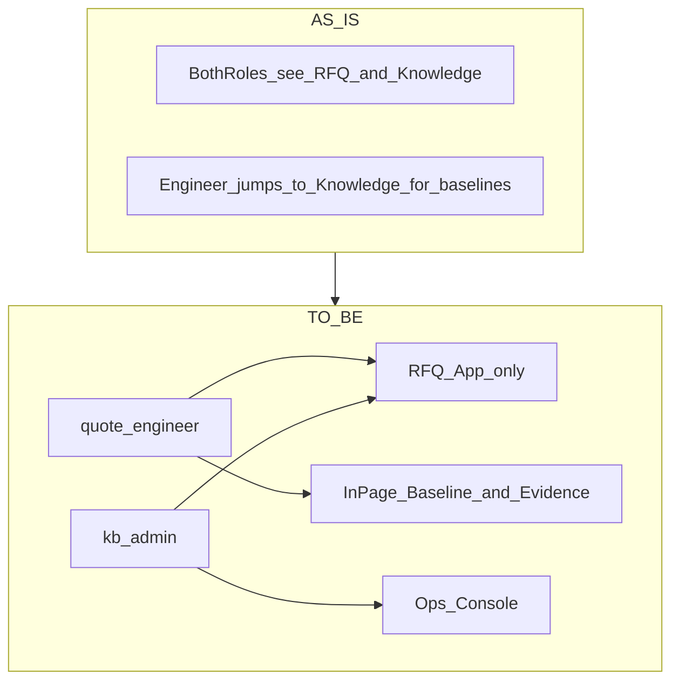
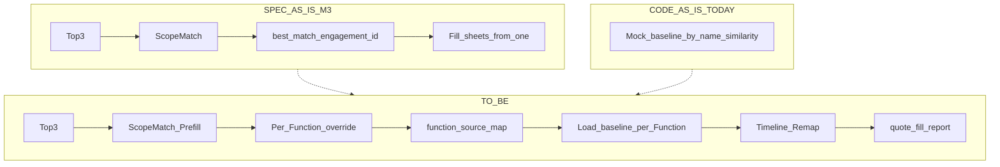

# 已定变更范围 · 任务方案与架构（内部 Review 稿）

**版本：** v0.3 · 2026-07-25  
**状态：** 我方产品/架构方向已内部确定 · **待客户确认单签字后锁定合同范围** · 未授权前不按全量开工  
**关联：** [customer-feedback-draft-2026-07-25.md](./customer-feedback-draft-2026-07-25.md) · [m3-scope-match-spec.md](../supplementary/m3-scope-match-spec.md) · [template-mapping.md](../supplementary/template-mapping.md) · [pdf-ppt-de-rfq-vision-eval.md](./pdf-ppt-de-rfq-vision-eval.md) · [manpower-baselines-spec.md](../supplementary/manpower-baselines-spec.md)

---

## 1. 如何阅读本文

| 标记 | 含义 |
|------|------|
| **已定方案** | 我方推荐做法已拍板，可写进确认单草案、可对客讲解 |
| **待客户确认** | 方向已定，是否纳入本期合同 / 展示细节等客户回复 |
| **后置 / 剔除** | 明确不做或二期另议，避免范围膨胀 |
| **实现波次** | 合同前体验壳 / 签约后正式实现 / 归属 M3 等 |

**总状态：** 方案（怎么做）已定 · 合同范围（做不做进哪一版）未定。

---

## 2. Review 结论摘要（v0.2）

| 结论 | 说明 |
|------|------|
| **总体** | 任务切分与「Word 入口 + 九模块多源拼装 + 起草可选」主架构合理，可作确认单与排期骨架 |
| **须收紧** | T1 导航隐藏范围、T3 选源落页与 scope 关系、规格 AS_IS vs 代码 AS_IS、T4 检索成本、T7 回收站工作量 |
| **须补任务** | 车型字段规范（T2a）、`function_source_map` 与 `/quote`·M3·UI Profile 依赖、测试门禁与规格回写时机 |

下文已按上述意见修订；§8 为仍待拍板的开放问题。

---

## 3. 已定任务与对应方案

### T1 · 工程师 / 管理员体验分流（P0）

| 项 | 内容 |
|----|------|
| **问题** | 两角色登录后界面接近；工程师易被知识库运维信息干扰 |
| **已定方案（默认）** | 工程师侧栏**不出现「平台 · 知识库」**；仅报价助手（及里程碑解锁的后续步）。管理员：运营入口（项目文档 / 用户 / 概览） |
| **开放点** | 若客户坚持工程师要「偶尔自己搜库」：可保留只读「检索」入口（无上传/索引）——**默认不做**，见 §8-Q1 |
| **证据层** | 人天明细、检索片段在 **RFQ 页内抽屉/面板**；后端继续允许工程师读 `baselines` / 使用任务内已落库的 similar/matrix 数据；**不**依赖跳转 `/knowledge` |
| **交互调整** | 「人天基线」→「查看该项目人天明细」（页内）。工程师移除「用相同关键词验证」外链；`kb_admin` 可在运维台保留检索 |
| **角色模型** | 本期仍两角色 `quote_engineer` / `kb_admin`（三级角色后置） |
| **实现波次** | 合同前体验：**做实** |
| **验收要点** | 工程师账号无知识库运维菜单；矩阵页可打开人天抽屉；无死链到 `/knowledge` |
| **状态** | 已定方案 · 待客户确认 |

---

### T2 · 对比矩阵表头与出处（P0）

| 项 | 内容 |
|----|------|
| **问题** | 列头仅项目名；源文件不便查阅 |
| **已定方案** | 列头：**项目名 · 公司名 · 车型**（缺省「—」）。权限内提供出处/下载 |
| **数据现实** | `customer` / `project_name` / `source_doc` / `engagement_id` 已有；**无稳定一等公民「车型」字段**（今多落在 `platform_type` 或名称里） |
| **入库门禁（已定 · 本期做）** | 写入/更新检索索引前须齐：`project_name` · `customer` · `year` · `functions`（≥1）。Web 批索引与 IT/全量重建同等硬拦；未齐记失败、不入向量。**车型暂不加门禁** |
| **衍生任务 T2a** | 车型一等字段 + **kb_admin 主数据**（客户/车型可维护、表单下拉、列表筛选）；未填前表头车型可为「—」；**不进**索引硬门禁 |
| **下载** | 新能力：鉴权 + 审计 + 仅授权角色；与「工程师不进运维页」不冲突（矩阵内下载即可） |
| **实现波次** | 表头（有则显示）：W1。T2a + 下载：W2 |
| **状态** | 已定方案 · T2a/下载细则待定 |

---

### T3 · 按九大模块多源选历史项目 → 拼装人力报价

| 项 | 内容 |
|----|------|
| **问题** | 不同模块选用不同历史项目的人力数据拼成新报价表 |
| **已定方案（粒度）** | 按九大 Function Sheet 选源，非 ~100 细维度。键名：`PM` · `BIW` · `Interior` · `GI` · `Test validation` · `Chassis` · `CAE` · `EE` · `PS` |
| **已定方案（交互）** | 矩阵下方（或 `/quote` 生成前一步）**报价数据源面板**：每模块 Radio（Top-3 或「不引用」）。ScopeMatch **预填**同一 best_match，允许覆盖 |
| **已定方案（生成）** | 持久化 `function_source_map` → 按模块从对应 baselines 抽岗位行 → **时间轴 remap 到当前 RFQ** → 九 Sheet + 多源 `quote_fill_report`。禁止整表粘贴历史日期 |
| **与 scope 的关系（补清）** | **仅当前 RFQ `development_scope`（及映射到的 Sheet）可选手动选源**；不在范围内的模块保持模板空/`null`，与现 M3「scope 外不填」一致 |
| **缺基线** | 某历史项目无该 Function → 该 Radio 禁用并提示「无报价基线」 |
| **落页（补清）** | **推荐：** 矩阵完成后在 RFQ 页完成选源并保存 map；`/quote` 生成时只读确认 + 生成。避免两处可改导致不一致 |
| **相对原 M3** | 单一 `best_match_engagement_id` → `function_source_map`；ScopeMatch 降为预填 |
| **代码现实（补清）** | 今日 **规格**有 ScopeMatch，**实现**仍为 Demo Mock 选基线；多源拼装是对 **目标 M3** 的修正，不是改已上线的 ScopeMatch 代码 |
| **依赖** | `ARIA_UI_PROFILE` 解锁 `/quote` 全量；真实 `manpower_baselines.json`（非 Mock）；门禁单测/API |
| **实现波次** | W1：选源壳（标注「确认后生成报价」）。W3/M3：真拼装 |
| **验收要点** | 两模块选自两 engagement 的 Excel 可区分来源；报告字段正确；scope 外模块为空 |
| **状态** | 已定方案 · 待客户确认按模块口径 |

---

### T4 · 模块工作范围关键字摘要（选源辅助）

| 项 | 内容 |
|----|------|
| **已定方案** | 客户关键字表 → 对 Top-3 × 相关模块做检索/摘要 → 展示在选源面板（默认） |
| **架构约束（补清）** | 避免每次打开面板现场打 3×9 次检索。矩阵完成后 **异步算一次**，结果缓存进任务（如 `module_source_summaries`），选源只读缓存 |
| **不做** | 按细技术维度维护关键字 |
| **实现波次** | 关键字齐后进 W3（可与真拼装并行）；W1 可用静态占位 |
| **状态** | 已定方案 · 待材料与展示落点 |

---

### T5 · 正式 RFQ = 标准 Word（管理口径 + 系统入口）

| 项 | 内容 |
|----|------|
| **已定方案** | 正式分析/归档/合同附件以 **标准 RFQ Word** 为准；PPT/PDF 为原材料。解析主路径不改为「直接吃 PPT」 |
| **系统含义** | 无模板共创前，**不承诺**起草台 Word 导出验收；解析继续接受客户现有 Word 变体（与今一致） |
| **状态** | 已定方案 · 待客户认同 + 模板 |

---

### T6 · RFQ 起草工作台（可选增强）

| 项 | 内容 |
|----|------|
| **定位** | 解析前可选：原材料 → 正式 Word → 现网解析 |
| **B1** | 拆页抽图、文本层捞取、模板向导、生成 docx、入队解析、草稿保存 |
| **B2** | 色标清单；Spike + 出内网政策 |
| **状态机（补清）** | 宜用任务子阶段/独立草稿实体，**慎用**与现有 `processing_status` 硬挤同一枚举，避免与 F1.11（取消/重试/归档）冲突。建议：`draft_workspace` 挂 task_id，就绪后调用现有 upload/parse 入口 |
| **存储** | 页图与原材料占磁盘；纳入容量/清理策略（对齐 KB 507 思路） |
| **明确不做** | 路径 C（PPT 直接矩阵/报价） |
| **实现波次** | W4 变更单；是否本期待客户勾选 |
| **状态** | B1 方案已定 · B2 另议 |

---

### T7 · 管理员侧增强（P1，分期）

| 项 | 内容 |
|----|------|
| **已定方案** | 演进 Engagement，不新建平行 DMS；IA 可称「项目文档管理」 |
| **合同前** | 导航/列表壳、用户演示路径、概览占位 + AI 健康一条 |
| **签约后** | 软删 + 回收站 30 天、覆盖/补传、用户初始密码/禁用 |
| **工作量警示（补清）** | 回收站涉及：**库文件 + 索引 generation/chunk + baselines** 联动软删/恢复/到期清理，属于 **偏大** 的数据生命周期特性，确认单应单列验收，不宜当「改个删除按钮」 |
| **分期规格** | [knowledge-lifecycle-spec.md](knowledge-lifecycle-spec.md)：L1 补传/替换（CHG13）→ L2 项目删除（CHG14）→ L3 回收站+文档删除（CHG09） |
| **剔除** | 模型用量 / Token / 独立模型管理页 |
| **状态** | 壳已定 · 生命周期规格已落盘 · 深能力待排期/确认单 |

---

### T8 · 明确后置 / 剔除

| 项 | 状态 |
|----|------|
| 多知识库 + ACL | 后置；数据面预埋见 [knowledge-space-preembed-spec.md](knowledge-space-preembed-spec.md)（默认 Space=`quoting`） |
| 三级角色 + 检索范围 | 后置 |
| PPT/PDF 直接进矩阵/报价 | 后置（不承诺） |
| 模型用量 / Token 看板 | **本轮剔除** |

---

## 4. 架构（现状 → 目标）

### 4.1 角色与信息架构



---

### 4.2 RFQ 主链路（含起草可选前置）

```mermaid
flowchart LR
  subgraph optional [Optional_Drafting]
    Raw[PPT_PDF]
    Desk[DraftingWorkbench]
    WordOut[Standard_DOCX]
    Raw --> Desk --> WordOut
  end
  subgraph core [Core]
    WordIn[Formal_RFQ_DOCX]
    Parse[Parse_DimensionReview]
    Matrix[ComparisonMatrix]
    Picker[FunctionSourcePicker_save_map]
    WordIn --> Parse --> Matrix --> Picker
  end
  WordOut -.-> WordIn
  Picker --> QuotePage[Quote_Confirm_and_Generate]
  QuotePage --> Assemble[MultiSource_Assemble]
  Assemble --> Xlsx[Nine_Function_Excel]
```



**要点：** 选源保存发生在矩阵之后、生成之前；`/quote` 以已保存 map 为准。

---

### 4.3 报价选源：规格 AS_IS → TO_BE（代码仍为 Mock）



**数据契约：**

```text
RFQTask.function_source_map = {
  "PM": "engagement_id_a",
  "BIW": "engagement_id_b",
  "Chassis": "engagement_id_a",
  "PS": null
}
# 仅 scope 内模块非 null；生成前校验
```

**可选缓存：** `RFQTask.module_source_summaries`（T4，矩阵后异步写入）。

---

### 4.4 起草台位置

| 层 | 说明 |
|----|------|
| UI | 左材料廊 · 右模板向导 |
| 服务 | 与 `RFQAnalysisService` 解耦；产出 docx 再走现有解析入口 |
| 状态 | 独立草稿工作区，避免污染 `processing_status` 主枚举 |
| B2 | 独立 job；不写报价数字 |

---

### 4.5 组件改动映射

| 组件 | 变化 |
|------|------|
| `AppLayout` / 可见性 | 工程师隐藏知识库导航（默认） |
| `ComparisonMatrix` | 表头；去工程师外链 |
| `rfq/page` | 人天/证据抽屉；**FunctionSourcePicker** + 保存 map |
| `quote/page` | 展示已保存 map；触发多源生成 |
| RFQTask / API | `function_source_map`；可选 summaries / draft_workspace |
| M3 规格 + Quote 编排 | 多源循环 + 报告；废止「仅单 best_match」为唯一路径 |
| BaselinesStore | 读侧已具备，编排层多 engagement 循环 |
| 新建（B1） | Drafting 服务、页图存储、Word 填充 |
| Knowledge 写 | 仍 `kb_admin`；IA 可改名 |
| 规格回写 | 确认单签字后更新 `m3-scope-match-spec.md` / `prod.md` F4.9 表述 |

---

## 5. 实现波次

| 波次 | 内容 | 前提 |
|------|------|------|
| **W0** | 对客反馈 / 要材料 | 进行中 |
| **W1** | T1 做实；T2 表头（有字段则显示）；T3 选源壳；T7 壳 | 客户口头认同（可选开工） |
| **W2** | T2a 车型规范；下载；T7 回收站等（若确认单勾选） | 确认单签字 |
| **W3** | T3 真拼装 + T4 摘要；接真实 baselines；`/quote` 全量 | M3 + 确认单含拼装 |
| **W4** | T6 B1 → 可选 B2 | 客户勾选 + 模板 + 样例 |

---

## 6. 客户依赖

| 材料 | 阻塞 |
|------|------|
| 认同按模块选源 / Word 入口 / 工程师不进运维 | 确认单 |
| 正式 RFQ Word 模板 | T5/T6 |
| 九大模块关键字表 | T4 |
| 技术维度清单确认 | 矩阵 |
| 多样化历史项目包 | 对标质量 |
| 带图样例 + 对照 Word | T6 |
| 色标图例 + 出内网 | T6-B2 |

---

## 7. 测试与规格门禁（开发约束）

- T3：`function_source_map` 持久化、多源拼装、缺基线、scope 外为空 — **unit + API** 必补；改解析/拼装逻辑时跑 regression。  
- T1：角色导航可见性 — 前端测试或契约测试。  
- T6：拆包失败、空文本层、生成 Word 后再解析 — 不 500。  
- LLM/RAG：**Mock**；不依赖真 Ollama 做门禁。  
- 确认单签字后：**先改规格文档再开工**（至少 M3 选源章节），避免代码与 `prod.md` 长期分叉。

---

## 8. 开放问题与已拍板项

| ID | 问题 | 结论 | 备注 |
|----|------|------|------|
| Q1 | 工程师是否保留只读知识库检索入口？ | **已定：否** | 完全隐藏；证据在 RFQ 内 |
| Q2 | 中文「白车身」等 ↔ Sheet 映射表谁维护？ | **已定：配置表** | 初值按 template-mapping，客户可改 |
| Q3 | 真拼装写进本期合同还是仅 M3？ | **已定：M3 里程碑含多源拼装** | 避免 R1 范围爆炸 |
| Q4 | T6 B1 确认单默认勾选？ | **已定：默认不勾** | 新需求、原合同未估。下周与客户确认：一期期望交付时间、是否纳入本期。纳入则单列范围与工期 |
| Q5 | 选源面板落在哪一页？ | **已定：仅 RFQ 页可改** | `/quote` 只读确认。需求确认前可做 **RFQ 页选源体验壳** 给客户点选确认交互 |

**体验版建议（Q5）：** W1 在矩阵下提供九模块 Radio + 保存提示即可；文案标明「生成报价以签约后/M3 为准」，避免客户以为 Excel 已按多源真拼装。

---

## 9. 修订记录

| 版本 | 日期 | 说明 |
|------|------|------|
| v0.1 | 2026-07-25 | 首版落盘 |
| v0.2 | 2026-07-25 | Review：收紧 T1/T3/T4/T6/T7；区分规格与代码 AS_IS；补 T2a、测试门禁、开放问题 |
| v0.3 | 2026-07-25 | Q1–Q5 拍板：Q4 默认不勾、下周对客确认是否纳入；Q5 仅 RFQ + 确认前体验壳 |
