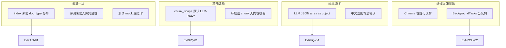

# R1 开发错误总结与提效指南

**版本：** v1.0 · 2026-07-06  
**范围：** 2026-07-04～07-06（架构决策 · Spike 验证 · 提交门禁）  
**受众：** 后续 R1 Wave 1–6 开发、Review、Spike 复跑  
**关联：** [rfq-parse-spike-closure.md](rfq-parse-spike-closure.md) · [rag-compare-spike-closure.md](rag-compare-spike-closure.md) · [r1-execution-plan.md](r1-execution-plan.md)

> **用法：** 开工新模块前扫一眼 §4「提效清单」；遇到类似症状查 §2「错误索引」。

---

## 1. 总览

| 类别 | 典型表现 | 根因类型 | 已修复 / 待办 |
|------|----------|----------|---------------|
| 架构误判 | 把 pgvector 当 30 并发首要矛盾 | **瓶颈识别错误** | 已决策：P0 = worker + Ollama 闸 |
| RFQ 解析 | 23–36 min / crash / 里程碑错块 | **策略 + 启发式 + JSON 契约** | Spike 已修；**生产化待 Wave 3** |
| RAG 评测 | 初跑 2/5 Pass，像检索算法差 | **入库不完整（无 Q_A）** | 已修；**SPK-K01/K02 进生产门禁** |
| 单元测试 | 空检索仍返回 Mock 命中 | **重构后 mock 层过时** | 已修 `test_rag_service.py` |
| 工程脚本 | `run_tests.ps1` 解析失败 | **PowerShell 编码** | **待修**（见 §3.6） |
| Git 流程 | 127 文件混在一个 checkpoint | **Spike 周期长未 commit** | 已 commit `bc4665c`；后续按 Wave 切 commit |

---

## 2. 错误索引（按模块）

### 2.1 架构与容量规划

#### E-ARCH-01：外部建议单与代码真实现状不一致

| 项 | 内容 |
|----|------|
| **现象** | Claude 建议「Chroma 独立容器 → pgvector 减容器」；建议 LangChain 0.2→0.3 |
| **实际** | Chroma 为 **嵌入式 `PersistentClient`**，Compose 无 Chroma 服务；**代码零 LangChain import** |
| **后果** | 若照单全收，会估错工作量、改错优先级 |
| **纠正** | pgvector 价值在 **备份统一 + R1 检索质量**；并发 P0 是 **Ollama + BackgroundTasks** |
| **预防** | 架构变更前 **grep 代码 + 读 compose**；外部 memo 须对照 [dev-context.md](../../dev-context.md) |

#### E-ARCH-02：把向量库当成 20–30 人并发瓶颈

| 项 | 内容 |
|----|------|
| **现象** | 讨论 30 人同时 RFQ 时，优先争论 Chroma vs pgvector |
| **实际** | 单 GPU Ollama **串行生成** + `BackgroundTasks` **无队列无持久化** 才是硬顶 |
| **后果** | 30 人同时提交 → 30 线程抢 GPU；容器重启 → 任务永久 `parsing` |
| **决策** | **R1-I01–I03** PG 任务表 + worker + `OLLAMA_MAX_CONCURRENT` |
| **预防** | 容量文档写清 **GPU 吞吐** 与 **软件排队** 分工；见 [customer-it-infrastructure.md](../../docs/customer-it-infrastructure.md) |

---

### 2.2 RFQ 解析 Spike

#### E-RFQ-01：`chunk_scope` 9×LLM 性能陷阱

| 项 | 内容 |
|----|------|
| **现象** | 客户模板解析 ~23.5–36 min；scope 7 batch 占 ~95% 时间 |
| **根因** | 默认按 chunk 批量调 LLM，7B CPU 每次 2–5 min |
| **修复** | 改用 **`rules_first`**：规则 + 条件 LLM 补洞 → **0 LLM · 秒级 · modules 90** |
| **R1 决策** | 生产主路径 **rules_first**；`chunk_scope` 仅 DEV 基线对比 |
| **预防** | 结构化 Word RFQ **先规则后 LLM**；Spike 必跑两种策略再定默认 |

#### E-RFQ-02：里程碑 chunk 误选 §3.2 合同条款

| 项 | 内容 |
|----|------|
| **现象** | milestones LLM pass 读到付款/合同文本，里程碑字段错误 |
| **根因** | 仅按章节标题选块，「3.2」同时含合同与进度表 |
| **修复** | `is_milestone_chunk()`：**内容特征**（开发进度、M0、日期）而非标题 alone |
| **预防** | chunk 选择：**标题 + 正文关键词** 双条件；加单测 `test_milestone_excludes_scope_chunks` |

#### E-RFQ-03：里程碑正则 `数据?` 误匹配

| 项 | 内容 |
|----|------|
| **现象** | 表头「数据主要节点」匹配失败或误匹配 |
| **根因** | `数据?` 在正则中表示「数 OR 据」，不是「数据」可选 |
| **修复** | 改为 `(?:\s*数据)?` 或明确字面量 `数据主要节点` |
| **预防** | 中文表头正则 **写样例 + 单测**；Review 时警惕 `?` 在中文间的语义 |

#### E-RFQ-04：LLM 返回 JSON 数组导致 crash

| 项 | 内容 |
|----|------|
| **现象** | scope batch 6：`complete_json` 期望 object，收到 `[{...}]` → 500 / spike abort |
| **根因** | Prompt 未强制 object；模型有时返回 list of modules |
| **修复** | `json_utils.normalize_llm_json()`：array → `{ "modules": [...] }` |
| **预防** | **所有** LLM JSON 入口走 `normalize_llm_json`；单测覆盖 list 响应（已有 `test_normalize_list_of_modules`） |

#### E-RFQ-05：LLM merge 漏 Function（BIW/CAE 等）

| 项 | 内容 |
|----|------|
| **现象** | `chunk_scope` 路径 `functions_in_scope` 仅 PM、Chassis |
| **根因** | 多 pass merge 不完整 |
| **对比** | `rules_first` 从 §3.1.1 一次提取 **7 个 Function** |
| **预防** | §3.1.1 等 **固定结构** 用规则；LLM 只补洞 |

#### E-RFQ-06：`.doc` 依赖 Word COM（环境）

| 项 | 内容 |
|----|------|
| **现象** | 客户模板为 `.doc`，Linux/无 Office 环境无法 spike |
| **根因** | `rfq_document_loader` 在 Windows 用 COM 转 docx |
| **待办** | R1 上传优先 **docx**；`.doc` 走 IT 转换或验证期专用机 |
| **预防** | Spike 文档注明 **OS/依赖**；CI 用 docx fixture |

---

### 2.3 RAG / 知识库 Spike

#### E-RAG-01：index 仅 rfq → 评测假象「vector 很差」

| 项 | 内容 |
|----|------|
| **现象** | v1.0：indexed **144**，vector **2/5（40%）**；Q_A query 全 FAIL |
| **根因** | pgvector 里 **`doc_type` 全为 rfq**，35 行 Q_A **从未入库** |
| **修复** | 全量 re-index：**171 = rfq 136 + qa 35** → vector **12/15（80%）**，RFQ **6/6** |
| **预防** | **SPK-K01**：入库后 assert rfq+qa 计数；见 `flatten_preview_chunks` |
| **教训** | **先查 index 分布，再调算法**；否则 A/B 对比无意义 |

#### E-RAG-02：`spike_rag_compare.py` 的 `indexed_count` AttributeError

| 项 | 内容 |
|----|------|
| **现象** | 脚本报告阶段 crash |
| **根因** | 直接访问不存在的属性，未走 Service API |
| **修复** | 改用 `KnowledgeIndexService.indexed_count()` |
| **预防** | Spike 脚本 **只通过 Service 公共方法** 读状态；脚本也应有 smoke test |

#### E-RAG-03：vector 在 3 条 Q_A 上 FAIL（非 bug）

| 项 | 内容 |
|----|------|
| **现象** | 中文 paraphrase query 与 chunk 英文 Question 向量距离大 |
| **样例** | Data Management / Change Management / Chassis 硬点 |
| **决策** | R1 **维持 vector**（80% Pass）；Hybrid → **R1-P2-02** 变更单 |
| **预防** | 评测集用 **模板真实 Question**（`debug_eval_queries.sample.json`）；记录 FAIL 根因 **SPK-K06** |

#### E-RAG-04：重构后生产路径与 Demo 路径分叉未同步测试

| 项 | 内容 |
|----|------|
| **现象** | `RAGService.search_similar_projects` 改走 `KnowledgeIndexService`，Chroma mock 失效 |
| **关联** | 见 E-TEST-01 |
| **预防** | 替换存储层时 **同 PR 更新** `test_rag_service.py` + API test |

---

### 2.4 测试与门禁

#### E-TEST-01：`test_real_search_empty_returns_no_mock_fallback` 失败

| 项 | 内容 |
|----|------|
| **现象** | commit 前 pytest：mock `_get_chroma` 返回 []，实际仍返回 3 条 pgvector 命中 |
| **根因** | 测试 mock **旧依赖层**；生产已切 `KnowledgeIndexService` |
| **修复** | mock `KnowledgeIndexService` 返回 `FakeIndex` |
| **预防** | 架构迁移 checklist：**谁被 mock？** 与 **谁被调用？** 一致 |
| **规则** | 见 [aria-testing-gate.mdc](../../.cursor/rules/aria-testing-gate.mdc) |

#### E-TEST-02：`run_tests.ps1` 在 PowerShell 下解析失败

| 项 | 内容 |
|----|------|
| **现象** | `TerminatorExpectedAtEndOfString`（中文 `Write-Host` 行） |
| **根因** | 脚本编码 / 引号与 Windows PowerShell 5.x 不兼容 |
| **临时** | 直接 `python -m pytest unit_tests/` + `API_tests/` |
| **待办** | 修复 ps1 编码为 UTF-8 BOM 或去掉尾部中文装饰块 |
| **预防** | CI/本地门禁 **优先保证 ps1 可跑**；或文档写明 fallback 命令 |

#### E-TEST-03：pgvector 单测在 SQLite 环境 skip

| 项 | 内容 |
|----|------|
| **现象** | `test_pgvector_store.py` 2 skipped |
| **根因** | 单测默认无 PostgreSQL |
| **可接受** | API/Service 层 Mock embed + store |
| **提效** | 可选：docker compose 起 PG 的 `@pytest.mark.integration` 子集 |

---

### 2.5 Git 与工程卫生

#### E-GIT-01：Spike 周期过长导致 mega-commit

| 项 | 内容 |
|----|------|
| **现象** | 127 文件、+10080 行一次性提交 |
| **风险** | Review 困难、回滚粒度粗 |
| **已做** | checkpoint commit `bc4665c` 后再开 Wave 1 |
| **预防** | **每个 Spike 结案 / 每个 Wave 结束** 单独 commit；见 [git-workflow.md](git-workflow.md) |

#### E-GIT-02：临时文件险些入库

| 项 | 内容 |
|----|------|
| **文件** | `.tmp_*`、`debug-*.log`、`*.tsbuildinfo`、`pgvector_index_state.json` |
| **修复** | 扩展 `.gitignore`；`git reset` 排除后再 commit |
| **预防** | commit 前 `git status` 扫 untracked；validation_reports 已 ignore |

---

## 3. 根因分类（便于复盘）

| 根因 | 出现次数 | 最高代价 |
|------|----------|----------|
| **未验证前置数据**（index/入库） | 2 | 错误结论 + 数小时 A/B |
| **LLM 路径默认过重** | 1 | 20–36 min/RFQ |
| **启发式 fragile**（chunk/regex） | 2 | 错误 milestones + 调试 |
| **JSON 契约未统一** | 1 | spike crash |
| **重构未同步测试** | 1 | commit 门禁失败 |
| **架构文档 vs 代码** | 2 | 错误优先级 |

---

## 4. 后续提效清单（开发必读）

### 4.1 Spike / 验证前（5 分钟）

- [ ] **Index 体检：** rfq count + qa count + total ≈ 基准（模板 **171**）
- [ ] **环境变量：** `DATABASE_URL`、`MOCK_RAG=false`、`PYTHONPATH=backend`
- [ ] **报告归档：** `validation_reports/*.json`（已 gitignore，本地保留）

### 4.2 实现 RFQ 解析（Wave 3）

- [ ] 主路径 **`rules_first`**，LLM 仅 §3.3 条件触发
- [ ] 所有 LLM JSON → **`normalize_llm_json`**
- [ ] chunk 选择：**内容特征测试** 先于 LLM
- [ ] 单测：**客户模板 fixture** + 非法 JSON 不 500

### 4.3 实现知识库（Wave 2）

- [ ] ingest 后 **assert doc_type**（**SPK-K02**）
- [ ] 禁止 **仅 rfq** 入库（**SPK-K01**）
- [ ] 评测集固定 **15 条** sample JSON，变更需重跑 spike 脚本

### 4.4 架构迁移（任意 Wave）

- [ ] 改 Service 依赖 → **同 PR 改 unit + API test**
- [ ] 检查 mock 点是否与 **实际 import 路径** 一致
- [ ] 跑 `python -m pytest unit_tests/ API_tests/`（或修好的 `run_tests.ps1`）

### 4.5 提交前（项目 rules）

- [ ] 无 `.env`、客户脱敏、`.tmp_*`
- [ ] 解析/RAG/Prompt 变更 → 考虑 `--regression`
- [ ] commit 粒度：**一个 Wave 或一个 Spike 主题**

### 4.6 待办工程债（非阻塞但应排期）

| ID | 项 | 建议任务 |
|----|-----|----------|
| DEBT-01 | 修复 `run_tests.ps1` 编码 | R1-E 或 chore commit |
| DEBT-02 | milestones P1/P4/SOP 规则补全 | SPK-F05 |
| DEBT-03 | §4.2 七表 deliverables | SPK-F06 |
| DEBT-04 | `insufficient_evidence` 生产门控 | R1-I08 / SPK-K05 |

---

## 5. 决策记录（避免重复争论）

| 话题 | 已决 | 勿在 R1 重开 |
|------|------|--------------|
| RFQ 解析默认路径 | **rules_first** | chunk_scope 9×LLM 作生产默认 |
| R1 检索 | **vector + metadata** | Hybrid/Rerank（→ P2 变更单） |
| 任务执行 | **PG 队列 + worker** | BackgroundTasks 长任务 |
| LangChain | **移除依赖** | 为「升级 LangChain」改代码 |
| 评测门槛 | 内部 **12/15**；客户 O-03 | 未 re-index 就调 embedding 模型 |

---

## 6. 相关提交与报告

|  artifact | 路径 |
|-----------|------|
| Spike checkpoint commit | `bc4665c`（release/r1） |
| RFQ rules_first 报告 | `backend/data/validation_reports/rfq_parse_spike_rules_first.json` |
| RAG v1.1 报告 | `backend/data/validation_reports/rag_compare_spike.json` |
| 15 条评测集 | `backend/data/debug_eval_queries.sample.json` |
| 执行顺序 | [r1-execution-plan.md](r1-execution-plan.md) |

---

## 7. 修订历史

| 版本 | 日期 | 说明 |
|------|------|------|
| v1.0 | 2026-07-06 | 首版：汇总 07-04～07-06 Spike 与 commit 门禁问题 |
