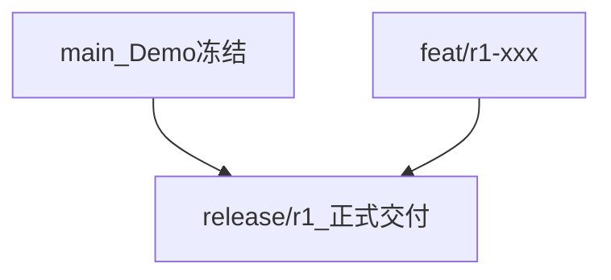

# R1 Git 分支与开发流程

**版本：** v1.0 · 2026-07-04  
**索引：** [README.md](README.md)  
**依据：** [formal-delivery-strategy.md §5](../supplementary/formal-delivery-strategy.md) · D3 分支决策

> **受众：** 开发团队（内部 · 不对客户披露）

---

## 1. 分支模型



| 分支 | 用途 | 合并来源 | 禁止 |
|------|------|----------|------|
| **`main`** | Demo 基线；阿里云体验 | `hotfix/demo-*`（仅严重缺陷） | R1 新功能 · pgvector · F1.10 |
| **`release/r1`** | R1 唯一交付线 | `feat/r1-*` | Demo-only Mock 增强 · 超 R1 scope |
| **`feat/r1-*`** | 单任务分支（对齐 dev-tasks ID） | — | 长期不合并 |

**环境绑定：**

| 环境 | 分支 | Compose | Profile | LLM/RAG |
|------|------|---------|---------|---------|
| 阿里云 Demo | `main` | `docker-compose.aliyun-demo.yml` | `experience` | Mock 可开 |
| 本地 R1 开发 | `release/r1` / `feat/r1-*` | `docker-compose.yml` | `dev` / `r1` | 单测可 Mock |
| 客户内网 R1 | `release/r1`（tag） | `docker-compose.prod.yml` | **`r1`** | **必须 false** |

---

## 2. 开工前三步（一次性）

### Step 1 — 冻结 `main`（Demo 基线）

在 `main` 上整理 commit（建议拆分，**勿提交** `.env`、`.tmp_*`、`tsbuildinfo`）：

```powershell
cd e:\work\aria

# 确认不要纳入：.env、.tmp_*、frontend/tsconfig.tsbuildinfo
git status

# 建议先提交文档与规划（示例）
git add prod.md dev-context.md docs/
git commit -m "docs: prod v1.6、正式版规格与 R1 任务/Git 流程"

# 若有 Demo 代码/脚本变更，另开 commit
# git add ...
# git commit -m "chore: Demo compose 与脚本更新"

# Demo 冻结标签
git tag -a demo-freeze-2026-07 -m "Demo Phase 1 frozen"
git push origin main
git push origin demo-freeze-2026-07
```

### Step 2 — 创建 `release/r1`

```powershell
git checkout -b release/r1
git push -u origin release/r1
```

更新 [dev-tasks.md](dev-tasks.md) **R1-E01** → 已完成；[pre-development-open-items.md](../supplementary/pre-development-open-items.md) **I-04** → 已关闭。

### Step 3 — 日常在 `release/r1` 上开发

```powershell
git checkout release/r1
git pull
git checkout -b feat/r1-i01-task-queue   # 示例：对齐 dev-tasks ID
# ... 开发 ...
.\run_tests.ps1
git add ...
git commit -m "feat: PG 任务队列表与迁移（R1-I01）"
git checkout release/r1
git merge feat/r1-i01-task-queue
git push origin release/r1
```

---

## 3. 分支命名

```
feat/r1-i01-task-queue
feat/r1-k02-ingest
feat/r1-f08-confirm-dimensions
fix/r1-k07-reindex-api
hotfix/demo-ui-typo          # 仅 main
```

---

## 4. 合并门禁（PR 或 merge 前必过）

- [ ] 对应 [dev-tasks.md](dev-tasks.md) ID + [delivery-traceability.md](../supplementary/delivery-traceability.md) 里程碑 **R1**
- [ ] Service + unit test + API test（LLM/RAG Mock）
- [ ] `.\run_tests.ps1` 全绿；解析/RAG/Prompt 变更时 `.\run_tests.ps1 --regression`（或 `./run_tests.sh --regression`）
- [ ] 无 `.env`、客户脱敏 RFQ/报价
- [ ] R1 scope：不含 M3/M4/M5

**Commit message：** 见 `.cursor/rules/aria-git-commit.mdc`；body 可加 `Tasks: R1-K02`。

**推荐：** `feat/r1-*` → PR → `release/r1`（小团队可先 local merge，仍须跑测试）。

---

## 5. 标签与里程碑

| Tag | 含义 | 分支 |
|-----|------|------|
| `demo-freeze-YYYY-MM` | Demo 冻结 | `main` |
| `r1-alpha-YYYY-MM-DD` | 内部演示（seed 基准库） | `release/r1` |
| `r1-beta-YYYY-MM-DD` | **客户 R1 验收签字** | `release/r1` |

R1 签字后可继续在同一 `release/r1` 开发 M3，或打 tag 后切 `release/m3`。M6 终态可打 `v1.0.0`。

---

## 6. 同步策略

| 方向 | 策略 |
|------|------|
| `main` → `release/r1` | **不自动 merge**；仅 cherry-pick Demo 壳/UI 严重缺陷修复 |
| `release/r1` → `main` | **禁止** |
| Demo 热修 | `hotfix/demo-*` → `main` → 部署阿里云；评估是否 cherry-pick 到 `release/r1` |

---

## 7. 禁止项

- 在 `main` 上开发 R1 生产逻辑
- `release/r1` 合并 Demo-only Mock 增强
- `git commit --no-verify` 跳过测试
- R1 验收 tag 打在 `main` 上
- 提交 `.env`、密钥、客户脱敏文件

---

## 8. 与 dev-tasks 对应

| Git 动作 | dev-tasks |
|----------|-----------|
| 本文档 | R1-E06 |
| 创建 `release/r1` | R1-E01 |
| PR traceability 模板 | R1-E04 |
| 首个 `feat/r1-i*` | R1-I01 起 |
