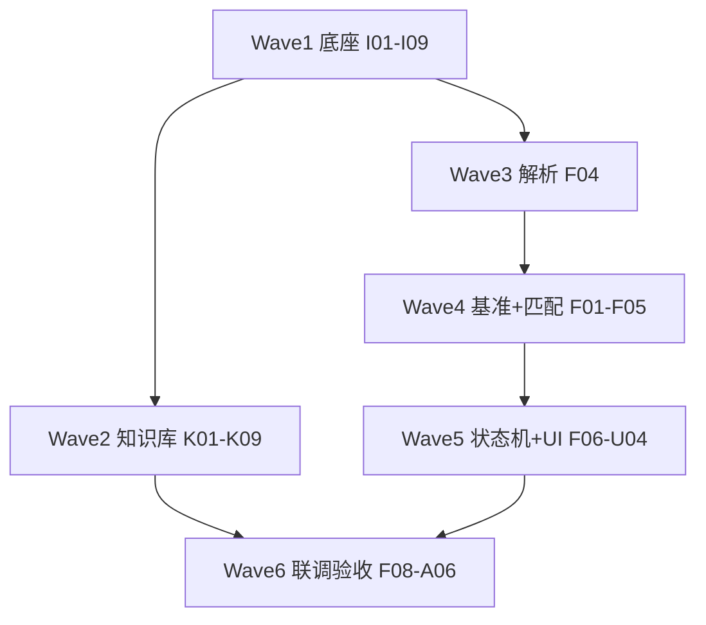

# R1 正式实施 — 统一执行计划（Spike 后）

**版本：** v1.0 · 2026-07-06  
**状态：** **计划已定 · 尚未开工生产代码**  
**用途：** 唯一 **执行顺序** 清单；[dev-tasks.md](dev-tasks.md) 为完整 ID 索引；[spike-follow-up-tasks.md](spike-follow-up-tasks.md) 为 Spike 结论摘要。

> **原则：** 按 **Wave** 顺序执行；同 Wave 内 `#` 可并行；**未写代码前请先对本计划签字/确认**。

---

## 0. 已完成（不再排期）

| ID | 产出 |
|----|------|
| R1-E01, R1-E04, R1-E06 | 分支、PR 模板、Git 流程 |
| R1-K10 | Debug UI + `run_kb_debug_validation.py` |
| **Spike（DEV）** | `rules_first` 解析 · RAG vector 12/15 · 评测 15 条 · 结案文档 |
| **部分工程** | `rfq_rules_extractor.py` · pgvector/Debug 路径（**未**进生产 Service/worker） |

---

## 1. 执行总览（6 个 Wave）

| Wave | 主题 | 核心 ID | 预估 |
|------|------|---------|------|
| **1** | 任务队列 + pgvector 生产底座 | R1-I01–I09 | Week 1–2 |
| **2** | 知识库 ingest + vector 检索 | R1-K01–K09, SPK-K* | Week 2–4 |
| **3** | RFQ 解析 rules_first 生产化 | R1-F04, SPK-F01–F07 | Week 4–5 |
| **4** | 维度基准 seed + 匹配 | R1-F01,F03,F05, SPK-F08 | Week 4–5（与 3 末并行） |
| **5** | dimension_review + 前端 | R1-F06–F07, R1-U01–U03 | Week 5–6 |
| **6** | confirm + RAG 矩阵 + 验收 | R1-F08–F10, R1-U04–U06, R1-A* | Week 6–8 |

---

## 2. Wave 1 — 基础设施（P0-1 · 阻塞一切长任务）

| 序 | ID | 任务 | DoD | 依赖 | 状态 |
|----|-----|------|-----|------|------|
| 1.1 | **R1-I01** | `task_jobs` 表 + 迁移 | queued/running/completed/failed | — | 待开始 |
| 1.2 | **R1-I02** | worker 进程（SKIP LOCKED） | compose/systemd 可启停 | 1.1 | 待开始 |
| 1.3 | **R1-I05** | pgvector 扩展 + `knowledge_chunks` 生产化 | 与 spike Debug 路径统一 namespace 策略 | — | 待开始 |
| 1.4 | **R1-I06** | Ollama `nomic-embed-text` 生产接入 | 写入 pgvector | 1.3 | 待开始 |
| 1.5 | **R1-I07** | `RAGService` → pgvector（弃 Chroma 生产路径） | 单测 Mock | 1.4 | 待开始 |
| 1.6 | **R1-I08** | `insufficient_evidence` 拒答 | **SPK-K05**；禁止 Mock 兜底 | 1.5 | 待开始 |
| 1.7 | **R1-I04** | Ollama 并发闸 + `queue_position` / ETA | api-design §3 | 1.2 | 待开始 |
| 1.8 | **R1-I03** | RFQ 流水线迁入 worker | 移除 BackgroundTasks；**SPK-F03** | 1.2, 1.7 | 待开始 |
| 1.9 | **R1-I09** | I 层 unit + API 测试 | 队列降级、空库拒答 | 1.1–1.8 | 待开始 |

**Gate：** 1.8 完成前，生产环境禁止同步等待 >30s 的 RFQ 解析 HTTP。

---

## 3. Wave 2 — 知识库 2A（P0-2 · 优先于 RFQ 联调）

| 序 | ID | 任务 | DoD | 依赖 | 状态 |
|----|-----|------|-----|------|------|
| 2.1 | **R1-K01** | manifest + engagements 表 | rag-design §5.2 | 1.5 | 待开始 |
| 2.2 | **R1-K02** + **SPK-K01** | 分类型 ingest；**必须 rfq+qa 同时入库** | 模板基准 **171** chunks | 2.1 | 待开始 |
| 2.3 | **SPK-K02** | ingest 回归：assert doc_type 分布 | unit/API；rfq+qa count | 2.2 | 待开始 |
| 2.4 | **R1-K04** + **K04a** | 报价 → baselines（不向量化） | manpower_baselines.json | 2.2 | 待开始 |
| 2.5 | **R1-K05** | `GET /knowledge/baselines` | API test 200 | 2.4 | 待开始 |
| 2.6 | **R1-K03** + **SPK-K03** | metadata 预过滤 + **vector Top-K**（同 spike） | 无 Hybrid | 2.2 | 待开始 |
| 2.7 | **R1-K07** | Re-index API | IT 目录 + Web | 2.2 | 待开始 |
| 2.8 | **R1-K06** | Engagement upload ≤5 套/次 | 导入报告 | 2.2 | 待开始 |
| 2.9 | **R1-K08** + **K08b** | `/knowledge` 验收台 + baselines Tab | Profile=r1 | 2.5–2.7 | 待开始 |
| 2.10 | **R1-K09** + **SPK-K04** | 评测 ≥15 条；内部 **12/15** 已达成 | 客户 O-03 签字 | 2.6 | **进行中** |
| 2.11 | **SPK-K06** | 3 条 vector FAIL 根因文档（P1） | 不强制 hybrid | 2.10 | 待开始 |

**并行（工程准备）：** R1-E02、R1-E03、R1-E05 可在 Wave 1–2 穿插。

---

## 4. Wave 3 — RFQ 解析 rules_first（P0-3 · R1-F04）

> Spike 代码在 `rfq_rules_extractor.py` / `spike_rfq_parse.py`；本 Wave **迁入生产 Service**。

| 序 | ID | 任务 | DoD | 依赖 | 状态 |
|----|-----|------|-----|------|------|
| 3.1 | **R1-F04-01** | **`RFQParseService` 骨架** | 类 + `parse_rules_first()` 入口；读 settings；返回 `rfq_modules` schema | — | **待创建** |
| 3.2 | **SPK-F04** / F04-02 | 统一 `rfq_document_loader` + `rfq_chunker` | 与 spike 同路径；弃 Demo 截断 | 3.1 | 待开始 |
| 3.3 | **SPK-F01** / F04-03 | 接入 `extract_rfq_rules()` | 主路径 rules_first | 3.2 | 待开始 |
| 3.4 | **SPK-F02** / F04-04 | LLM 兜底（overview/milestones/scope 条件触发） | `normalize_llm_json` | 3.3 | 待开始 |
| 3.5 | **SPK-F07** / F04-05 | 解析测试门禁 | unit + API；客户模板 fixture | 3.4 | 待开始 |
| 3.6 | **R1-F04-06** | 接入 worker 任务（`parsing` 阶段） | 经 **R1-I03** 调用 3.1–3.4 | 1.8, 3.5 | 待开始 |
| 3.7 | **SPK-F05** | 里程碑 P1/P4/SOP 规则补全（P1） | 可选；不阻塞 3.6 | 3.3 | 待开始 |
| 3.8 | **SPK-F06** | §4.2 交付物表规则（P1） | 7 表 deliverables | 3.3 | 待开始 |

**汇总映射：** R1-F04 = 3.1–3.6（3.7–3.8 为 P1 增强）。

---

## 5. Wave 4 — 维度基准 + 匹配（P0-3 · F1.10a–b）

> **与 Wave 3 末并行：** 3.1 完成后即可启动 **4.1–4.3**（不依赖 worker）。

| 序 | ID | 任务 | DoD | 依赖 | 状态 |
|----|-----|------|-----|------|------|
| 4.1 | **R1-F01-01** | **`dimension_baseline.v1.json` seed** | 20–30 项；Chassis/CAE/BIW/… | — | **待创建** |
| 4.2 | **R1-F01-02** | **Baseline 加载 Service** | 读 JSON；version；modules | 4.1 | **待创建** |
| 4.3 | **R1-F03** | `GET /rfq/dimension-baseline` | API test 200 | 4.2 | 待开始 |
| 4.4 | **R1-F05-01** | **`prompts/v1/rfq_baseline_match.txt`** | batch 输入/输出 schema | 4.1 | **待创建** |
| 4.5 | **R1-F05-02** | **`DimensionMatchService` 骨架** | keywords 预填 + module batch LLM | 4.2, 4.4 | **待创建** |
| 4.6 | **SPK-F08** / F05-03 | 匹配 → `dimension_draft` + merge | 4–8 次 LLM/batch | 4.5, **3.3** | 待开始 |
| 4.7 | **R1-F05-04** | 匹配 unit + API 测试 | Mock LLM；非法 JSON 不 500 | 4.6 | **待创建** |

**汇总映射：** R1-F01 = 4.1–4.2 · R1-F05 = 4.4–4.7。

**明确不做本 Wave：** R1-F02（客户 Excel 导入）→ R1-β · O-01。

---

## 6. Wave 5 — 状态机 + 勾选 UI（P0-3）

| 序 | ID | 任务 | DoD | 依赖 | 状态 |
|----|-----|------|-----|------|------|
| 5.1 | **R1-F06** | 状态机 `dimension_review` | parsing → dimension_review → retrieving | 4.6, 3.6 | 待开始 |
| 5.2 | **R1-F07** | `PUT /rfq/tasks/{id}` 更新 draft | 勾选、work_content、custom_items | 5.1 | 待开始 |
| 5.3 | **R1-U01** | `DimensionBaselineReview` 组件 | 全量基准表、模块摘要 | 5.1 | 待开始 |
| 5.4 | **R1-U02** | `/rfq` 两阶段流 | dimension_review → 矩阵 | 5.3 | 待开始 |
| 5.5 | **R1-U03** | TaskContextBar 状态文案 | dimension_review 等待勾选 | 5.1 | 待开始 |
| 5.6 | **R1-U05** | Profile=r1 路由守卫 | 与 R1-E03 一致 | R1-E03 | 待开始 |

---

## 7. Wave 6 — confirm + RAG 矩阵 + 验收

| 序 | ID | 任务 | DoD | 依赖 | 状态 |
|----|-----|------|-----|------|------|
| 6.1 | **R1-F08** | `POST .../confirm-dimensions` | vector Top-3 RAG + 触发矩阵 | **2.6**, 5.2 | 待开始 |
| 6.2 | **R1-F09** | 对比矩阵（仅 in_scope） | comparison_service | 6.1 | 待开始 |
| 6.3 | **R1-U04** | 矩阵页 UI | 仅 in_scope 行 | 6.2 | 待开始 |
| 6.4 | **R1-K08c** | Top-3 ↔ baselines 联动 | 矩阵页入口 | 6.2, 2.5 | 待开始 |
| 6.5 | **R1-F10** | RFQ 全链路测试 | unit + API + regression | 6.1–6.3 | 待开始 |
| 6.6 | **R1-U06** | 3 RFQ 样本 E2E 联调 | 无 Mock 欺骗 | 6.5, 2.8 | 待开始 |
| 6.7 | **R1-A01–A07** | 彩排 + 客户验收 | O-01～O-05 | 6.6 | 待开始 |

---

## 8. 不在此计划内（已决策跳过或 Phase 2）

| 项 | 处置 |
|----|------|
| chunk_scope 9×LLM 解析 | DEV spike 基线 only |
| Hybrid / Rerank 生产 | **R1-P2-02** / **SPK-K07** |
| R1-F02 客户基准 Excel | R1-β |
| M3/M4/M5 | 合同外 |

---

## 9. 新创建的子任务 ID（已写入本计划 · dev-tasks 待同步）

以下 ID **原先不存在**，已在本计划中 **首次定义**：

| 新 ID | 说明 | 并入 |
|-------|------|------|
| **R1-F04-01** | `RFQParseService` 骨架 | R1-F04 |
| **R1-F04-06** | worker 接入 | R1-F04 + R1-I03 |
| **R1-F01-01** | seed JSON 文件 | R1-F01 |
| **R1-F01-02** | Baseline Loader Service | R1-F01 |
| **R1-F05-01** | `rfq_baseline_match.txt` | R1-F05 |
| **R1-F05-02** | `DimensionMatchService` 骨架 | R1-F05 |
| **R1-F05-04** | 匹配测试 | R1-F05 + R1-F10 |

---

## 10. 建议「第一批开工」清单（你确认后执行）

若只开 **一条线**，按此顺序 **写代码**：

1. **R1-I01 → I02 → I03**（worker，否则后面无法生产化）
2. **R1-F04-01 → F04-03 → F04-05**（解析 Service + 测试，可先不挂 worker 本地验）
3. **R1-F01-01 → F01-02 → F03**（seed + API，可与 2 并行）
4. **R1-F05-01 → F05-02 → F05-04**（匹配，依赖 2 产出 rfq_modules + 3 seed）
5. **R1-K02 + SPK-K01**（与 1–4 中后段并行，F08 前必须完成）

---

## 11. 文档索引

| 文档 | 角色 |
|------|------|
| **本文** | **执行顺序（唯一）** |
| [dev-tasks.md](dev-tasks.md) | 全量 ID + 状态跟踪 |
| [spike-follow-up-tasks.md](spike-follow-up-tasks.md) | Spike 结论 → ID 映射 |
| [rfq-parse-spike-closure.md](rfq-parse-spike-closure.md) | ② 解析结案 |
| [rag-compare-spike-closure.md](rag-compare-spike-closure.md) | ④ 检索结案 |
