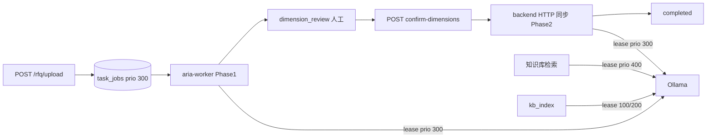
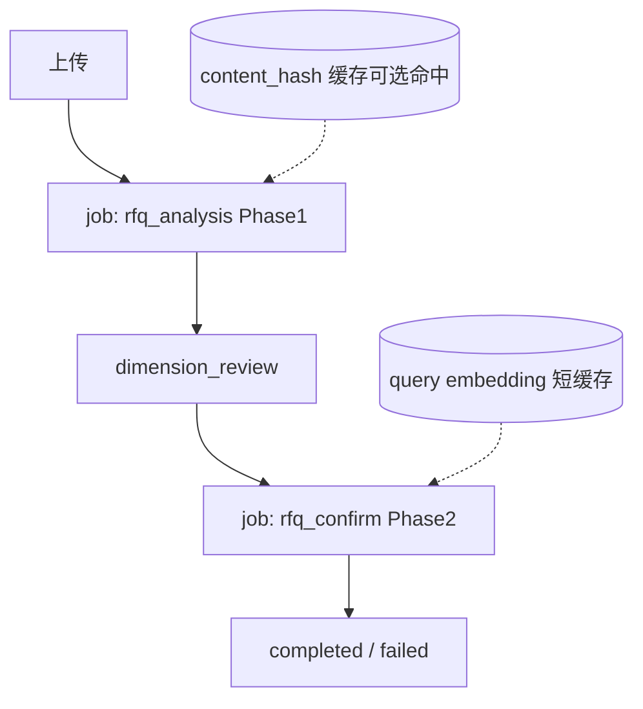
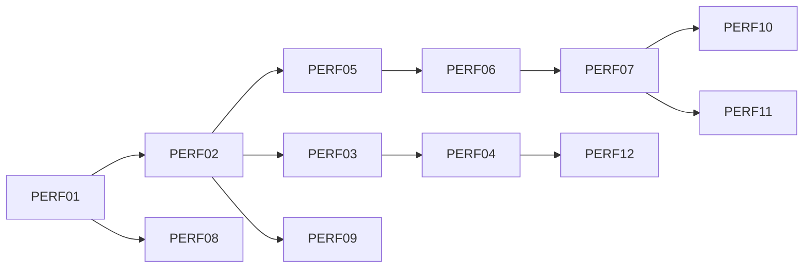

# R1+ · RFQ 多人并发等待体验改进方案

**版本：** v1.2 · 2026-07-26  
**状态：** 方案已共识 · **Wave 7A/7B（PERF01–07）已落地** · **Wave 7C PERF08–09 已落地** · **PERF10–11 已落地** · **下一优先 PERF12**（待 GPU 机时）  
**关联：** [dev-tasks.md](dev-tasks.md)（**R1-PERF**） · [r1-execution-plan.md](r1-execution-plan.md) Wave 7 · [api-design.md](../supplementary/api-design.md) §3 · [kh00-architecture-decisions.md](kh00-architecture-decisions.md) · [knowledge-ui-design-tasks.md](knowledge-ui-design-tasks.md)（文案风格对齐）  
**实现分支：** `feat/r1-perf01-rfq-confirm` → `release/r1`；PERF08/09：`feat/r1-perf09-embedding-cache`（含 poll 修复与 PERF08）

---

## 1. 背景与目标

### 1.1 问题

忙时多名工程师同时上传 RFQ 解析时，会出现排队。根因是 **单卡 Ollama 串行**（`OLLAMA_MAX_CONCURRENT=1`）与长任务占满 GPU，**不是缺少消息中间件**。客户问卷可接受区间：忙时 3–5 人连排 **≤10 分钟**（prod §4.4）。

### 1.2 目标（稳定性 + 易用性）

| 维度 | 目标 |
|------|------|
| **真实等待** | 缩短 GPU 占用：减重复 LLM/embedding、规则优先、错峰 KB |
| **体感等待** | 透明排队、分阶段进度、可离开可回来、文案可懂 |
| **稳定性** | Phase2 入队后与 Phase1 同等可取消/恢复；不引入新中间件；失败不拖垮 API |
| **容量承诺** | 不改变客户已确认的「单 worker + 并发 1」基线，除非另行硬件/配置评估通过 |

### 1.3 非目标（本方案明确不做）

- **不引入 Redis / Celery / 新 Broker**（KH00 ADR 已否决；现有 PG `task_jobs` 已满足）
- **不承诺**多人真正并行跑完 RFQ（需第二 GPU 或提高并发并实测）
- **不做**跨任务 LLM 结果复用（不同 RFQ 危险）
- **不改** query > rfq > kb 的优先级语义
- **不阻塞** R1-β 客户签字（本块为 **R1 签字后 / R1+ 体验增强**；可与内网 UAT 并行打磨）

---

## 2. 现状摘要



| 已具备 | 缺口 |
|--------|------|
| PG 队列 + worker + SKIP LOCKED；Phase2 `rfq_confirm` 入队 | 忙时提示条 + 429/503 操作区（PERF10，**已落地**） |
| 跨进程 Ollama 租约 + 优先级 | TaskContextBar 排队/待确认强化（PERF11） |
| 排队位次 / ETA / queue_wait_ms / run_ms / phase | 彩排「双人排队」剧本 |
| 429 队列满、取消、stale 恢复 | confirm 后离开页面体验仍可打磨 |
| Phase1 content_hash 解析缓存（PERF08） | — |
| Query embedding 短缓存（PERF09） | — |
| TaskContextBar + 轮询（含 BUG-POLL01 隔离） | — |

---

## 3. 目标架构

### 3.1 原则

1. **继续用 PostgreSQL 任务表**，不换 Broker。  
2. **GPU 是唯一硬瓶颈**；工程优先「少占 GPU + 透明等待」。  
3. **任务阶段可观测、可取消、可恢复**，与 KH 索引 job UX 口径一致。  
4. **缓存只做内容级短缓存**，落 PG/磁盘，不上 Redis。

### 3.2 目标流水线



| Job / 阶段 | 触发 | 执行方 | 说明 |
|------------|------|--------|------|
| `rfq_analysis`（已有） | 上传 / 重试 | worker | 解析 + 维度匹配 → `dimension_review` |
| `rfq_confirm`（**新增**） | 工程师确认维度 | worker | RAG + 矩阵；API 仅入队返回 202/200+queued |
| （可选细化）`matching` phase | Phase1 内部 | worker | 不强制拆独立 job；用 `job.phase` 即可 |

**可选后期拆分（P2，不阻塞本方案主线）：** 将 Phase1 再拆 `rfq_parse` / `rfq_match` 仅当需要独立重试粒度或规则解析 0 LLM 先出结果时再做。

### 3.3 缓存设计（内容级）

| 缓存 | Key | Value | TTL / 失效 | 存放 | 状态 |
|------|-----|-------|------------|------|------|
| RFQ 解析 + 自动维度草稿 | `sha256(file bytes):parser_version:prompt_version:baseline_version` | `rfq_modules` + **自动** `dimension_draft` | parser / prompt / baseline 任一变更即 miss | PG `rfq_parse_cache`（Alembic `010_rfq_parse_cache`） | **PERF08 已落地** |
| Query embedding | `sha256(normalized query text):embedding_model` | vector (JSON) | 默认 TTL 24h（`QUERY_EMBEDDING_CACHE_TTL_SECONDS`；`0` 关闭） | PG `query_embedding_cache`（Alembic `011_query_embedding_cache`） | **PERF09 已落地** |
| LLM 整段生成 | — | — | **禁止跨任务复用** | — | 不做 |

#### PERF09 落地约定（手测 / 运维）

| 项 | 约定 |
|----|------|
| 作用路径 | 仅 `request_type` ∈ `{query, rfq}`（知识库试搜 / RFQ confirm 检索）；**不**缓存 `kb_full` / `kb_incremental` 索引批 |
| 命中行为 | 跳过 Ollama embedding 调用，直接用缓存向量做 pgvector 检索 |
| 失效 | embedding 模型名变更；超过 TTL；损坏条目删除后回落 |
| 失败语义 | lookup/store 异常静默回落全量 embed，不得 500 |
| 实现 | `query_embedding_cache_service.py` · `embed_texts` |

#### PERF08 落地约定（手测 / 运维）

| 项 | 约定 |
|----|------|
| 判定「同一份文件」 | **整文件字节** SHA-256（非文件名、非任务 ID）。Word 另存导致字节变化 → miss（偏保守） |
| 写入时机 | Phase1 **成功进入** `dimension_review` 后 `store`；匹配中取消 / 失败 **不写** |
| 命中行为 | 跳过解析 **与** 自动维度匹配，直接 `dimension_review`（日志：`rfq_analyze_cache_hit`） |
| Owner 隔离 | **永不**缓存工程师勾选；仅自动匹配草稿；任务间 deepcopy |
| 作用范围 | **仅 Phase1**（`rfq_analysis`）。确认后的 `rfq_confirm`（对比矩阵）**不走**本缓存 |
| 重试 | `retry` 清空本任务 `rfq_modules`/`dimension_draft`；若全局 cache 已有同 key 则整段命中，否则全量重跑（无「只续跑匹配」断点） |
| 失败语义 | lookup/store/损坏条目静默回落全量路径，**不得**导致 500 |
| 实现 | `rfq_parse_cache_service.py` · `analyze_task`；单测 + API + regression |

### 3.4 资源与扩展路径（运维）

| 档位 | 条件 | 效果 |
|------|------|------|
| **基线（当前）** | 单 worker · `OLLAMA_MAX_CONCURRENT=1` | 排队可控；满足问卷 |
| **配置评估** | 显存与延迟实测通过后试 `=2` | 有限并行；需客户/IT 同意 |
| **硬件** | 第二 GPU 或独立 embedding 节点 | 真并行；再考虑多 worker 副本 |
| **错峰** | KB 全量 rebuild 维护窗 | 白天 RFQ 少被 KB 挤占 |

**禁止：** 在 `MAX_CONCURRENT=1` 时盲目加 worker 副本（只会争抢同一租约）。

---

## 4. 稳定性要求

| 项 | 要求 |
|----|------|
| Phase2 入队 | `confirm-dimensions` 不再长时间占用 API worker 线程；重启后 orphan 用现有 `recover_orphaned_confirm_phase` 思路升级为 job 恢复 |
| 取消 | Phase2 与 Phase1 同等：`cancelling` → abort LLM/embed → 回滚到 `dimension_review`（已有语义保留） |
| 优先级 | confirm job 优先级 = RFQ（300）；不得高于 query（400） |
| 单飞 | 同一 `task_id` 同时仅一个 `rfq_confirm`；重复确认返回 `reused` 或 409 |
| 队列满 | 沿用 `TASK_MAX_QUEUE_SIZE`；confirm 入队也计入深度（或单独 soft limit，须在 API 契约写清） |
| 测试 | unit + API：入队、取消、重启恢复、缓存 miss/损坏、429；LLM/RAG **一律 Mock** |
| 观测 | status 暴露：`queue_position`、`estimated_wait_seconds`、`queue_wait_ms`、`run_ms`、`phase`、友好 `status_message` |

---

## 5. 前端 UI / UX 设计

> 对齐 EDAG 主题与现有 `/rfq` 壳；**不新造仪表盘**；长任务遵循「可离开、可取消、文字状态不唯色」。

### 5.1 设计原则（易用性）

1. **一句话说清在干什么**：排队 / 解析 / 等你确认 / 生成对比表。  
2. **区分「等别人」和「机器在算」**：避免用户以为系统卡死。  
3. **人审阶段鼓励离开**：`dimension_review` 不占 GPU，文案引导可稍后再回。  
4. **忙时诚实**：预计等待较长时给「建议错峰」提示，不制造「秒出」预期。  
5. **领域错误落在操作区**：429/503/取消中，禁止只 toast。

### 5.2 状态词典（API ↔ 中文，单一口径）

| `processing_status` | `job.phase`（建议） | 中文主文案 | 辅助说明（UI 副文案） |
|---------------------|---------------------|------------|----------------------|
| `queued` | `queued` | 排队等待中 | 前面还有 N 个任务；预计还需约 M 分钟 |
| `parsing` | `parsing` | 正在解析 RFQ | 抽取范围、里程碑等；可离开本页 |
| `parsing` | `matching` | 正在匹配基准维度 | 进度 已完成 a/b 批（有则显示） |
| `dimension_review` | — | 请确认基准维度 | 需您勾选后才会生成对比表；此时不占用算力 |
| `queued`（confirm 后） | `queued` | 对比表任务排队中 | 确认已提交；前面还有 N 个任务 |
| `retrieving` | `retrieving` | 正在检索相似项目 | 在历史项目库中查找对标 |
| `generating` | `generating` | 正在生成对比矩阵 | 即将完成 |
| `cancelling` | — | 正在取消 | 请稍候，正在停止当前计算 |
| `cancelled` | — | 已取消 | 可重新解析或重新确认维度 |
| `completed` | — | 分析完成 | 可查看对比矩阵 |
| `failed` | — | 分析失败 | 显示原因 +「重新解析」主按钮 |

**文案禁令：**

- 不出现「系统错误」「请稍后」而无原因。  
- 不对客户展示 Redis/Celery/GPU/Ollama 等实现词；可用「计算资源」「当前有其他人正在分析」。  
- 不把 `queue_wait_ms` 原始毫秒直接展示；统一「约 X 分钟」或「不足 1 分钟」。

### 5.3 关键信息架构（`/rfq`）

```
/rfq 工作区
├── 顶部：文件名 + 状态 Tag +（可选）忙碌提示条
├── 主进度卡（长任务时）
│   ├── 当前阶段标题（状态词典主文案）
│   ├── 副文案：排队位次 / 预计等待 / 「解析中」时长
│   ├── 进度条或阶段步骤（上传 → 解析 → 确认维度 → 生成对比表）
│   └── 操作：取消分析 | 返回任务列表 |（完成后）查看矩阵
├── dimension_review 区（人审）
│   └── 主 CTA：确认并生成对比表
│       └── 提交后切到「对比表任务排队/生成中」进度卡
└── 对比矩阵区（completed）
```

侧栏任务列表 / TaskContextBar：

- 进行中：显示短状态 + 排队位次（若有）。  
- `dimension_review`：用警示色 Tag「待您确认」，与「机器在跑」区分。  
- 非 `/rfq` 页：TaskContextBar 提示「某某 RFQ 正在排队/解析/待确认」，点击回 `/rfq`。

### 5.4 关键文案库（可直接给前端/产品签收）

**排队中**

- 主：`排队等待中`  
- 副：`排队中：第 {n} 位 · 预计还需约 {m} 分钟`（「还需」= 剩余等待粗估，非总时长）  
- 已等待：`已等待 {elapsed}`（与 ETA 分开展示）  
- 若 ETA 不可用：`排队中：第 {n} 位 · 预计剩余等待时间暂不可用`

**解析 / 匹配中**

- 主：`正在解析 RFQ` / `正在匹配基准维度`  
- 副：`系统正在分析文档，通常需要几分钟。可关闭本页，稍后从任务列表继续。`  
- 有批次：`正在匹配基准维度（{a}/{b}）`

**人审**

- 主：`请确认基准维度`  
- 副：`请勾选本次报价需要的维度。确认前不会占用计算资源，也不影响其他人排队。`  
- CTA：`确认并生成对比表`

**Confirm 已提交**

- Toast/操作区：`已提交，正在排队生成对比表`  
- 副：`生成期间可离开本页；完成后可在任务列表查看。`

**队列满 429**

- 操作区：`当前排队人数已满（{depth}/{max}）。请稍后再上传，或取消不再需要的任务后再试。`

**Ollama/资源繁忙 503（检索）**

- `当前计算资源繁忙，检索暂时不可用。请稍后再试；进行中的 RFQ 分析不受影响。`

**忙时提示条**（当 `estimated_wait_seconds ≥ 600` 或 `queue_position ≥ 3`）

- `现在使用的人较多。您的任务已安全排队；若不紧急，也可错开高峰再上传。`

**时长拆分（详情/进度卡底部，小号字）**

- `排队用时约 {q} · 分析用时约 {r}`  
- 仅在有 `queue_wait_ms` / `run_ms` 时显示；帮助区分「慢在等人」还是「慢在模型」。

### 5.5 交互细则

| 场景 | 行为 |
|------|------|
| 上传成功 | 立即进入进度卡；开始轮询；侧栏出现任务 |
| 轮询 | 500ms～退避；卸载取消；刷新可恢复；超时有明确文案+重试 |
| 取消 | Modal 确认：「取消后需重新解析/确认，确定取消？」；`cancelling` 禁用重复点 |
| 确认维度 | 按钮 loading → 入队成功后切进度卡；**不**整页假死无反馈 |
| 重复确认 | 若已有 running confirm：提示「对比表正在生成中」并附着现有进度 |
| 完成 | 自动展开/滚动到矩阵；可选轻提示「对比表已生成」 |
| 失败 | 主按钮「重新解析」；展示 `error_msg`；保留原文件名 |

### 5.6 无障碍与响应式

- 状态不唯色：Tag + 文字双通道。  
- 进度卡 `aria-live="polite"` 更新主文案（避免每 500ms 刷屏，可节流到阶段变化时）。  
- 窄屏：进度卡全宽；时长与排队信息折行，不横向溢出。

### 5.7 与知识库页的协同提示

工程师在 `/knowledge` 时若有进行中的 RFQ：

- **不**在知识库页插入 TaskContextBar（规格已定平台页无 task 栏）。  
- 可选：仅在「有本人 RFQ 长任务」时，于知识库顶栏用非阻塞 Alert：`您有 1 个 RFQ 任务进行中，点击查看` → `/rfq`。  
- 本项标为 **P1 可选**，不阻塞主方案。

---

## 6. 任务拆分与排期

> 状态枚举同 dev-tasks：`待开始` · `进行中` · `已完成` · `阻塞`  
> 开发顺序仍遵守：**Service → unit → API → API test → 前端 → 联调**。

### 6.1 总览

| Wave | 主题 | ID | 预估 | 优先级 |
|------|------|-----|------|--------|
| **7A** | Phase2 入队 + 恢复/取消契约 | R1-PERF01–04 | 3–5 人日 | **P0** |
| **7B** | 进度 phase + 时长拆分 UX | R1-PERF05–07 | 2–3 人日 | **P0** |
| **7C** | 内容/embedding 缓存 | R1-PERF08–09 | 2–4 人日 | **P1** |
| **7D** | 忙时引导 + TaskContextBar 强化 | R1-PERF10–11 | 1–2 人日 | **P1** |
| **7E** | 配置/硬件评估（可选） | R1-PERF12 | 1–2 人日 + 机时 | **P2** |

建议落在 **R1-β 签字前后的体验增强窗口**；不替代 O-01～O-05。

### 6.2 任务明细

#### Wave 7A — Phase2 任务化（稳定性 P0）

| ID | 任务 | 产出 / DoD | 依赖 | 状态 |
|----|------|------------|------|------|
| **R1-PERF01** | `rfq_confirm` job 类型 + enqueue | `confirm-dimensions` 创建/复用 job；API 快速返回；payload 含 task_id + draft 快照版本 | R1-F08, R1-I02 | **已完成** |
| **R1-PERF02** | worker handler：retrieving → generating → completed | 与现同步逻辑等价；失败写 `error_msg`；成功写矩阵 | PERF01 | **已完成** |
| **R1-PERF03** | 取消 / stale / 重启恢复 | Phase2 取消回滚 `dimension_review`；orphan HTTP 路径废弃或仅兼容旧任务 | PERF02, R1-F11 | **已完成** |
| **R1-PERF04** | unit + API 测试 | 入队、单飞/reused、取消、失败、队列满；Mock LLM/RAG | PERF03 | **已完成** |

#### Wave 7B — 可观测进度与文案（易用性 P0）

| ID | 任务 | 产出 / DoD | 依赖 | 状态 |
|----|------|------------|------|------|
| **R1-PERF05** | Phase1/2 `job.phase` + `status_message` 规范 | parsing/matching/retrieving/generating；批次 a/b 写入 message | PERF02 | **已完成** |
| **R1-PERF06** | status API 契约对齐 | 稳定返回 queue_position、ETA、queue_wait_ms、run_ms、phase | PERF05, R1-I04 | **已完成** |
| **R1-PERF07** | `/rfq` 进度卡 + 状态词典落地 | §5 文案；排队 vs 执行拆分；Vitest 覆盖文案函数 | PERF06 | **已完成** |

#### Wave 7C — 缓存减负（效率 P1）

| ID | 任务 | 产出 / DoD | 依赖 | 状态 |
|----|------|------------|------|------|
| **R1-PERF08** | RFQ 文件 content_hash 解析缓存 | 同文件+同版本命中跳过重解析；owner 隔离勾选；损坏回落 | PERF01 | **已完成** |
| **R1-PERF09** | query embedding 短缓存 | confirm/检索同文复用；模型名变更失效；单测 | PERF02 | **已完成** |

#### Wave 7D — 忙时与跨页提示（易用性 P1）

| ID | 任务 | 产出 / DoD | 依赖 | 状态 |
|----|------|------------|------|------|
| **R1-PERF10** | 忙时提示条 + 429/503 操作区文案 | §5.4；阈值见 `frontend/src/lib/rfqBusyUx.ts` | PERF07 | **已完成** |
| **R1-PERF11** | TaskContextBar：排队位次/待确认强化 | 非 RFQ 页可理解；点击回任务；Vitest | PERF07 | **已完成** |

#### Wave 7E — 容量评估（可选 P2）

| ID | 任务 | 产出 / DoD | 依赖 | 状态 |
|----|------|------------|------|------|
| **R1-PERF12** | `OLLAMA_MAX_CONCURRENT=2` 或双卡评估备忘录 | 延迟/显存/稳定性报告；通过才改生产默认；**默认保持 1** | PERF04, 4090 机时 | **下一优先**（待 GPU 机时） |

### 6.3 依赖关系



### 6.4 验收标准（内部）

- [x] 多人连续上传：任务均入队；UI 显示位次与阶段；无 API 线程被 Phase2 长时间占用（PERF01–02；手测通过）  
- [x] 确认维度后 Phase2 走 worker；取消/stale/重启可恢复；无幽灵 `retrieving`（PERF03）  
- [x] 取消 Phase2：回到可再次确认的 `dimension_review`（PERF03；API/unit 覆盖）  
- [x] 排队/执行文案落地（「预计还需」「已等待」）；取消态隔离与进度清单修复（PERF07 + 手测）  
- [x] `run_tests.ps1` 全绿（含 cancel API 文案断言 + 进度控件 Vitest）  
- [x] 同文件二次上传：Phase1 命中 content_hash 缓存，快速进入 `dimension_review`；确认后 Phase2 仍正常排队（PERF08；手测通过）  
- [ ] 彩排脚本增加「双人排队 + 一人确认维度离开再回」子弹（更新 `r1-rehearsal-script.md`）

### 6.5 明确不做清单（再确认）

| 项 | 原因 |
|----|------|
| Redis / Celery | ADR；无 GPU 吞吐增益 |
| 多 worker 默认扩容 | 并发=1 时无效 |
| 跨 RFQ LLM 缓存 | 正确性风险 |
| 强制客户升级双卡 | 属商务/IT；仅评估 |

---

## 7. 文档与契约同步清单（实施时）

实施对应 PR 时同步（**本次方案阶段只列项，不改契约正文直至编码**）：

| 文档 | 待更新点 |
|------|----------|
| [api-design.md](../supplementary/api-design.md) §3 | `rfq_confirm` job；confirm 入队；phase；**PERF08 解析缓存行为说明已同步** |
| [prod.md](../../prod.md) §5.x | Phase2 异步；体验验收一句 — 待补 |
| [ops-guide.md](../ops-guide.md) | 忙时运维：错峰 KB、队列观察 — **§3.4.3 已同步** |
| [r1-rehearsal-script.md](r1-rehearsal-script.md) | 双人排队彩排 — 待补 |
| [customer-it-infrastructure.md](../customer-it-infrastructure.md) | 仍推荐并发=1；评估路径备注 — 待 PERF12 |
| 本文 | **PERF01–11 + BUG-POLL01 已回写已完成**；**PERF12 为下一优先**（待 GPU 机时后再跑） |

---

## 8. 决策记录

| 日期 | 决策 | 结论 |
|------|------|------|
| 2026-07-20 | 是否引入 Redis/Celery | **否** |
| 2026-07-20 | 是否 Phase2 入队 | **是（P0）** |
| 2026-07-20 | 是否内容级缓存 | **是（P1）** |
| 2026-07-20 | 是否默认提高 Ollama 并发 | **否；仅 P2 评估** |
| 2026-07-20 | 与 R1-β 关系 | **不阻塞签字；签字后体验增强优先做 7A/7B** |
| 2026-07-25 | 7A/7B 落地 | **PERF01–07 已完成**（含取消 Session 刷新、取消态按 task 隔离）；下一优先 **PERF08–11** |
| 2026-07-26 | PERF08 落地 | **content_hash 解析缓存**（PG `rfq_parse_cache`）；仅 Phase1；owner 勾选不缓存；下一优先 **PERF09–11** |
| 2026-07-26 | BUG-POLL01 | Phase2 轮询按 `task_id` 隔离，避免并发上传卡住「检索相似历史」直至刷新 |
| 2026-07-26 | 本地分支合成 | poll-isolation 分支 cherry-pick PERF08，避免本地 DB 已 stamp `010` 时缺 migration 无法启动 |
| 2026-07-26 | PERF09 落地 | query/`rfq` embedding 短 TTL 缓存（PG）；KB 索引路径不缓存；下一优先 **PERF10–11** |
| 2026-07-26 | PERF10 落地 | 忙时提示条（位次≥3 或 ETA≥600s）+ 上传/确认 429 与检索 503 操作区文案；下一优先 **PERF11** |
| 2026-07-26 | PERF11 落地 | TaskContextBar 排队/待确认文案 + 侧栏「待您确认」；轻量 status 轮询取位次；下一优先 **PERF12** |
| 2026-07-26 | PERF12 排期 | **下一优先**；GPU 机器配好后再做并发=2/双卡评估备忘录；此前不改生产默认 `OLLAMA_MAX_CONCURRENT=1` |

---

## 9. 签收

| 角色 | 关注点 | 签收 |
|------|--------|------|
| 架构 / 后端 | §3–4、Wave 7A/7C | □ |
| 前端 / UX | §5、Wave 7B/7D | □ |
| 产品 / PM | 目标、非目标、与 R1-β 关系 | □ |
| 运维 / IT | §3.4、PERF12 | □ |
