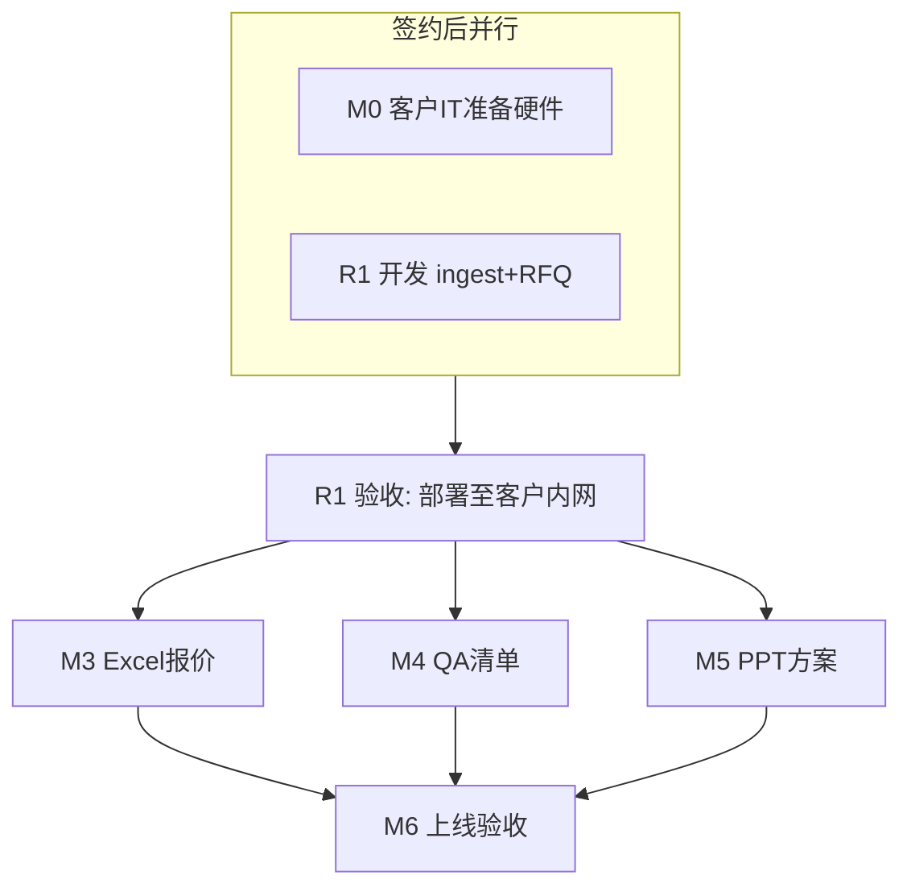

# ARIA 报价助手 — 全量交付需求清单与报价

**版本：** v1.9 · 2026-06-29  
**文档同步：** 客户版 **v3.5** · v1.9 **缓冲前置 R1/M3/M4** · [m3/m4/m5 规格](supplementary/)  
**开发模式：** **1 人全职 + AI 辅助开发**  
**报价模型：** **里程碑固定总价**（变更另议）  
**客户：** EDAG（爱达克）

> 关联：[customer-feedback-baseline.md](customer-feedback-baseline.md) · [prod.md](../prod.md) v1.4 · [platform-brand.md](supplementary/platform-brand.md)

---

## 0. 产品定位与对外卖点（须写入交付方案）

> **PM 结论：** 对客户不能只卖「报价助手」，须同时交付 **可扩展的企业知识库平台能力**。

| 层级 | 本期交付 | 客户获得的长期资产 |
|------|---------|-------------------|
| **ARIA 平台** | 本地 LLM + RAG + Engagement 建库规范 + 运维脚本 | **企业知识库体系底座**，可挂接更多应用 |
| **报价助手** | RFQ / 对标 / QA / PPT / Excel 五步 | 首期业务价值 |
| **扩展路径** | 文档与架构预留 | 财务助手等应用复用同一 KB、同一 `${ARIA_DATA_ROOT}` |

**对客话术（建议写入 Word 方案第一节）：**

> 本项目交付的不仅是报价自动化，而是在贵司内网建立 **ARIA 智能应用平台** — 含可运营的历史项目知识库、本地大模型与统一检索能力。报价助手是首个应用；知识库结构（Engagement 项目包、manifest、分类型索引）可按贵司需要扩展至更多工程资料与 future AI 应用。

---

## 1. 资源估算方法论（对内）

### 1.1 校准锚点：8D 报告系统

| 项 | 8D 系统（已完成） | 说明 |
|----|------------------|------|
| 周期 | **1 个月**（全职 solo + AI） | ≈ **20–22 个有效开发日** |
| 技术栈 | Web 流程引导、上传、在线编辑（鱼骨图）、Docker、本地 DB、备份盘 | 与 ARIA 工程形态相近 |
| 文档输出 | **PPT 模板 + 占位符填充** | 与 ARIA 方案模块同类能力 |
| **不含** | RAG、向量库、本地大模型 | ARIA **新增**的主要复杂度 |

### 1.2 本次估算口径（solo + AI）

| 原则 | 说明 |
|------|------|
| **人日 = 日历日** | 您全职投入时，无团队并行；1 人日 ≈ 1 个工作日 |
| **Demo 代码抵扣** | RFQ 页、五步 UI、Excel PM+Chassis、KB 骨架已存在 → R1–R3 估时 **下调 30–40%** |
| **AI 辅助增益** | 脚手架、单测、API、文档：约 **节省 30%** 编码时间 |
| **AI 难加速项** | PPT shape 摸底、客户样本 Prompt 调优、Engagement 数据整理、UAT 往返：**接近全人工** |
| **首次 RAG 惩罚** | 知识库切块、检索评测、pgvector/Embedding 调优：在 M1/M2/M4 **+20% 缓冲** |
| **RAG Spike（显式）** | M1 含 **切块策略验证 + 检索评测集** 5 人日（见 §4.3） |
| **模块测试（显式）** | 每里程碑含单测/API 测/模块验收，合计约 **12 人日**（见 §4.4） |
| **客户等待** | Engagement 样本、UAT 排期、**M0 环境就绪**不计入开发日；**M0 与 R1 开发并行**，但 **R1 正式验收前须 M0 通过** |

### 1.3 与「团队版」人天的关系

| 维度 | 团队版（proposal 原估） | Solo 版（本文） |
|------|------------------------|----------------|
| 全量功能人天 | 112–135 人天（2 后端 + 1 前端并行） | **~92 人天**（串行 + Demo 抵扣 + AI 增益） |
| 日历工期 | 18–22 周 | **~18 周**（**R1 起算**；M0 客户并行） |
| 报价逻辑 | 人天 × ¥2,500 | **里程碑固定价**（见 §5） |

### 1.4 业界收费参考（企业内部私有化 LLM / RAG 应用）

> 非本项目中标价，用于校验数量级是否合理。

| 类型 | 国内市场常见区间（2024–2026） | 与本项目关系 |
|------|------------------------------|-------------|
| RAG PoC（单场景检索 + 简单问答） | ¥8 万 – ¥20 万 | 仅相当于 M1 |
| 单工作流文档自动化（模板 Excel/Word） | ¥15 万 – ¥40 万 | 相当于 M3 或 M4 单项 |
| **垂直业务平台**（RAG + 多模板输出 + 私有化部署） | **¥25 万 – ¥60 万** | 与全量 ARIA 可比 |
| 集成商多模块交付（含定制 Prompt、UAT、培训） | ¥40 万 – ¥80 万+ | 团队 3–5 人 × 3–6 月 |
| 企业知识库平台（含运营、权限、多 App） | ¥80 万 – ¥200 万+ | 超出本期范围 |

**结论：** 全量 solo 交付固定价 **¥28 万 – ¥36 万** 处于业界垂直 RAG 应用 **中位偏下**（因 solo 无团队管理费，但风险与单点依赖需体现在里程碑付款上）。

---

## 2. 产品功能需求清单（全量）

### 2.1 平台层（P0）

| ID | 功能项 | 描述 | 优先级 |
|----|--------|------|--------|
| P-01 | 本地私有化部署 | Docker Compose 生产画像、`ARIA_DATA_ROOT` 独立数据盘 | P0 |
| P-02 | Ollama 对接 | Qwen2.5 推理 + nomic-embed-text；`MOCK_*` 仅开发用 | P0 |
| P-03 | 统一 RAG 管道 | `RAGService.search()` 单一出口 | P0 |
| P-04 | Engagement 项目包 | manifest.json；RFQ + QA + 报价 + 方案关联入库 | P0 |
| P-05 | 知识库运营 | 统计、检索实验室、批量导入、Re-index | P0 |
| P-06 | 分类型切块 | RFQ 章节 / QA 行 / 报价 Sheet / 方案段 | P0 |
| P-07 | manpower_baselines | 历史报价 Excel 结构化为人天基线表 | P0 |
| P-08 | 健康检查与备份 | health API、日备脚本 | P0 |
| P-09 | 中文 Web UI | Ant Design；顶栏平台 + 报价助手导航 | P0 |

### 2.2 报价助手 — RFQ 与对标（P0）

| ID | 功能项 | 描述 | 客户反馈 |
|----|--------|------|---------|
| A-01 | RFQ 上传解析 | .docx + PDF 文本提取 | — |
| A-02 | Function / 交付物 / 里程碑 | LLM 结构化 JSON + Schema 校验 | — |
| A-03 | **技术维度清单** | LLM 输出维度列表 | **#5** |
| A-04 | **维度清单确认** | 工程师增删改后确认，再生成矩阵 | **#5** |
| A-05 | 相似项目检索 | **Top-3** + 相似度 + 来源（不足 3 个时 Warning） | — |
| A-06 | 技术维度对比矩阵 | 可编辑、保存、置信度 | — |
| A-07 | Function 缺口 Alert | 无历史参考的领域警告 | — |
| A-08 | 任务历史 | 多 RFQ 任务切换回看 | — |
| A-09 | 相似项目 Expand | 方案摘要 + 链至 QA | — |

### 2.8 知识库范围与 M3/M4/M5 消费（v3.5 · 架构分界）

> **2026-07-02：** 里程碑与 AI 边界以 [prod.md v1.5](../prod.md) · [客户版 v3.7](ARIA-报价助手-正式版交付方案与报价（客户版）.md) · [delivery-traceability.md](supplementary/delivery-traceability.md) 为准。下文部分表格仍为内部人日演算，**对外签约以 v3.7 固定价为准**。

**R1 建 Engagement 三件套知识库：** RFQ + Q_A + 报价（**必达**）；历史 Proposal **可选**（配对归档，**不作 M5 生成输入**）。

| 能力 | R1 | M3 | M4 | M5 |
|------|----|----|----|-----|
| RFQ 切块 + 向量 | ✓ | Top-3 + ScopeMatch | Top-3 选 Q_A 文件 | RFQ 预填模板 |
| Q_A **按行** ingest | ✓ | — | 读全表 Area 合并 | — |
| 报价 **baselines JSON** | ✓ | 抽取 + **时间轴重映射** | — | — |
| Proposal 可选入库 | 验证用 | — | — | **不用** RAG |
| LLM | ingest 可选 | `manpower_row_map` | `qa_dedupe` + `qa_impact_classify` | **不用**正文 |

**数据流（v3.5）：**

```
R1: manifest → RFQ/Q_A行/quote baselines
→ M3: ScopeMatch → 抽取岗位人天 → RFQ milestones 重排 Excel
→ M4: A/B/C Q_A → Area 合并 → 语义去重 → G/H 规则导出
→ M5: Content Template 34页 + proposal_fill_report
```

**规格：** [m3](supplementary/m3-scope-match-spec.md) · [m4](supplementary/m4-qa-merge-spec.md) · [m5](supplementary/m5-proposal-fill-spec.md) · [R1](R1-知识库验收与检索评测说明（客户版）.md)

**M5 人日/internal 价：** 原 ~19 人日 / ¥36,200 **待 PM 重估**（范围大幅缩减）。

---

### 2.9 M3 vs M4 复杂度对比（v3.5 修订）

| 维度 | M3 Excel 报价 | M4 QA 清单 |
|------|--------------|-----------|
| 主逻辑 | ScopeMatch + **baselines 抽取** + **时间轴算法** | Excel 合并 + **qa_dedupe** |
| LLM | **弱/中**（岗位行筛选；非填月列） | **中**（去重 + G 列；**不造题**） |
| 测试 | **高**（数字 + 日期 + 多 Sheet） | 中（去重质量 + 模板列） |
| **综合** | **偏高** | 中 |

**M3 人日 ≥ M4**；R1 含 quote/Q_A 解析与 baselines 验收。

---

### 2.3 报价助手 — 人力报价 Excel（P0）

| ID | 功能项 | 描述 | 客户反馈 |
|----|--------|------|---------|
| B-01 | 12 Sheet 模板复制 | 客户 `报价人力模板.xlsx` | — |
| B-02 | Project information 填充 | 客户/项目/里程碑 | — |
| B-03 | **9 Function Sheet 全填** | PM/BIW/Interior/GI/Chassis/CAE/EE/PS/Test | — |
| B-04 | **ScopeMatch + baselines 抽取** | Top-3 → best_match → scope 内岗位；**RFQ 时间轴重映射**（非整表粘贴） | **#4 v3.5** |
| B-05 | Manpower 汇总 | 各 Function 人天合计 | — |
| B-06 | 差异说明 | LLM 文字说明（不写核心数字） | **#4** |
| B-07 | 导出前确认 | checkbox + review_status | — |
| B-08 | 交付物→人天说明表 | F4.8 真实基线（非 Mock） | — |

### 2.4 报价助手 — QA 澄清清单（P0）

| ID | 功能项 | 描述 | 客户反馈 |
|----|--------|------|---------|
| C-01 | 历史 QA **按行 ingest** | R1 全 8 列；M4 读 A/B/C 文件 | v3.5 |
| C-02 | **Area 合并 + qa_dedupe + qa_impact_classify** | 非 qa_generate 造题 | **#2 v3.5** |
| C-03 | QA 交付方式 | **仅生成 / 下载 Excel**（Q3 已确认 2026-07-04）；不做 Web 在线编辑 | Q3 ✓ |
| C-04 | **客户 Q_A 模板导出** | 8 列；C/E/F 生成时留空 | **#2** |
| C-05 | Question 双语格式 | `英文\n中文` | **#2** |

### 2.5 报价助手 — 技术方案 PPT（P0）

| ID | 功能项 | 描述 | 客户反馈 |
|----|--------|------|---------|
| D-01 | **Content Template 34页** | `Technical Proposal_Content_Template.pptx` | **#3 v3.5** |
| D-02 | **RFQ 预填 + scope 删页 + fill_report** | Slide 1/2；**非**四段式 AI 正文 | **客户澄清** |
| D-03 | 四段式填充 | 输入 / 前置条件 / 工作内容 / 交付物 | **#3** |
| D-04 | 按 Function 选页 | 无关模块页删除或保留占位 | — |
| D-05 | slide_mapping 配置 | 占位符 shape_id 映射（类 8D 经验） | — |
| D-06 | 品牌页 / 架构图 | 保留模板原图，不 AI 生成 | — |
| D-07 | Web 预览 + 下载 .pptx | `/proposal` | — |

### 2.6 人机协同与上线（P0）

| ID | 功能项 | 描述 |
|----|--------|------|
| E-01 | review_status 状态机 | draft → in_review → approved → exported |
| E-02 | 对比表 / QA 人工修订持久化 | |
| E-03 | audit trail（关键操作日志） | |
| E-04 | 引用反馈 → 再索引（可选增强） | P1 |
| E-05 | 用户手册 + IT 部署文档 | |
| E-06 | 工程师 + IT 培训 | 各 1 场 |
| E-07 | UAT 支持 | 3–5 人 × 3 份 RFQ |

### 2.7 明确不含

财务助手 · OA 集成 · 细粒度权限 · 扫描 RFQ OCR · AI 生成架构图 · 实验/外部费用核算

---

## 3. 交付发布顺序（客户逐步可用）

> 原则：**每发布一次，客户多一项可独立使用的生产能力**；顺序与架构、运维依赖一致。

### 3.0 前置门槛 M0 — 客户基础设施就绪（与 R1 **并行**，验收前完成）

> **运维结论：** 无 GPU + Ollama + 独立数据盘，**无法在内网验收真实知识库与 RFQ**。  
> **排期结论：** M0 **不占用开发主线日历** — 签约后 **客户 IT 即启动采购/装机**，与 **R1 开发同期进行**；开发方从 **第 1 周起算 R1**，前期可在开发机或 `MOCK_*` 环境推进 ingest / RFQ；**R1 正式验收与内网部署交付须在 M0 通过后**（通常 R1 第 5–6 周收尾时）。

| 项 | 责任方 | 目标时间 | 验收 |
|----|--------|---------|------|
| GPU 服务器到位 | 客户 IT | **签约后启动；R1 收尾前到位** | 可 SSH / 远程 |
| 独立数据盘挂载 `/data/aria` | 客户 IT | 同 M0 | `df` 可见 |
| Ollama + Qwen2.5 + embedding 模型 | 客户 IT（我方协助） | **R1 验收前** | `ollama list` 可用 |
| Docker + Compose 可运行 | 客户 IT（我方协助） | **R1 验收前** | hello 容器 |
| 内网访问 / VPN | 客户 IT | **R1 验收前** | 工程师可访问 :80 |

**M0 不单独计费**（含在 R1 实施服务内）；**服务器硬件与数据盘采购费用由贵司承担**（不在本项目报价内）。若需我方 **现场/远程部署协助**，可选 **¥8,000–15,000** 单列。

#### M0 职责分界（须写入对客方案）

| 类别 | **贵司 IT / 采购（主责）** | **开发方（协助）** |
|------|---------------------------|-------------------|
| **硬件** | 采购 GPU 服务器（建议 RTX 4090 级）、独立数据盘、网络 | 提供配置建议与验收清单 |
| **系统** | 操作系统安装、磁盘挂载 `/data/aria`、防火墙/VPN、SSH 账号 | 远程指导；可选现场协助（另议） |
| **软件** | 按文档安装 Docker、Ollama；开放内网访问端口 | 提供安装步骤、模型清单；协助 pull 模型 |
| **人员** | **指定 IT 对接人**；协调机房/采购周期 | M0 协助约 2 人日（含在 R1） |
| **验收** | 签字确认 M0 检查项通过 | 执行 health / compose / `ollama list` 联合验收 |

> 硬件与网络规格详见 [customer-it-infrastructure.md](customer-it-infrastructure.md)。**无贵司 IT 配合，无法完成 M0，亦无法完成 R1 内网正式验收。**

**日历影响：**

| 口径 | 说明 |
|------|------|
| **开发工期起算** | **签约后第 1 周 = R1 起点**（~96 人日 ≈ **18 周**开发主线） |
| **M0** | 客户并行准备，**不前置阻塞** R1 编码；仅阻塞 **R1 内网验收签字** |
| **R1 分两阶段对内** | ① 开发/单测（可用 Mock）→ ② M0 就绪后 **生产画像部署 + 检索/对标终验** |

### 3.1 里程碑总览（修订版）



| 发布 | 名称 | 客户可做什么 | 计划时间 | 预估工作量** | 依赖 |
|------|------|-------------|---------|------------|------|
| **M0** | 基础设施就绪 | IT 环境可跑真实 LLM/RAG | **与 R1 并行**；**R1 验收前完成** | 协助 **2 人日**（贵司 IT 主导） | **贵司 IT 采购装机**（主责） |
| **R1** | **知识库 + RFQ 对标** | **全类型入库** + baselines + 上传 RFQ + 维度确认 + 对比矩阵 | **第 1–8 周** | **45 人日**† | Engagement；**验收时** M0 |
| **M3** | 人力报价 Excel | scope 内 Function + **RFQ 时间轴** + fill report | 第 **9–11** 周 | **22 人日**† | R1 |
| **M4** | QA 澄清清单 | Q_A 模板导出 | 第 **12–13** 周 | **13 人日** | R1 |
| **M5** | 技术方案 PPT | **34 页 Content Template** 预填 + 报告 | 第 **14–17** 周 | **11 人日** | R1 |
| **M6** | 生产上线 | UAT、培训、备份演练 | 第 **18–20** 周 | **10 人日** | M3–M5 |
| **合计** | — | — | **约 20 周**（R1 起算） | **约 101 人日**† | — |

† **v1.9 修订：** 见 §4.0 / §4.0.2。对外 **签约价仍 ¥183,000**；原 4d 项目缓冲 **前置摊入 R1(+2)/M3(+1)/M4(+1)**，M6 仅 UAT/移交。

\* **开发主线日历**从 R1 第 1 周起算；M0 为客户 IT 并行项，延误则仅推迟 R1 **签字验收**，不必然推迟 R1 **编码**起点。  
\*\* **预估工作量** = 开发方 solo 全职人日（含实施、Spike、模块测试）；详见 §4.1。

**对内编号：** R1 = 原 M1 + M2 合并对客户验收（见 §3.2）。

### 3.2 M1 与 M2 是否分开交付？（PM 结论）

| 方案 | 单独 M1 时客户能做什么 | 是否推荐对客户分里程碑 |
|------|----------------------|----------------------|
| 仅知识库 | `/knowledge` 检索、导入；**可查历史项目**，但 **不能走 RFQ 报价主流程** | 可作**内部迭代**，不宜作首期唯一验收 |
| M1 + M2 | 完整「上传 RFQ → 对标」— **报价工程师核心增效起点** | **推荐合并为 R1 首期验收** |

**建议：**

- **合同与 Word 方案：** 首期付款与验收绑定 **R1（知识库 + RFQ 对标）**，不单拆 M1 收款。
- **实施过程：** 仍可先做完 ingest 再做完 RFQ，但 **不对客户做「仅知识库」的正式签字**（除非明确为 IT 预验收）。

### 3.3 技术依赖 vs Demo 五步流程

| 维度 | 是否必须按 Demo 顺序？ | 说明 |
|------|----------------------|------|
| **开发 / 里程碑交付顺序** | **否** | M3、M4、M5 可任意排列，只要 **R1** 已完成 |
| **工程师使用习惯（UI 五步）** | **建议保留，但不阻塞** | 当前导航：`RFQ → 对比矩阵 → 方案 → QA → 报价`（见 `WorkflowSteps.tsx`）— 这是**业务叙事顺序**，不是 API 硬依赖 |
| **单页是否可独立验收** | **是** | 例如仅交付 M4 时，客户可在 `/qa` 生成并导出 Excel，**无需**先出 PPT 或报价 |

| 里程碑 | 除 R1 外是否依赖其他业务模块 | 主要消费的任务字段 / 知识库 |
|--------|------------------------------|---------------------------|
| **M3 Excel** | 无 | `rfq_modules`、`comparison_table`、`manpower_baselines` |
| **M4 QA** | 无 | `rfq_modules`；KB 历史 QA 行 |
| **M5 PPT** | 无 | `rfq_modules`、`functions_in_scope`；**R1 历史方案段 + 相似项目方案摘要**（不重建库） |

### 3.4 推荐交付顺序（M3/M4/M5）

以下为 **solo 开发排期建议**，不是技术强制顺序：

| 策略 | 顺序 | 适用场景 |
|------|------|---------|
| **A · 业务价值优先（当前文档默认）** | M3 → M4 → M5 | 先让报价 Excel 可用（客户反馈 #4 强） |
| **B · 对齐 Demo 五步叙事** | M5 → M4 → M3 | 与客户演示路径一致：方案 → QA → 报价 |
| **C · 对齐客户输出编号** | M4 → M5 → M3 | 输出 1 QA → 输出 2 方案 → 输出 4 报价 |
| **D · 风险后置** | M4 → M3 → M5 | PPT 最耗时、最像 8D，放最后攻坚 |

**合同建议：** 首期验收 **R1**；M3–M5 顺序可调整；**M6 前全部完成**。

### 3.5 UI 与未交付模块的共存

某里程碑未交付时，对应页面可继续显示「开发中」或保留 Demo 预览 Tag，**不影响**已交付页面的真实能力；`WorkflowSteps` 可按 `artifacts_status` 逐步从 Mock 切为真实。

### 3.6 模块难度与风险分级

> **对内排期、报价、风险缓冲：建议标。**  
> **对客合同附件：只放「风险 / 客户配合」列即可**，不必写「开发难度」，避免引发议价或误解。  
> **对客三列表：** [附录 §2.5](../附录-模块能力与验收配合说明（客户版）.md#25-各里程碑实施关注点复杂度客户视角)

采用 **低 / 中 / 高** 三档（solo + AI、首次 RAG 前提下）：

| 里程碑 | 开发难度 | AI 质量不确定性 | 客户配合敏感度 | 综合 | 说明 |
|--------|---------|----------------|---------------|------|------|
| **R1** KB+RFQ | **高** | **高** | **高** | **高** | 含多类型入库 + RAG Spike；**+2d 样本调优缓冲** |
| **M3** Excel | **高** | 中 | **高** | **高** | **ScopeMatch + 时间轴 remap**；**+1d 选源返工缓冲** |
| **M4** QA | 中 | **高** | **高** | **中** | qa_dedupe + G 列；**+1d 回归缓冲** |
| **M5** PPT 预填 | **中** | 低 | 中 | **中** | **34 页 Content Template**；无 AI 正文；见 v3.5 |
| **M6** 上线 | 低 | 低 | 中 | 低 | 联调 + **UAT 缺陷修复 2–3d**；**不含** 跨阶段项目缓冲 |

**为何 M3 综合为「高」：** ScopeMatch + 时间轴 remap + 9 Sheet 数字验收，虽 LLM 弱于 M4，**表格与算法风险**占主导。

**v1.9 缓冲策略：** 原 §4.1 末行 **4d 浮动缓冲** 前置摊入 R1/M3/M4（见 §4.0.2），避免风险堆积在 M6。

---

### 3.7 模块复杂度与工时对照（内部 · v1.9）

> **对客版本：** [附录-模块能力与验收配合说明（客户版）.md](../附录-模块能力与验收配合说明（客户版）.md) §2.5 — **不含** 本表人日与 XL/L 档位。

#### 3.7.1 里程碑级（对内排期）

| 里程碑 | 工程复杂度 | AI 不确定 | 数据/算法风险 | **v1.9 承诺** | **P50 排期** | 测试已含 |
|--------|-----------|----------|--------------|-------------|-------------|---------|
| **R1** | XL | 高 | 高 | **45** | 47 | 8d 模块测 + Spike 10d + **缓冲 2d** |
| **M3** | XL | 中 | **高** | **22** | 25 | 4d + Spike 5d + **缓冲 1d** |
| **M4** | L | 高 | 中 | **13** | 13 | 3d + Spike 2d + **缓冲 1d** |
| **M5** | M | 低 | 中 | **11** | 11 | 3d + Spike 1d |
| **M6** | M | 低 | 中 | **10** | 10 | 2d + UAT 修缺陷 2–3d |
| **合计** | — | — | — | **101** | **106** | 模块测试 **~12d** 已摊入 R1–M5 |

#### 3.7.2 子模块级（开发经理视图）

| 子模块 | 复杂度 | v1.9 约算 | 最大风险 |
|--------|--------|----------|----------|
| manifest + 多类型 ingest | M | 6–8 | 无真实 Engagement |
| RFQ 切块 + Top-3 检索 | M | 6–8 | 检索准度 |
| **§四 development_scope 解析** | L | 4–6 | RFQ 模板差异 |
| Q_A 按行 ingest | M | 3–5 | — |
| quote → baselines 解析 | L | 5–8 | Excel 格式差 |
| `/knowledge` 验收台 | M | 5–7 | — |
| RFQ 维度确认 + 对比矩阵 | L | 8–10 | Prompt 迭代 |
| **ScopeMatchService** | L | 8–11 | **选源争议 R-M3-01** |
| 时间轴 remap + 9 Sheet 填充 | L | 8–12 | 模板列对齐 |
| Q_A 合并 + qa_dedupe | M | 8–10 | 去重质量 |
| M5 模板预填 + fill report | M | 9–11 | scope 映射签收 |

#### 3.7.3 101 人日是否含测试与 Bug 返修

| 类别 | 人日（约） | 是否计入 101 |
|------|-----------|-------------|
| 各里程碑 **模块测试**（单测/API/模块验收） | **~12** | ✓ 摊入 R1–M5 |
| Spike / Prompt / 算法调优 | **~18** | ✓ |
| M6 **集成 UAT 修缺陷** | **2–3** | ✓ 含在 M6 10d |
| 项目 **缓冲（前置）** | **4** | ✓ 摊入 R1(+2)/M3(+1)/M4(+1)；**不** 堆在 M6 |
| **多轮客户 UAT 返工** | 未单列 | ✗ 超出走变更单 / 日历顺延 |
| **真实样本到位后 1–2 周调优** | 未单列 | ✗ 日历顺延（合同 §4.5） |
| **质保期 P0/P1** | 未单列 | ✗ M6 后 3 个月 |

**对内结论：** 101 = **开发 + 自测 + 一轮终验小修**；**P50 排期建议 106 人日**（各阶段小量前置缓冲 + M6 隐性 Bug，不写入对客承诺）。

---

## 4. 分项工时估算（solo + AI，全职）

### 4.0 修订说明（v1.8 · 算法风险 + v3.5 范围）

**背景：** 正式签约前 **尚无客户真实 Engagement**；v3.5 引入 **ScopeMatch、§四 scope 解析、时间轴重映射** — M3 算法不确定性高于 v1.6「Top-1 + baselines 填充」假设。

**策略：** 对外 **固定价 ¥183,000 不变**；对内人日从 **M5 缩减（-8）** 挪至 **R1/M3 算法 Spike（+9）** + **项目缓冲 +1**。

| 里程碑 | v1.6 | **v1.8 对内** | Δ | 依据 |
|--------|------|--------------|---|------|
| **R1** | 40 | **43** | +3 | §四 `development_scope` Spike(2)；ScopeMatch **合成样本**评测框架(1) |
| **M3** | 16 | **21** | +5 | **ScopeMatch 算法** Spike(3)；时间轴 remap(1)；`quote_fill_report`(1) |
| **M4** | 11 | **12** | +1 | `qa_dedupe` + 10 条回归 |
| **M5** | 19 | **11** | −8 | v3.5 Content Template；无 RAG 正文 |
| **M6** | 10 | **10** | 0 | 维持 |
| **项目缓冲** | 3 | **4** | +1 | 签约前无真实文件 **日历** 风险 |
| **合计** | **96** | **101** | **+5** | M5 −8 与 R1/M3/M4 +9 部分对冲 |

**里程碑付款（对客）：** 仍 R1 ¥76,300 · M3 ¥30,500 · M4 ¥21,000 · M5 ¥36,200 · M6 ¥19,000 — **总价不变**；内部视为 M5 价款 **补贴** M3 算法攻坚（PM 可另议是否下调 M5 标价）。

**砍价底线：** 92→**97 人日** 时须书面缩减：ScopeMatch 联合评测条数、M3 Function 数量、或 M3 岗位行 LLM 改为纯规则。

---

### 4.0.2 v1.9 缓冲前置（2026-06-29）

**问题：** v1.8 将 **4d 项目缓冲** 单列在 §4.1 末行（§3.6 误标为「M6+缓冲」），与 **R1/M3 实际风险位置** 不匹配。

**调整：** 总价 **101 人日 / ¥183,000 不变**；4d 摊入高风险里程碑：

| 里程碑 | v1.8 | **v1.9** | 缓冲用途 |
|--------|------|---------|---------|
| **R1** | 43 | **45** | +2d 样本到位后入库/检索/§四解析微调 |
| **M3** | 21 | **22** | +1d ScopeMatch 选源争议、remap 列对齐 |
| **M4** | 12 | **13** | +1d qa_dedupe 回归 |
| **M5** | 11 | 11 | — |
| **M6** | 10 | 10 | 纯 UAT/培训/移交 + 终验小修 |
| ~~项目缓冲~~ | ~~4~~ | **0** | 已前置 |

**对客日历：** 仍 **约 18 周**；§十一「样本到位后 1–2 周调优」为 **客户配合类日历顺延**（不加价），与上表内部缓冲 **互补**。

---

### 4.0.1 v1.6 历史（归档）

v1.6 在 92 人日上 +4 → 96 人日；v1.8 在 v3.5 架构下 rebalance 为 **101 人日**；v1.9 将 4d 浮动缓冲 **前置**（见 §4.0.2）。

### 4.1 开发工时（含 Spike 与测试 · v1.9 对内）

| 发布 | 实施 | RAG/数据/算法 Spike | 模块测试 | **合计** | 日历周 |
|------|------|---------------------|---------|---------|--------|
| **M0** 环境协助 | 2 | — | — | **2** | 与 R1 并行 |
| **R1** KB+RFQ+入库 | 27† | **10**‡ | **8** | **45** | **8** |
| **M3** Excel 报价 | **13** | **5**§ | **4** | **22** | **3–4** |
| **M4** QA 清单 | **8** | 2 | **3** | **13** | 2 |
| **M5** PPT 预填 | **7** | 1 | **3** | **11** | **2** |
| **M6** 上线移交 | **8**¶ | — | **2** | **10** | 1.5 |
| **合计** | | | | **~101** | **~20 周** |

† R1 实施含 **+2d 前置缓冲**（样本/解析微调）  
‡ **R1 Spike 10 日：** RFQ 切块(2) + 检索评测(2) + quote baselines(2) + Q_A 行(1) + **§四 development_scope 解析(2)** + **ScopeMatch 合成评测集(1)**  
‡ **R1 实施另含（未单列 Spike）：** 单套/小批量 Web 上传（≤5 套/次）约 **+3～5 人日**，吃进 R1 **+2d 缓冲** 或 ingest 实施包  
§ **M3 Spike 5 日：** **ScopeMatch 算法** 与权重(3) + **里程碑→月列 remap**(1) + **2–3 份报价格式/合成 engagement**(1)  
¶ M6 实施 **8d** 含 UAT 协调、培训、备份演练及 **终验小修 2–3d**

#### M3 增量工作（v3.5 · 相对 v1.6）

| 工作项 | 人日 |
|--------|------|
| ScopeMatchService（scope 树 + 交付物 + 技术要求） | 3 |
| baselines **抽取** + scope→Sheet 映射（非整表粘贴） | 3 |
| RFQ **时间轴重映射** + Project information | 2 |
| `manpower_row_map` LLM + `quote_fill_report` | 2 |
| 9 Function + Manpower 汇总 + /quote UI | 3 |
| **Spike + 测试**（见 §4.1 表） | 9 |
| **实施小计（不含 Spike 重复计）** | **~12 实施 + 5 Spike + 4 测 ≈ 21** |

#### M4（v3.5）

| 原因 | 说明 |
|------|------|
| 主路径 | Area 合并 + **`qa_dedupe`** + G/H 规则（非 qa_generate） |
| +1 人日 | dedupe Prompt 回归 + 8 列模板 |

---

### 4.5 算法与技术风险登记（签约前 · 无真实样本）

> **PM/架构结论：** 下列风险 **已部分计入 §4.0 v1.8 人日**；未计入部分靠 **合同顺延 + 变更单** 兜底。

#### A. 高风险（须在合同 / R1 签字物中锁定）

| ID | 风险 | 触发条件 | 对交付影响 | 已缓冲 | 未覆盖时的处理 |
|----|------|---------|-----------|--------|----------------|
| **R-M3-01** | **ScopeMatch 选源争议** | 客户认为 best_match 不应是 A 而是 B | M3 验收失败、返工 | **M3 +3 Spike** | **M3 验收增：** 3 份 RFQ **联合 ScopeMatch 签字**；不通过则算法迭代（含在 21 人日内）；仍失败 → **变更单** |
| **R-RFQ-01** | **§四 development_scope 解析失败** | RFQ 模板与样例不一致 | M3/M5 全阻塞 | **R1 +2 Spike** | R1 验收含 **§四 解析率 KPI**（≥3 样本中 ≥2 可解析）；达不到 **不签 R1 或书面降级** |
| **R-DATA-01** | **签约前无真实 Engagement** | 算法仅用脱敏/合成/公开结构样本 | 上线后首轮真实 Excel 格式炸裂 | R1/M3 Spike 各 1 | 合同：**真实 3–5 套包到位后 1–2 周调优窗口**（日历顺延，不加价）；超出 → 变更单 |
| **R-XLS-01** | **历史报价 Excel 格式差异** | 合并单元格、隐藏 Sheet、公式 | baselines 解析失败 | quote parse 2d + M3 1d | R1 **failed_files 报告**；客户签收标准样本 |

#### B. 中风险

| ID | 风险 | 缓冲 | 缓解 |
|----|------|------|------|
| **R-M3-02** | **时间轴 remap** 与模板 milestone 列不对齐 | M3 +1 | 签收 `报价人力模板.xlsx` 列映射；单测锁定 D 列起 |
| **R-M3-03** | **manpower_row_map** LLM 选岗不稳定 | M3 含在 LLM 2d | 可降级 **纯规则全保留 Function 行**；UI 提示工程师删行 |
| **R-M4-01** | **qa_dedupe** 误删/漏删 | M4 +1 | 10 条固定回归；工程师 Web 可编辑 |
| **R-M4-02** | **qa_impact_classify** G 列争议 | 含 M4 Prompt | 源行 G 有值则 **不调用 LLM** |
| **R-RAG-01** | **Top-3 不足 3 个** | 0 开发 | 已产品化 Warning；ScopeMatch 在 N=1..3 均须可运行 |
| **R-RAG-02** | **RFQ 向量检索不准** | R1 评测 2d | ≥15 query 签字；Hybrid 不进 R1 |

#### C. 低风险 / 日历风险

| ID | 风险 | 处理 |
|----|------|------|
| **R-M5-01** | scope→slide 映射与客户理解不一 | M5 前书面映射表；`proposal_fill_report` |
| **R-M0-01** | GPU/数据盘延误 | 日历顺延；不签 R1 |
| **R-UAT-01** | 客户 UAT 排期空档 | 日历顺延 |

#### D. 合同建议（谈合同前写入）

1. **R1 阻塞项：** 3–5 套 Engagement **三件套** + M0 就绪；否则 R1 签字顺延。  
2. **R1 验收含 Spike Gate：** ingest 0 failed（已知例外书面列明）；§四 解析 + Top-3 对标 + baselines 对照。  
3. **M3 验收含 ScopeMatch Gate：** 双方对 **≥3 个 RFQ** 的 `best_match` **书面确认或接受系统说明**；含 `quote_fill_report`。  
4. **真实样本到位后：** 含 **1–2 周** 入库/解析/ScopeMatch **调优**（日历，非新增软件开发费）；超出范围走变更单。  
5. **固定价边界：** 新增 Function、新增 Sheet 映射规则、Hybrid/Rerank → 变更单。

#### E. 签约前可做的「无客户文件」准备（不占里程碑，但降风险）

| 动作 | 人日（售前） | 产出 |
|------|-------------|------|
| 用 **模板空文件 + 1–2 份公开/脱敏样例** 跑通 baselines 解析 | 1–2 | 解析器 v0 |
| **合成 3 组** engagement（manifest + 假 RFQ scope 树 + 假 quote）测 ScopeMatch | 2–3 | 算法单测 + 权重初值 |
| §四 解析 Prompt 对 **客户 RFQ 模板截图/目录** 做 dry-run | 1 | prompt-spec 更新 |

**合计约 4–6 人日售前** — 可不计入 101，但 **强烈建议签约前完成**，否则 R1 第 1–2 周爆炸。

---

### 4.2 RAG Spike 范围（R1 内 · v1.8）

| Spike 项 | 人日 | 产出 |
|---------|------|------|
| RFQ 切块策略 | 2 | 章节切块规范 |
| RFQ 检索评测（3 份标注） | 2 | 命中率基线 |
| 报价 Excel → baselines 解析 | 2 | ≥2 份可查询 |
| Q_A 行级切块 + 检索抽检 | 1 | 8 列 metadata |
| **§四 development_scope 解析** | **2** | JSON schema + 回归样本 |
| **ScopeMatch 合成评测（3 组）** | **1** | 权重初值 + 单测 |
| **小计** | **10** | **未通过不进入 R1 验收** |

### 4.3 各模块测试清单（每里程碑必含）

| 里程碑 | 单元/API 测试 | 模块验收测试 | 回归 |
|--------|-------------|-------------|------|
| **M0** | — | health、Ollama、compose up | — |
| **R1** | ingest（**含 quote+qa**）、search、rfq API | 3 RFQ 对标 + **baselines 可查** + **QA 行可检** | 检索评测集 |
| **M3** | excel generator | 9 Sheet + **汇总 UI** + 数字追溯 | **2–3 份历史报价格式** |
| **M4** | qa generator | 8 列模板 + 10 条样例 | QA schema |
| **M5** | ppt generator | 33 页抽样人工审阅 | 选页逻辑 |
| **M6** | 全量 `run_tests` | 3–5 人 UAT × 3 RFQ | 发布前全绿 |

**测试合计约 12 人日**，已摊入 §4.1「模块测试」列。

### 4.4 与 8D 项目对比（数量级校验）

| 对比项 | 8D 系统 | ARIA 全量 |
|--------|---------|-----------|
| 有效开发日 | ~22 | ~96（约 **4.4×**） |
| 日历 | 1 个月 | **~4.5 个月**（**R1 起算 18 周**） |
| 新增技术域 | — | RAG + 本地 LLM + 多 Prompt |
| 相似能力 | PPT 占位符填充、Docker、Web 流程 | M5、P-01、五步 UI |
| 输出物数量 | 1 类 PPT | Excel + QA Excel + PPT + 对标表 |

**4× 倍数合理**：RAG Spike/测试显式化后略高于原 3.5× 估算。

---

### 5.0 报价模型对照（市场里程碑价 vs 个人月收入价）

> **编制人收入假设：** 税前 **¥42,000 / 月**（solo 全职；含少量议价空间），折合 **¥1,909 / 人日**（按 22 个工作日/月）。

#### 工时 → 收入成本（您的底线参考）

| 口径 | 计算 | 金额 |
|------|------|------|
| **开发日合计** | 85 人日 ÷ 22 日/月 ≈ **3.9 人月** | **¥163,800** |
| **修订后（v1.6）** | **96 人日** × ¥1,909/日 | **¥183,264** |
| **对外签约取整** | 96 人日；约 **4.4 人月** × **¥4.2 万/月** | **¥183,000** |
| **日历周期** | ~18 周（**R1 起算**；M0 客户并行） | 同上 |

#### 按里程碑拆分（96 人日 · 对外总价 ¥183,000）

| 里程碑 | 开发日 | 签约金额（¥） |
|--------|--------|----------------|
| M0+R1 | 40 | **76,300** |
| M3 | 16 | **30,500** |
| M4 | 11 | **21,000** |
| M5 | 19 | **36,200** |
| M6 + 缓冲 | 10 | **19,000** |
| **合计** | **96** | **183,000** |

*M6 段 ¥19,000 建议拆为：终验 **¥13,800** + 质保尾款 **¥5,200**。*

* **当前采用：签约价 ¥183,000**（96 人日；**¥4.2 万/月** × 4.4 人月；含 **+4 人日** 关键缓冲）；裸成本 **¥176,000**（92 人日）为砍价底线。*

#### 成本价里程碑拆分（**当前签约方案 · v1.6**）

| 里程碑 | 开发日 | 金额（¥） |
|--------|--------|----------|
| **R1**（含 M0 协助 2 日） | 40 | **76,300** |
| **M3** Excel | 16 | **30,500** |
| **M4** QA | 11 | **21,000** |
| **M5** PPT | 19 | **36,200** |
| **M6** + 缓冲 | 10 | **19,000** |
| **合计** | **96** | **183,000** |

#### 两种对外报价策略

| 模型 | 总价 | 说明 |
|------|------|------|
| **A · 裸成本（92 人日）** | **¥176,000** | 无缓冲；砍价底线 |
| **B · 当前签约（96 人日）** | **¥183,000** | 含 +4 人日关键缓冲；**推荐对客** |
| **C · 市场里程碑价** | **¥33 万** | 业内私有化 RAG 参考 |

#### 签约里程碑占比（与 §5.1 付款一致）

| 里程碑 | 占人日% | 金额（¥） |
|--------|--------|----------|
| R1 | 42% | 76,300 |
| M3 | 17% | 30,500 |
| M4 | 11% | 21,000 |
| M5 | 20% | 36,200 |
| M6+缓冲 | 10% | 19,000 |
| **合计** | | **183,000** |

---

## 5. 里程碑固定报价

> **当前签约：¥183,000**（96 人日，§5.0）。裸成本 **¥176,000**（92 人日）为砍价底线。市场参考 **¥330,000** 仅供对照。

### 5.0 签约里程碑（当前对客 · v1.6）

| 里程碑 | 交付验收标准 | 开发日 | **固定价（¥）** |
|--------|-------------|--------|----------------|
| **R1** 知识库+RFQ | M0 通过；全类型入库；3 RFQ 对标 | 40 | **76,300** |
| **M3** Excel | 9 Function + 汇总 UI | 16 | **30,500** |
| **M4** QA | Q_A 8 列；12 条样例 | 11 | **21,000** |
| **M5** PPT | 33 页四段式 .pptx | 19 | **36,200** |
| **M6** + 缓冲 | UAT；培训；备份演练 | 10 | **19,000** |
| **合计** | | **96** | **183,000** |

### 5.0b 市场参考价里程碑

> 若客户预算充足或需含风险溢价，可参考 **¥33 万** 档位（原 v1.1）。

| 里程碑 | 交付验收标准 | 工作周期 | 开发日 | **固定价（¥）** | 累计 |
|--------|-------------|---------|--------|----------------|------|
| **M0** | GPU、数据盘、Ollama、Docker 就绪 | **与 R1 并行**；R1 验收前 | 2 | （含在 R1） | — |
| **R1** 知识库+RFQ | M0 通过；**全类型入库**+检索；3 RFQ 对标；**baselines+QA 行可检** | **第 1–6 周** | 38 | **115,000** | 115,000 |
| **M3** Excel | 9 Function xlsx；汇总 UI；岗位可追溯历史 | 第 7–9 周 | 15 | **48,000** | 163,000 |
| **M4** QA | Q_A 8 列；10 条样例认可 | 第 10–11 周 | 10 | **38,000** | 201,000 |
| **M5** PPT | 33 页四段式 .pptx | 第 12–15 周 | 18 | **85,000** | 286,000 |
| **M6** 上线移交 | UAT；培训；备份演练；**集成终验** | 第 16–17 周* | 6 | **44,000** | **330,000** |

\*第 16–17 周为开发/培训；客户集成 UAT 可与 M5 后并行，不单独拉长总工期。

### 5.1 付款节奏建议

> **原则：** **验收一批、付款一笔**；**签约不付款**，首笔在 **R1 验收**；**质保尾款** 在 M6 后 1–3 个月释放。付款与里程碑签字一一对应（§5.4）。

#### 方案一 · **签约价 ¥183,000**（v1.6 · 推荐对客）

里程碑金额：R1 ¥7.63万 · M3 ¥3.05万 · M4 ¥2.1万 · M5 ¥3.62万 · M6+缓冲 ¥1.9万

| 序号 | 付款节点 | 触发条件 | 金额（¥） | 累计 |
|------|---------|---------|----------|------|
| — | **合同签订** | 双方签字；贵司启动 M0、提交 Engagement 计划 | **0** | — |
| 1 | **R1 阶段验收** | M0 通过 + 全类型知识库 + 3 RFQ 对标签字 | **76,300** | 42% |
| 2 | **M3 阶段验收** | 9 Function Excel + 汇总页签字 | **30,500** | 58% |
| 3 | **M4 阶段验收** | Q_A 模板 + 样例签字 | **21,000** | 70% |
| 4 | **M5 阶段验收** | 33 页 PPT 签字 | **36,200** | 90% |
| 5 | **M6 集成终验** | 全链路 UAT + 培训 + 备份演练签字 | **13,800** | 97% |
| 6 | **质保尾款** | 上线后 **3 个月**无 P0 | **5,200** | 100% |
| | **合计** | | **183,000** | |

*签约 **不付款**；首笔 **¥7.63 万**在 R1 验收后支付。超出 96 人日范围的 UAT 返工走变更单。*

**可选简化：** M4+M5 合并一次付 **¥64,900**。

**砍价底线：** 可回落至 **¥176,000**（92 人日裸成本），需相应缩减缓冲与样例验收条数（变更单）。

#### 方案二 · 市场参考价 **¥33 万**（议价上限参照）

| 序号 | 付款节点 | 比例 | 金额（¥） | 条件 |
|------|---------|------|----------|------|
| — | 合同签订 | 0% | 0 | 启动；同步 M0 |
| 1 | R1 验收 | 35% | 115,500 | M0+R1 |
| 2 | M3 验收 | 15% | 49,500 | Excel 可用 |
| 3 | M4 验收 | 12% | 39,600 | QA 可用 |
| 4 | M5 验收 | 13% | 42,900 | PPT 可用 |
| 5 | M6 终验 | 15% | 49,500 | 集成 UAT + 培训 |
| 6 | 质保尾款 | 10% | 33,000 | 3 个月无 P0 |

*33 万方案亦可采用「签约不预付」；若客户坚持签约预付，可恢复 20% 预付并相应冲减 R1 尾款。*

#### 付款安排要点

| 要点 | 建议 |
|------|------|
| **签约** | **0 元**；以合同 + Engagement 计划 + M0 并行为启动条件 |
| **首笔款** | **R1 验收** ¥7.63 万（约 42%）；覆盖前 6 周主要投入 |
| **计价口径** | **签约价** 96 人日 × ¥1,909 ≈ **¥18.3 万**；裸成本 92 人日 ≈ **¥17.6 万**（砍价底线） |
| **中间里程碑** | M3/M4/M5 各付各的 |
| **质保金** | 保留 **¥1 万** 或总价 5–10% |
| **逾期** | 验收合格 15 日内付款；逾期可暂停下一里程碑 |
| **solo 风险** | 无预付款时，合同宜明确：客户样本/M0 延误不视为我方违约；R1 验收标准书面锁定 |

### 5.2 报价构成说明（对客户可简述）

- 含：平台+知识库体系、报价助手全功能、RAG 评测与模块测试、Docker 交付、文档、培训、UAT  
- 不含：服务器硬件、Ollama 模型下载、客户脱敏人工、差旅、年度运维（可选 ¥3–5 万/年）

### 5.4 分阶段验收 vs M6 终验（业内惯例）

> **PM 结论：** 分阶段交付 = **分阶段验收 + 分阶段付款**；M6 **不是**把各阶段测试重做一遍，而是 **集成终验 + 移交 + 质保启动**。

#### 业内常见做法（定制化软件 / AI 项目）

| 类型 | 何时做 | 谁签字 | 本项目对应 |
|------|--------|--------|-----------|
| **阶段功能验收** | 每个里程碑交付后 | 业务 + 项目经理 | **R1 / M3 / M4 / M5 各自验收**（已写验收标准） |
| **阶段测试** | 该里程碑开发完成时 | 开发方内部 + 客户抽检 | §4.3 各模块「模块测试」列（已摊入 R1–M5） |
| **集成 / 终验** | 全部模块交付后 | 业务负责人 | **M6：全链路走通 1–3 份 RFQ** |
| **培训与移交** | 终验前后 | IT + 关键用户 | M6：工程师培训 + IT 培训 + 备份演练 |
| **质保 / 尾款** | 上线后 1–3 个月 | 按合同 | 付款 15% 质保金（可与 M6 终验签字联动） |

#### M6 到底包含什么？（避免重复计费）

| 工作项 | 应放在 M6？ | 说明 |
|--------|------------|------|
| R1 检索评测、M3 Excel 样例测试… | **否** | 已在各阶段「模块测试」人日 |
| 全链路 RFQ→对标→QA→PPT→Excel 集成回归 | **是** | 约 **1–2 人日** |
| `run_tests` 发布前全绿 | **是** | 约 **0.5–1 人日** |
| 客户集成 UAT（3–5 人 × 0.5–1 天） | **是（日历）** | 客户时间；开发方 **2–3 人日** 修缺陷 |
| 用户手册定稿、培训 2 场 | **是** | 约 **2 人日** |
| 备份 / 恢复演练 | **是** | 约 **0.5–1 人日** |
| review_status / audit（若未在前序做完） | **视情况** | 可前移到 R1 起逐步交付 |

**修订后 M6 开发日建议：6–8 人日**（原 11 略偏高，因部分测试已摊入 R1–M5）。  
**日历 2 周** = 约 1 周开发/培训 + **1 周客户 UAT 排期窗口**（非全为开发）。

#### M6 报价 ¥55,000 是否合理？

| 视角 | 判断 |
|------|------|
| 占总价 17% | 偏高若仅「终验」；合理若含 **培训 + 集成修复 + 1 个月 hypercare 答疑（可选写进合同）** |
| 与 M3（9 日 / ¥4万）比 | M6 单价高因 **客户侧协调、UAT 往返、移交文档** — 属 PM/交付成本 |
| **建议** | 总价不变时：M6 **¥45,000**（纯终验+培训）+ 可选 **hypercare ¥10,000**；或维持 ¥55,000 但合同写清交付物 |

#### 推荐付款与验收对齐（签约价 ¥183,000）

| 节点 | 验收类型 | 付款（¥） |
|------|---------|----------|
| 合同签订 | 项目启动 | **0** |
| R1 | **阶段验收**（KB+RFQ） | **76,300** |
| M3 | **阶段验收** | 30,500 |
| M4 | **阶段验收** | 21,000 |
| M5 | **阶段验收** | 36,200 |
| M6 | **集成终验** | 13,800 |
| 质保期满 | 无 P0 | 5,200 |

### 5.3 可选单列

| 可选项 | 估价 |
|--------|------|
| M0 远程/现场部署协助 | ¥8,000 – 15,000 |
| 协助整理 Engagement（首批 5 项目） | ¥15,000 – 25,000 |
| 扫描版 RFQ OCR | ¥20,000 起 |
| 上线后 1 个月 hypercare 答疑 | ¥10,000（或含在 M6） |
| **年度运维包**（应用小版本 + 模型升级协助） | ¥30,000 – 50,000 / 年 |
| **单次 LLM 升级陪跑**（评测 + 灰度 + 回滚预案） | ¥8,000 – 15,000 / 次 |

### 5.5 大模型升级与运维（须整理，但分两层）

> **运维结论：** 必须给客户 **文档 + 可执行脚本 + 首次演练**；**不等于**把今后每次模型升级都包进 33 万固定价。

#### 两层边界

| 层级 | 内容 | 是否含在 33 万首期 | 责任方 |
|------|------|-------------------|--------|
| **A. 移交基线（M6 必交）** | 运维文档、一键脚本、升级流程、备份恢复演练 | **是** | 开发方交付；客户 IT 执行 |
| **B. 持续运维（质保后）** | 每 6–12 个月模型评估、代跑回归、现场升级、7×24 | **否** | 客户 IT 为主；可选年度服务 |

#### A. 首期应交付的文档（已有草稿，M6 定稿移交）

| 文档 | 路径 | 内容 |
|------|------|------|
| 部署与数据盘 | [deployment-guide.md](deployment-guide.md) | Compose、Ollama、GPU |
| 运维手册 | [ops-guide.md](ops-guide.md) | 巡检、Prompt/模型版本、故障 |
| IT 基础设施说明 | [customer-it-infrastructure.md](customer-it-infrastructure.md) | 对客户 IT |
| **LLM 升级 SOP** | deployment-guide **§7** | 评估→测试→.env→Re-index→灰度→回滚 |
| 版本上线测试 | deployment-guide **§8** | 回归 + UAT 流程 |

**建议新增（M6 前补齐）：** `docs/llm-upgrade-runbook.md` — 客户 IT 一页纸 Runbook（比 deployment-guide 更短）。

#### A. 首期应交付的脚本（已有 + 建议补充）

| 脚本 | 状态 | 用途 |
|------|------|------|
| `deploy/scripts/start.sh` | 已有 | 启动 |
| `deploy/scripts/stop.sh` | 已有 | 停止 |
| `deploy/scripts/backup.sh` | 已有 | 日备 |
| `deploy/scripts/reindex.sh` | 已有 | Embedding 变更后重建索引 |
| `run_tests.ps1` / `run_tests.sh` | 已有 | 升级后回归门禁 |
| **`deploy/scripts/preflight-ollama.sh`** | **建议新增** | 检查 Ollama/GPU/模型/health |
| **`deploy/scripts/upgrade-model-checklist.sh`** | **建议新增** | 拉模型 → 跑 regression → 输出通过/失败 |

M6 验收增加：**客户 IT 在见证下完成一次备份恢复 + preflight 脚本跑通**。

#### B. 大模型升级标准流程（写入合同附件摘要）

```
1. 评估：新模型兼容性说明（开发方或年度服务）
2. 备份：backup.sh
3. 测试环境：ollama pull + preflight + run_tests --regression
4. 配置：更新 .env OLLAMA_MODEL（及 EMBEDDING_MODEL 若变）
5. Re-index：仅 Embedding 变更时执行 reindex.sh
6. 灰度：1–3 名工程师试用 1 周
7. 全量 / 回滚：改回 .env + restart
```

**升级必测项（与 RAG 相关）：** RFQ 解析 JSON 成功率、检索 Top-3 命中率、1 份端到端 RFQ 对标、各 Generator 冒烟。

#### B. 日常维护做什么（客户 IT + 知识库管理员）

| 频率 | 事项 | 脚本/文档 |
|------|------|----------|
| 每日 | 备份 cron；磁盘空间 | backup.sh |
| 每周 | health API；Ollama 响应 | ops-guide §1 巡检 |
| 每月 | 知识库增量导入；Function 覆盖检查 | ingest / KB UI |
| 每季 | `run_tests` 冒烟；日志抽查 | ops-guide |
| 6–12 月 | LLM/Embedding 升级评估 | deployment-guide §7 |
| 按需 | Re-index、Prompt 小版本 | 年度服务或按人天 |

#### 估算是否计入 33 万？

| 工作 | 人日 | 计入 |
|------|------|------|
| 整理/定稿运维文档 + Runbook | 2 | **M6** |
| preflight / upgrade-checklist 脚本 | 1–2 | **M6** |
| M6 备份恢复联合演练 | 0.5 | **M6** |
| **今后每次模型升级陪跑** | 2–3 / 次 | **年度服务或单列** |
| **全年运维值班** | — | **¥3–5 万/年**（proposal 已有参考） |

---

## 6. 客户配合与关键路径

| 时间 | 客户动作 | 阻塞 |
|------|---------|------|
| **签约后即刻** | **M0：贵司 IT 采购/准备 GPU 服务器、独立数据盘、网络/VPN**；我方协助 Ollama/Docker 安装与验收 | **仅 R1 正式验收/内网部署** |
| 签约后 1 周内 | 指定 **IT 对接人**；启动硬件采购（若未到位） | M0 进度跟踪 |
| 签约后 1 周内 | 提供 **3–5 个脱敏 Engagement** + 签收模板 | R1 入库 |
| R1 第 5–6 周前 | **M0 须就绪**（硬件+模型+Compose） | R1 **签字验收** |
| R1 期间 | 指定知识库管理员 + IT 对接人 | 入库与对标 |
| R1 期间 | 提供 2–3 份 RFQ 用于 Prompt/检索评测 | 对标质量 |
| M5 前 | 确认 33 页与 Function 映射 | PPT 验收 |
| 各里程碑末 | 2–3 名工程师 UAT（0.5–1 天） | **阶段验收签字** |
| **M6** | IT 参与备份恢复演练 + 运维培训 | 终验 |

---

## 7. 风险与假设

### 7.1 估算已含 vs 未含（延迟谁买单）

| 类别 | 已计入 ~96 人日 | **未计入**（日历可能顺延，不自动增加开发报价） |
|------|----------------|----------------------------------------------|
| 开发与测试 | 各里程碑实施 + Spike + 模块测试 | — |
| 风险缓冲 | 项目缓冲 **4 人日** 已 **前置摊入 R1/M3/M4**（v1.9）；RAG Spike 已摊入各阶段 | — |
| AI 辅助 | 按 **solo + AI**（编码约 30% 增益） | AI 无法加速的 Prompt/数据整理仍占满人日 |
| 客户侧 | — | **M0 采购周期、样本拖延、UAT 空档、多轮返工** |
| 范围 | — | 模板大改、页数增加、新增模块 → **变更单** |

> **对客口径：** 表中「计划 18 周」指开发方 **全职投入且客户按时配合** 的主线；下列风险导致延误时，**里程碑签字与付款节点相应顺延**，不视为开发方单方违约（除非合同另有约定）。

### 7.2 可能造成开发/验收时间延迟的风险清单

| # | 风险 | 典型影响阶段 | 可能延迟 | 责任/缓解 |
|---|------|-------------|---------|----------|
| **R1** | **M0 硬件未在 R1 验收前到位**（GPU、数据盘、网络） | R1 签字验收 | **1–4 周+** | **贵司 IT** 签约即启动采购；我方协助验收 |
| **R2** | **Engagement 样本延迟或不全**（缺报价 Excel、Q_A、历史方案） | R1、M3、M4、M5 | **2–6 周** | **贵司** 1 周内提供 3–5 套；见确认单 |
| **R3** | **历史 Excel/PPT 格式与模板差异大**（多版本、合并单元格、非标准 Sheet 名） | R1 Spike、M3 | **3–10 人日** | 共同整理样本；必要时签「格式例外」 |
| **R4** | **RAG 检索命中率未达 Spike 基线**（切块/embedding/样本不足） | R1 | **1–3 周** | 我方调优；需客户补样本与人工标注评测集 |
| **R5** | **RFQ 解析或对标 Prompt 多轮不达标** | R1 | **1–2 周** | 客户提供 2–3 份代表性 RFQ；联合评测 |
| **R6** | **技术维度清单 / 对比矩阵争议**（反复改维度） | R1 | **3–7 天/轮** | 业务负责人尽早确认 F1.10 流程 |
| **R7** | **报价 Excel 数字准确性回归失败**（历史报价格式不一） | M3 | **1–2 周** | 签收模板 + 2–3 份标准历史报价 |
| **R8** | **Q_A 生成质量客户不认可**（双语、领域术语） | M4 | **1–2 周** | 补充历史 Q_A；Prompt 迭代 |
| **R9** | **PPT 页码与 Function 映射未书面确认** | M5 | **1–3 周** | M5 前签收映射清单 |
| **R10** | **PPT 模板 shape/占位符与预期不符**（需重新摸底） | M5 | **1–2 周** | 签约时锁定模板版本 |
| **R11** | **客户 UAT 排期空档**（工程师无暇试用） | 各里程碑末 | **1–2 周/次** | 每阶段提前预约 0.5–1 天 UAT |
| **R12** | **UAT 多轮返工超出单里程碑测试预算** | M3–M6 | **按轮 3–5 人日** | 区分缺陷 vs 新需求；新需求走变更 |
| **R13** | **IT 防火墙/权限导致内网无法访问** | M0、R1 部署 | **3–10 天** | IT 提前开端口与 VPN |
| **R14** | **Ollama 模型下载或 GPU 驱动问题** | M0 | **2–5 天** | IT + 我方远程协助 |
| **R15** | **开发方非全职或并行其他项目** | 全线 | **同比顺延** | 合同约定投入度 |
| **R16** | **范围蔓延**（加 Function、加 PPT 页、加 PDF OCR 等） | 受影响模块 | **变更单另估** | 签约范围以 §2 为准 |
| **R17** | **模板/字段签约后变更**（Q_A、报价、Proposal 换版） | M3–M5 | **3–15 人日/次** | 变更控制；大改变里程碑价 |

### 7.3 关键假设（若不成立 → 顺延）

| 假设 | 若不成立 |
|------|---------|
| 开发方 **solo 全职** 投入本项目 | 日历 **同比顺延** |
| **M0 在 R1 验收前完成** | R1 **签字验收**顺延（编码可先用 Mock/开发机） |
| 客户 **4 周内** 提供完整 Engagement + 签收模板 | R1 及 M3/M4/M5 **连锁顺延** |
| Engagement 含 **报价 + Q_A + 历史方案**（至少各 1 份可检索） | M3/M4/M5 质量或工期受影响 |
| Excel / PPT **模板结构稳定**（签约版） | 模板变更 → **变更单** |
| 33 页为 **模块动态页**（非 54 页全填） | 已在 M5 范围界定 |
| 各里程碑 UAT **2–3 人 × 0.5–1 天** 可排期 | 验收签字顺延 |

### 7.4 高风险项（建议写进合同附件或会议纪要）

1. **R1 + R2 + R4**：知识库与样本 — 首期最大不确定性  
2. **R9 + R10**：PPT — 工时最像 8D，模板摸底不可省  
3. **R11 + R12**：客户 UAT — 日历拖延最常见；前置 **4 人日**缓冲覆盖 R1/M3/M4 小返工，M6 仅终验小修；超出走变更单  

### 7.5 Oral FAQ（对内 · 不出现在对客 Word）

| 客户问题 | 建议应答口径 |
|---------|-------------|
| 「你们团队几个人？分别负责什么？」 | 本项目为 **专项交付**：**项目负责人 1 名全职投入**，统筹架构、开发、部署与联调，也是贵司 **唯一固定对接窗口**；测试、验收支持与操作手册由同一负责人 **一体化交付**（非大型驻场团队）。对客文档见易懂版 §4.4。 |
| 「能否安排开发工程师和测试工程师同时参会？」 | 里程碑评审与双周例会由 **项目负责人** 代表乙方出席即可；必要时远程协调贵司 IT 或硬件厂商。不要求两名独立工程师同时到场。 |
| 「183,000 怎么算出来的？日费率多少？」 | 本报价为 **里程碑固定总价**，按阶段验收付款，**不按人天计费**。对客可提供 **阶段参考人日**（约 101 人日 / 20 周，见易懂版 §6.1 表 A），说明工作量分布；**不提供日费率表**，避免被按工时砍价。若采购书面强制要求费率附件，再单独评估是否出方式 B（非默认）。 |
| 「R1 占 42%，为什么第一期花钱多、看到的东西少？」 | R1 交付的是 **全项目共用底座 + 可演示系统**：内网知识库、3–5 套入库、baselines、15 条检索评测、3 份 RFQ 对标全流程与 **R1 签字件**；M3–M6 均依赖此底座。详见易懂版 §5.1–§5.2 与 R1 验收说明。 |
| 「能不能只做 60 人天、打折？」 | 固定总价已含风险缓冲；范围以里程碑交付物为准。若 **缩小范围**（如去掉 M5），可变更单重新评估；**不按人天折扣**。 |

---

## 8. 文档维护

- 功能变更 → 更新 §2 并重新评估对应里程碑价格  
- ~~客户书面确认 Q2/Q3~~ → **已完成 2026-07-04**（见 [customer-feedback-baseline.md](customer-feedback-baseline.md) v1.3）
- 实际开工后 → 每里程碑结束更新「实际人日」列供复盘  

---

**编制说明：** 本清单基于 solo+AI 校准（8D 项目 1 个月锚点）、ARIA 现有 Demo 抵扣、业界私有化 RAG 项目市价区间交叉校验。**最终合同价以双方签章为准。**
