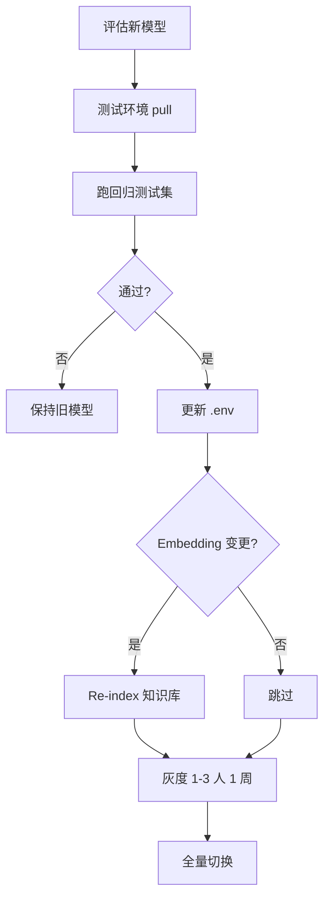

# ARIA 智能应用平台 — 部署方案

**首期应用：** ARIA 报价助手  
**版本：** v1.4 · 2026-07-07  

---

## 目录

1. [部署架构](#1-部署架构)
2. [服务器配置要求](#2-服务器配置要求)
   - [2.4 模型选型与扩展规划](#24-模型选型与扩展规划)
   - [2.5 Demo 双档验收与 Stub 说明](#25-demo-双档验收与-stub-说明)
3. [环境准备](#3-环境准备)
4. [Ollama 安装与配置](#4-ollama-安装与配置)
5. [ARIA 应用部署](#5-aria-应用部署)
6. [网络与访问](#6-网络与访问)
7. [LLM 定期更新流程](#7-llm-定期更新流程)
8. [版本上线测试流程](#8-版本上线测试流程)
9. [备份与恢复](#9-备份与恢复)
10. [安全加固](#10-安全加固)

---

## 1. 部署架构

```
办公室员工 ─── 内网直连 ──► aria.company.internal (:80)
远程员工   ─── VPN ────────► 内网 ──► aria.company.internal

┌─────────────────────────────────────────────────────────┐
│  Ubuntu Server 22.04 LTS                                 │
│                                                          │
│  ┌──────────┐  ┌──────────────┐  ┌──────────────┐  ┌──────────────┐ │
│  │  Nginx   │  │ aria-frontend│  │ aria-backend │  │ aria-worker  │ │
│  │  :80     │──│  :3000       │  │  :8000       │  │  (同镜像)     │ │
│  └──────────┘  └──────────────┘  └──────┬───────┘  └──────┬───────┘ │
│                                          │                  │         │
│  ┌──────────────────────────────────────▼──────────────────▼───────┐ │
│  │ PostgreSQL 16 + pgvector（业务表 + 向量索引 + 任务队列）          │ │
│  └─────────────────────────────────────────────────────────────────┘ │
│                                          │               │
│  ┌──────────────────────────────────────▼───────────┐   │
│  │ Ollama (systemd, 非容器)                          │   │
│  │ localhost:11434                                   │   │
│  │ /data/ollama/models                               │   │
│  └───────────────────────────────────────────────────┘   │
│                                                          │
│  /opt/aria/deploy/  ← 应用交付（系统盘，可重装）            │
│                                                          │
│  /data/aria/       ← 独立数据盘（持久化，可整块迁移）       │
│    app/            → 容器 /app/data                       │
│      uploads/ outputs/ knowledge_base/ templates/          │
│    postgres/       → PostgreSQL（含 pgvector 向量）         │
│    backups/        → 每日备份                              │
│                                                          │
│  /data/ollama/models  ← 大模型文件（同数据盘挂载点 /data）   │
└─────────────────────────────────────────────────────────┘
```

**Deployment Profile（部署画像）：**

| Profile | Compose 文件 | 数据盘 | 用途 |
|---------|--------------|--------|------|
| **dev** | `docker-compose.yml` | 否（`./backend/data`） | 本地开发、CI、`run_tests` |
| **experience** | `docker-compose.aliyun-demo.yml` | 否 | 4C8G 远程 UI Mock |
| **production** | `docker-compose.prod.yml` | **是**（`/data/aria`） | 内网 GPU 生产 |

**设计原则：**

- ARIA 应用容器化（Docker Compose）；**生产**使用 `docker-compose.prod.yml` 将 PG 与业务数据 bind 到 `${ARIA_DATA_ROOT}`（默认 `/data/aria`）
- Ollama 独立进程（GPU 直通、模型文件大）；模型目录 `/data/ollama/models`
- **应用（/opt/aria/deploy）与数据（/data）分离**，换机时可 rsync `/data` 后重装应用
- 源码不交付，镜像黑盒部署

---

## 2. 服务器配置要求

### 2.1 三档配置对比

| 指标 | 基础版 | 推荐版 ★ | 旗舰版 |
|------|--------|---------|--------|
| CPU | 16 核 | 32 核 | 64 核 |
| 内存 | 64 GB | 128 GB ECC | 256 GB |
| GPU | 无 | RTX 4090 24G | A100 40G |
| 系统盘 | 500 GB SSD | 1 TB NVMe | 2 TB NVMe |
| 数据盘 | 4 TB HDD | 8 TB RAID1 + 2 TB SSD | 16 TB RAID5 |
| 推理速度 | 5–10 tok/s | 30–50 tok/s | 80–120 tok/s |
| 并发用户 | 3–5 | 10–15 | 20–30 |
| 适用模型 | 7B/14B | **32B Q4** ★ | 32B 全精度 / 多卡并行 |
| 预算参考 | 2–4 万 | **6–10 万** | 20 万+ |

### 2.1.1 客户容量建议（问卷 2026-07-07）

| 问卷项 | 客户答案 | 部署建议 |
|--------|----------|----------|
| 使用人数 | 10–20 人 | **推荐版**（10–15 并发浏览） |
| 忙时同时干活 | 3–5 人 | 单 `aria-worker` + `OLLAMA_MAX_CONCURRENT=1` |
| 集中使用 | 很少错开 | 不必多 worker 副本 |
| 排队容忍 | 可等几分钟 | SLA：5 人连排 **≤10 分钟** |

**环境变量（生产 `.env` 须含）：** `JWT_SECRET`、`AUTH_ENABLED=true`、`OLLAMA_MAX_CONCURRENT=1`、`TASK_JOB_AVG_SECONDS=120`

**首次部署：** 运行 `deploy/scripts/create_admin.py` 创建 `kb_admin`；IT 预置工程师账号（10–20 个）。

### 2.2 推荐版详细配置

```
处理器：  Intel Xeon Silver 4314 × 2（32 核 64 线程）
内存：    128 GB DDR4 ECC
显卡：    NVIDIA RTX 4090 24 GB × 1
系统盘：  1 TB NVMe SSD
数据盘：  8 TB HDD × 2（RAID1）+ 2 TB SSD（模型文件）
电源：    1200 W 80+ 金牌冗余
操作系统：Ubuntu Server 22.04 LTS
网络：    双千兆网口
UPS：     在线式 2 KVA
```

### 2.3 存储规划

> **生产环境：** 建议配置 **独立数据盘**，挂载至 `/data`（见 [customer-it-infrastructure.md](customer-it-infrastructure.md)）。

| 路径 | 预估大小 | 说明 |
|------|---------|------|
| `/data/ollama/models` | 20–80 GB | 模型文件（32B≈20G） |
| `/data/aria/postgres` | 1–30 GB | PostgreSQL（**含 pgvector 向量索引**） |
| `/data/aria/app/knowledge_base` | 10–500 GB | 历史项目原始文档 |
| `/data/aria/app/uploads` | 1–10 GB | 用户上传 RFQ |
| `/data/aria/app/outputs` | 1–10 GB | 生成文件 |
| `/data/aria/app/templates` | &lt; 100 MB | Excel/QA 模板（首次部署从交付包复制） |
| `/data/aria/postgres` | 1–20 GB | PostgreSQL 数据目录 |
| `/data/aria/backups` | 按保留策略 | 每日备份（保留建议 ≥30 天） |
| `/opt/aria/deploy` | &lt; 5 GB | 镜像包、compose、`.env`（系统盘） |

### 2.4 模型选型与扩展规划

> **原则：** 扩展性靠 ARIA 插件架构（Generator / Prompt / `.env` 换模型），**不要求 Day 1 安装最大参数量模型**。硬件按 **RTX 4090 24G** 采购，模型按阶段从 14B 升级到 32B 即可。

#### 2.4.1 ARIA 中哪些环节需要模型

| 环节 | 模型类型 | 是否必须大 LLM |
|------|----------|----------------|
| RFQ 解析（Function、里程碑、交付物） | 主 LLM（Qwen2.5） | 是 |
| 相似项目检索 | Embedding（`nomic-embed-text`） | 小模型即可 |
| 技术对比 / 置信度 | RAG + 规则 | 基本不靠 LLM |
| Excel 人力报价 | 模板 + 基线 | **否** |
| 方案/QA Stub（Demo 框架） | 无 LLM | **否** — 固定 Mock JSON |
| QA 清单 / PPT（Phase 2 全量） | 主 LLM | 是，文案质量敏感 |
| 财务规则（Phase 3） | 规则为主 | LLM 辅助有限 |

只需选型：**1 个主 LLM + 1 个 Embedding**（RAG 开启时）。

#### 2.4.2 主 LLM 推荐（按阶段）

| 阶段 | 推荐模型 | 典型显存 | 单次 RFQ（GPU） | `.env` |
|------|----------|----------|-----------------|--------|
| 内部开发 / 笔记本 | `qwen2.5:7b` | ~6 GB | 较慢 | `OLLAMA_MODEL=qwen2.5:7b` |
| **客户 Demo（Phase 1）** | **`qwen2.5:14b`** | ~16 GB | 约 30s–2min | `OLLAMA_MODEL=qwen2.5:14b` |
| **正式生产（Phase 2）** | **`qwen2.5:32b`（Q4）** | ~20 GB（4090 可跑） | 更稳、JSON 更规整 | `OLLAMA_MODEL=qwen2.5:32b` |
| 高并发 / 多用户 | 32B + 任务队列 | — | 加 GPU 或限流 | 同左 |

Embedding（知识库向量，与主 LLM 独立）：

| 模型 | 用途 | 何时需要 |
|------|------|----------|
| **`nomic-embed-text`** | RAG 检索 | `MOCK_RAG=false` 时 |

#### 2.4.3 按硬件倒推

| 客户 GPU | 现实选择 |
|----------|----------|
| 无独显 / &lt;8 GB | `MOCK_LLM=true`（流程 Demo）；或 7B CPU（不推荐对客户 Demo） |
| 8–12 GB | 7B 或 14B 量化 |
| **16 GB+** | **14B**（Demo 舒适区） |
| **24 GB（RTX 4090）★** | **14B 全速 / 32B Q4**（推荐采购档位） |
| 40 GB+（A100） | 32B 全精度；远期多模型并存 |

**口诀：** 有 4090 → Demo 用 14B，稳定后升 32B；无 GPU → 先 Mock，硬件到位再开真实 LLM。

#### 2.4.4 选型决策流程

```
开始
  │
  ├─ 是否已有 GPU（≥16 GB 显存）？
  │     否 → MOCK_LLM=true，先交付流程 Demo
  │     是 ↓
  │
  ├─ 当前阶段？
  │     Demo / Phase 1  → qwen2.5:14b
  │     生产 / Phase 2  → qwen2.5:32b
  │     本地开发        → qwen2.5:7b 或 Mock
  │
  ├─ 是否启用真实知识库（MOCK_RAG=false）？
  │     是 → ollama pull nomic-embed-text
  │
  └─ 验收：GET /api/v1/health
        ollama_reachable: true
        ollama_model_ready: true
        embedding_model_ready: true（若开 RAG）
```

Windows 开发机快速安装见 [local-llm-setup.md](local-llm-setup.md)（`scripts/setup_ollama.ps1` / `check_ollama.ps1`）。

#### 2.5 Demo 双档验收与 Stub 说明

Phase 1 交付为 **框架可认知 Demo**（见 [prod.md §9](../prod.md)），部署与验收分两档：

| 档位 | 依赖 Ollama | 依赖 GPU | 验收文档 |
|------|------------|---------|---------|
| **框架档** | 否（Stub 不调用 LLM） | 否 | prod §10.1.1；test-plan §6.1 |
| **能力档** | 是（`MOCK_LLM=false`） | 建议 16GB+ | prod §10.1.2 |

**Stub 环境变量：**

- `generate-proposal` / `generate-qa` **不需要**额外配置；与 `MOCK_LLM`、`MOCK_RAG` **无关**
- 能力档仍须：`OLLAMA_BASE_URL`、`OLLAMA_MODEL`、可选 `MOCK_RAG=false` + ingest

**部署检查（Demo 彩排前）：**

```bash
# 1. 容器与健康
curl -s http://localhost/api/v1/health | jq .

# 2. 能力档：LLM 就绪（若 MOCK_LLM=false）
# ollama_reachable / ollama_model_ready 应为 true

# 3. 框架档：Stub（实现后）
curl -s -X POST http://localhost/api/v1/rfq/tasks/{task_id}/generate-proposal
curl -s -X POST http://localhost/api/v1/rfq/tasks/{task_id}/generate-qa
# 应返回 demo_preview: true 与结构化 JSON
```

**对客户说明：** 使用 [demo-scope-brief.md](demo-scope-brief.md) 一页纸；演示时方案/QA 页须可见「Demo 预览」标识。

**UI 路由：** `/rfq` → `/proposal` → `/qa` → `/quote` → `/knowledge`（与 prod §7.2 一致）。

#### 2.4.5 如何验证「选对了」（3 份脱敏 RFQ）

| 指标 | 14B 可接受 | 建议升级到 32B |
|------|------------|----------------|
| JSON 一次解析成功 | 大部分成功 | 频繁 `parse_error` / 需重试 2–3 次 |
| Function / 模块识别 | 与人工一致 ≥80% | &lt;70% |
| 单次耗时（4090） | &lt;2 分钟 | &gt;3 分钟且 GPU 未满载 |
| 工程师手工改字段量 | 少量修正 | 需大面积手改 |

#### 2.4.6 扩展性与未来 AI 功能

| 扩展方式 | 是否需要更大模型 |
|----------|------------------|
| 新增 QA / PPT / 财务模块 | 通常 **14B → 32B** 即可 |
| Excel 全 9 Function | **不需要** LLM |
| 多模型路由（解析 32B + 摘要 14B，远期可选） | 两个中等模型并存；**首期生产 32B Q4 已足够** |
| 多用户并发 | **加 GPU / 队列**，非单纯换最大模型 |

**给客户的默认方案：**

| 角色 | 主模型 | Embedding | 硬件 |
|------|--------|-----------|------|
| Demo（节后） | 14B | nomic-embed-text | RTX 4090 或 ≥16 GB 显卡 |
| 生产（Phase 2） | 32B | nomic-embed-text | RTX 4090 24G × 1 |
| 开发（EDAG 内部） | 7B 或 Mock | 可选 | 现有笔记本 |

切换模型仅改 `.env`，无需改 ARIA 代码：

```bash
OLLAMA_MODEL=qwen2.5:14b   # 或 qwen2.5:32b
EMBEDDING_MODEL=nomic-embed-text
MOCK_LLM=false
```

---

## 3. 环境准备

### 3.0 Windows 开发机 / 国内网络（Docker Desktop）

开发阶段在 Windows 上使用 Docker Desktop 时，若拉取 `nginx`、`postgres`、`python` 等镜像失败（`registry-1.docker.io` 超时或 IPv6 不可达），在 **Docker Engine** 中配置：

```json
{
  "registry-mirrors": [
    "https://docker.m.daocloud.io",
    "https://docker.1ms.run"
  ],
  "ipv6": false
}
```

完整示例见 [docker-desktop-engine.example.json](docker-desktop-engine.example.json)。配置后使用项目根目录标准命令：

```bash
docker compose up --build
```

后端 `pip install` 若出现哈希校验失败，执行 `docker compose build --no-cache backend`；Phase 0 可用 `docker-compose.dev.yml` 跳过 AI 大包以缩短构建时间。详见 [README.md](../README.md)。

### 3.1 操作系统初始化

```bash
sudo apt update && sudo apt upgrade -y
sudo apt install -y curl wget git htop ufw nvtop

# 防火墙：仅开放必要端口
sudo ufw allow ssh
sudo ufw allow 80
sudo ufw allow 443
sudo ufw enable

# Docker
curl -fsSL https://get.docker.com | sudo sh
sudo usermod -aG docker $USER
sudo systemctl enable docker

# NVIDIA 驱动（GPU 服务器）
# 参考 NVIDIA 官方文档安装驱动 + nvidia-container-toolkit
```

### 3.2 目录创建（生产）

```bash
# 数据盘挂载至 /data 后执行（fstab 由客户 IT 配置）
export ARIA_DATA_ROOT=/data/aria

sudo mkdir -p "$ARIA_DATA_ROOT"/app/{uploads,outputs,knowledge_base,templates}
sudo mkdir -p "$ARIA_DATA_ROOT"/postgres
sudo mkdir -p "$ARIA_DATA_ROOT"/backups
sudo mkdir -p /data/ollama/models
sudo mkdir -p /opt/aria/deploy

# 首次部署：从交付包复制 Excel/QA 模板（若 app/templates 为空）
# cp -r /opt/aria/backend/data/templates/* "$ARIA_DATA_ROOT/app/templates/"

sudo chown -R "$USER:$USER" "$ARIA_DATA_ROOT" /data/ollama /opt/aria/deploy
```

**开发 / 远程体验环境** 无需上述目录，使用仓库内 `backend/data` 即可。

---

## 4. Ollama 安装与配置

> Ollama 及模型文件属于**客户基础设施**，不属于 ARIA 代码交付范围。ARIA 通过 HTTP 与之通信。

### 4.1 安装

```bash
curl -fsSL https://ollama.com/install.sh | sh
sudo systemctl enable ollama
```

### 4.2 安全加固（仅监听本机）

```bash
sudo mkdir -p /etc/systemd/system/ollama.service.d/
sudo tee /etc/systemd/system/ollama.service.d/override.conf << 'EOF'
[Service]
Environment="OLLAMA_HOST=127.0.0.1:11434"
Environment="OLLAMA_MODELS=/data/ollama/models"
EOF
sudo systemctl daemon-reload
sudo systemctl restart ollama
```

### 4.3 拉取模型

按 [§2.4 模型选型与扩展规划](#24-模型选型与扩展规划) 选择档位：

```bash
# Demo / 开发
ollama pull qwen2.5:14b
ollama pull nomic-embed-text

# 生产（推荐）
ollama pull qwen2.5:32b
ollama pull nomic-embed-text

# 验证
ollama run qwen2.5:32b "你好，请用一句话介绍自己"
```

### 4.4 无外网环境

1. 在有网机器 `ollama pull` 后打包 `/data/ollama/models`
2. U 盘传输至客户服务器
3. 放置到 `OLLAMA_MODELS` 目录
4. `systemctl restart ollama`

### 4.5 ARIA 环境变量

```bash
# .env
OLLAMA_BASE_URL=http://host.docker.internal:11434   # Linux 生产用 host 网络或 172.17.0.1
OLLAMA_MODEL=qwen2.5:32b
EMBEDDING_MODEL=nomic-embed-text
```

---

## 5. ARIA 应用部署

### 5.1 生产部署（GPU 服务器）

```bash
# 代码或交付包置于 /opt/aria（含 docker-compose.prod.yml）
cd /opt/aria
cp .env.production.example .env
nano .env   # POSTGRES_PASSWORD、MOCK_LLM=false、OLLAMA_MODEL 等

# 确认数据目录已创建（§3.2）
export ARIA_DATA_ROOT=/data/aria

# 启动（脚本位于 deploy/scripts/）
bash deploy/scripts/start.sh

# 验证
curl -s http://localhost/api/v1/health | python3 -m json.tool
```

Compose 文件：[docker-compose.prod.yml](../docker-compose.prod.yml)（`ARIA_DATA_ROOT` bind `app/` 与 `postgres/`）。

### 5.2 导入镜像（黑盒交付，可选）

```bash
scp aria-v1.0.0.tar.gz user@server:/opt/aria/deploy/
cd /opt/aria
docker load < deploy/aria-v1.0.0.tar.gz
cp .env.production.example .env
nano .env
bash deploy/scripts/start.sh
```

### 5.3 开发 / 本地 Demo 环境

```bash
git clone <repo-url> aria
cd aria
cp .env.example .env
# 配置 OLLAMA_BASE_URL=http://host.docker.internal:11434

ollama pull qwen2.5:14b
ollama pull nomic-embed-text

docker-compose up --build
```

**访问地址：**

- 前端：http://localhost:3000
- API 文档：http://localhost:8000/docs
- 健康检查：http://localhost:8000/api/v1/health

### 5.4 导入知识库

```bash
# 将历史文档放入数据盘知识库目录
rsync -avz ./knowledge_base/ /data/aria/app/knowledge_base/

# 批量导入（容器内路径仍为 /app/data/knowledge_base）
docker exec aria-backend python scripts/ingest_documents.py

# 增量更新：Phase 2 提供 incremental_update；Demo 可重复执行 ingest
```

### 5.5 版本更新

```bash
bash deploy/scripts/stop.sh
docker load < deploy/aria-v1.1.0.tar.gz   # 若使用镜像交付
bash deploy/scripts/start.sh
# ${ARIA_DATA_ROOT} 下数据不受影响
```

---

## 6. 网络与访问

### 6.1 Nginx 配置

```nginx
# nginx/aria.conf
server {
    listen 80;
    server_name aria.company.internal;

    client_max_body_size 50M;

    location / {
        proxy_pass http://aria-frontend:3000;
        proxy_set_header Host $host;
        proxy_set_header X-Real-IP $remote_addr;
    }

    location /api/ {
        proxy_pass http://aria-backend:8000;
        proxy_read_timeout 300s;
        proxy_set_header Host $host;
        proxy_set_header X-Real-IP $remote_addr;
    }
}
```

### 6.2 访问方式

| 用户 | 方式 |
|------|------|
| 办公室 | 内网 DNS `aria.company.internal` |
| 远程 | VPN 接入内网后同上 |

---

## 7. LLM 定期更新流程



| 步骤 | 责任方 | 动作 |
|------|--------|------|
| 1. 评估 | 开发方 | 提供兼容性说明、benchmark 对比 |
| 2. 测试环境验证 | 开发方 + 客户 IT | pull 新模型，跑 `run_tests.sh --regression` |
| 3. 更新配置 | 客户 IT | 修改 `.env` 中 `OLLAMA_MODEL` |
| 4. Re-index | 客户 IT / 开发方 | Embedding 变更时执行 `./scripts/reindex.sh` |
| 5. 灰度 | 业务负责人 | 1–3 名工程师试用 1 周 |
| 6. 全量 | 客户 IT | 确认无问题后正式切换 |
| 回滚 | 客户 IT | `.env` 改回旧模型 + `systemctl restart ollama` |

**建议频率：** LLM 模型每 6–12 个月评估；ARIA 应用每 1–3 个月小版本。

---

## 8. 版本上线测试流程

| 阶段 | 环境 | 测试内容 | 通过标准 |
|------|------|---------|---------|
| 1. 开发自测 | 本地 compose | `run_tests.sh` | 100% 通过 |
| 2. 集成测试 | 测试服务器 | 3 RFQ 端到端 + Excel 导出 | 无崩溃，文件可打开 |
| 3. 回归测试 | 测试服务器 | 固定 RFQ 集 + Prompt 版本 | 关键字段一致率 ≥ 90% |
| 4. UAT | 预生产 | 3–5 工程师试用 1 周 | 无 P0 阻塞 |
| 5. 生产上线 | 生产 | `./update.sh` + health check | 全容器 running，health 200 |

**每个版本交付：** `CHANGELOG.md` + 升级步骤 + 回滚步骤

---

## 9. 备份与恢复

### 9.1 自动备份

使用仓库脚本 [deploy/scripts/backup.sh](../deploy/scripts/backup.sh)：

```bash
# crontab: 0 2 * * * /opt/aria/deploy/scripts/backup.sh
bash /opt/aria/deploy/scripts/backup.sh
```

备份内容：

- `pg_dump` → `${ARIA_DATA_ROOT}/backups/YYYYMMDD/aria_db.sql`
- `rsync`：`app/` 下 `uploads`、`outputs`、`knowledge_base`、`templates` + `postgres/`（含 pgvector）
- 默认保留 30 天（环境变量 `RETENTION_DAYS`）

### 9.2 恢复（同机）

```bash
bash deploy/scripts/stop.sh

BACKUP=/data/aria/backups/20260618
APP=/data/aria/app

docker compose -f docker-compose.prod.yml up -d postgres
sleep 5
docker exec -i aria-postgres psql -U aria_admin -d aria_db < "$BACKUP/aria_db.sql"

for sub in uploads outputs knowledge_base templates; do
  [[ -d "$BACKUP/$sub" ]] && rsync -a "$BACKUP/$sub/" "$APP/$sub/"
done

bash deploy/scripts/start.sh
```

### 9.3 数据迁移（换服务器）

1. **旧机：** 停止服务 `deploy/scripts/stop.sh`；确认 `${ARIA_DATA_ROOT}` 与 `/data/ollama` 完整。
2. **传输：** `rsync -avz /data/ newhost:/data/`（或挂载磁盘至新机）。
3. **新机：** 安装 OS、Docker、NVIDIA 驱动、Ollama（§3–§4）；**无需重下模型**（若 `/data/ollama/models` 已迁移）。
4. **部署应用：** 放置交付包于 `/opt/aria`，`cp .env.production.example .env`，`deploy/scripts/start.sh`。
5. **验证：** `GET /api/v1/health`；抽样 RFQ 上传与对标。

**RPO / RTO 参考：** 日备 → RPO ≤ 24h；含硬件上架 RTO 约 4–8h（不含采购）。

---

## 10. 安全加固

| 项 | 措施 |
|----|------|
| Ollama | 仅 127.0.0.1:11434 |
| PostgreSQL | 不暴露公网，仅 Docker 内网 |
| 防火墙 | 仅 80/443 + SSH |
| 密码 | `.env` 强密码，不入 Git |
| HTTPS | 生产建议内网 CA 证书 |
| 登录 | 生产 `AUTH_ENABLED=true`；JWT 签发于 `JWT_SECRET`（`openssl rand -hex 32`） |
| 角色 | `kb_admin` 与 `quote_engineer` 两角色；账号由 IT 预置，不开放自助注册 |
| 密码 | 初始密码由 IT 分发；首次登录后建议修改；密码 hash 存 PostgreSQL（bcrypt） |
| 日志 | 不记录 RFQ 全文到外部 |

---

**关联文档：**

- [ops-guide.md](ops-guide.md)
- [customer-it-infrastructure.md](customer-it-infrastructure.md)
- [prod.md](../prod.md)
- [proposal.md](proposal.md)
