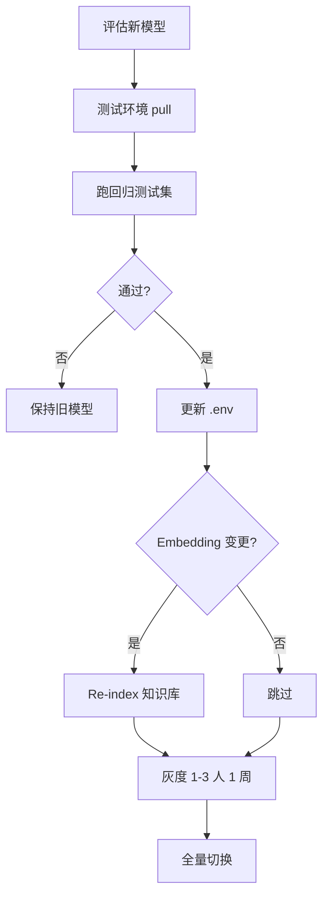

# ARIA 智能报价辅助系统 — 部署方案

**版本：** v1.0  
**日期：** 2026-06-18

---

## 目录

1. [部署架构](#1-部署架构)
2. [服务器配置要求](#2-服务器配置要求)
3. [环境准备](#3-环境准备)
4. [Ollama 安装与配置](#4-ollama-安装与配置)
5. [ARIA 应用部署](#5-aria-应用部署)
6. [网络与访问](#6-网络与访问)
7. [LLM 定期更新流程](#7-llm-定期更新流程)
8. [版本上线测试流程](#8-版本上线测试流程)
9. [备份与恢复](#9-备份与恢复)
10. [安全加固](#10-安全加固)

---

## 1. 部署架构

```
办公室员工 ─── 内网直连 ──► aria.company.internal (:80)
远程员工   ─── VPN ────────► 内网 ──► aria.company.internal

┌─────────────────────────────────────────────────────────┐
│  Ubuntu Server 22.04 LTS                                 │
│                                                          │
│  ┌──────────┐  ┌──────────────┐  ┌──────────────┐       │
│  │  Nginx   │  │ aria-frontend│  │ aria-backend │       │
│  │  :80     │──│  :3000       │  │  :8000       │       │
│  └──────────┘  └──────────────┘  └──────┬───────┘       │
│                                          │               │
│  ┌──────────────┐  ┌──────────────┐     │               │
│  │ PostgreSQL   │  │ ChromaDB     │     │               │
│  │  :5432       │  │ (文件存储)    │     │               │
│  └──────────────┘  └──────────────┘     │               │
│                                          │               │
│  ┌──────────────────────────────────────▼───────────┐   │
│  │ Ollama (systemd, 非容器)                          │   │
│  │ localhost:11434                                   │   │
│  │ /data/ollama/models                               │   │
│  └───────────────────────────────────────────────────┘   │
│                                                          │
│  /opt/aria/data/  ← Volume 挂载（不入镜像）              │
│    uploads/ outputs/ knowledge_base/ chroma_db/ templates/│
└─────────────────────────────────────────────────────────┘
```

**设计原则：**

- ARIA 应用容器化（Docker Compose）
- Ollama 独立进程（GPU 直通、模型文件大）
- 客户数据目录 Volume 挂载，容器重建不丢数据
- 源码不交付，镜像黑盒部署

---

## 2. 服务器配置要求

### 2.1 三档配置对比

| 指标 | 基础版 | 推荐版 ★ | 旗舰版 |
|------|--------|---------|--------|
| CPU | 16 核 | 32 核 | 64 核 |
| 内存 | 64 GB | 128 GB ECC | 256 GB |
| GPU | 无 | RTX 4090 24G | A100 40G |
| 系统盘 | 500 GB SSD | 1 TB NVMe | 2 TB NVMe |
| 数据盘 | 4 TB HDD | 8 TB RAID1 + 2 TB SSD | 16 TB RAID5 |
| 推理速度 | 5–10 tok/s | 30–50 tok/s | 80–120 tok/s |
| 并发用户 | 3–5 | 10–15 | 20–30 |
| 适用模型 | 7B/14B | 32B Q4 | 72B |
| 预算参考 | 2–4 万 | **6–10 万** | 20 万+ |

### 2.2 推荐版详细配置

```
处理器：  Intel Xeon Silver 4314 × 2（32 核 64 线程）
内存：    128 GB DDR4 ECC
显卡：    NVIDIA RTX 4090 24 GB × 1
系统盘：  1 TB NVMe SSD
数据盘：  8 TB HDD × 2（RAID1）+ 2 TB SSD（模型文件）
电源：    1200 W 80+ 金牌冗余
操作系统：Ubuntu Server 22.04 LTS
网络：    双千兆网口
UPS：     在线式 2 KVA
```

### 2.3 存储规划

| 路径 | 预估大小 | 说明 |
|------|---------|------|
| `/data/ollama/models` | 20–80 GB | 模型文件（14B≈9G, 32B≈20G） |
| `/opt/aria/data/chroma_db` | 5–50 GB | 向量库，随知识库增长 |
| `/opt/aria/data/knowledge_base` | 10–500 GB | 历史项目原始文档 |
| `/opt/aria/data/uploads` | 1–10 GB | 用户上传 RFQ |
| `/opt/aria/data/outputs` | 1–10 GB | 生成文件 |
| `/data/aria_backups` | 按保留策略 | 每日备份 |

---

## 3. 环境准备

### 3.0 Windows 开发机 / 国内网络（Docker Desktop）

开发阶段在 Windows 上使用 Docker Desktop 时，若拉取 `nginx`、`postgres`、`python` 等镜像失败（`registry-1.docker.io` 超时或 IPv6 不可达），在 **Docker Engine** 中配置：

```json
{
  "registry-mirrors": [
    "https://docker.m.daocloud.io",
    "https://docker.1ms.run"
  ],
  "ipv6": false
}
```

完整示例见 [docker-desktop-engine.example.json](docker-desktop-engine.example.json)。配置后使用项目根目录标准命令：

```bash
docker compose up --build
```

后端 `pip install` 若出现哈希校验失败，执行 `docker compose build --no-cache backend`；Phase 0 可用 `docker-compose.dev.yml` 跳过 LangChain/ChromaDB 以缩短构建时间。详见 [README.md](../README.md)。

### 3.1 操作系统初始化

```bash
sudo apt update && sudo apt upgrade -y
sudo apt install -y curl wget git htop ufw nvtop

# 防火墙：仅开放必要端口
sudo ufw allow ssh
sudo ufw allow 80
sudo ufw allow 443
sudo ufw enable

# Docker
curl -fsSL https://get.docker.com | sudo sh
sudo usermod -aG docker $USER
sudo systemctl enable docker

# NVIDIA 驱动（GPU 服务器）
# 参考 NVIDIA 官方文档安装驱动 + nvidia-container-toolkit
```

### 3.2 目录创建

```bash
sudo mkdir -p /opt/aria/{data/{uploads,outputs,knowledge_base,chroma_db,templates},deploy}
sudo mkdir -p /data/ollama/models
sudo mkdir -p /data/aria_backups
sudo chown -R $USER:$USER /opt/aria /data/ollama /data/aria_backups
```

---

## 4. Ollama 安装与配置

> Ollama 及模型文件属于**客户基础设施**，不属于 ARIA 代码交付范围。ARIA 通过 HTTP 与之通信。

### 4.1 安装

```bash
curl -fsSL https://ollama.com/install.sh | sh
sudo systemctl enable ollama
```

### 4.2 安全加固（仅监听本机）

```bash
sudo mkdir -p /etc/systemd/system/ollama.service.d/
sudo tee /etc/systemd/system/ollama.service.d/override.conf << 'EOF'
[Service]
Environment="OLLAMA_HOST=127.0.0.1:11434"
Environment="OLLAMA_MODELS=/data/ollama/models"
EOF
sudo systemctl daemon-reload
sudo systemctl restart ollama
```

### 4.3 拉取模型

```bash
# Demo / 开发
ollama pull qwen2.5:14b
ollama pull nomic-embed-text

# 生产（推荐）
ollama pull qwen2.5:32b
ollama pull nomic-embed-text

# 验证
ollama run qwen2.5:32b "你好，请用一句话介绍自己"
```

### 4.4 无外网环境

1. 在有网机器 `ollama pull` 后打包 `/data/ollama/models`
2. U 盘传输至客户服务器
3. 放置到 `OLLAMA_MODELS` 目录
4. `systemctl restart ollama`

### 4.5 ARIA 环境变量

```bash
# .env
OLLAMA_BASE_URL=http://host.docker.internal:11434   # Linux 生产用 host 网络或 172.17.0.1
OLLAMA_MODEL=qwen2.5:32b
EMBEDDING_MODEL=nomic-embed-text
```

---

## 5. ARIA 应用部署

### 5.1 导入镜像（生产）

```bash
# 收到交付包
scp aria-v1.0.0.tar.gz user@server:/opt/aria/deploy/
cd /opt/aria/deploy
docker load < aria-v1.0.0.tar.gz

# 配置
cp .env.template .env
nano .env   # 填写 POSTGRES_PASSWORD 等

# 启动
./scripts/start.sh
```

### 5.2 开发/Demo 环境

```bash
git clone <repo-url> aria
cd aria
cp .env.example .env
# 配置 OLLAMA_BASE_URL=http://host.docker.internal:11434

ollama pull qwen2.5:14b
ollama pull nomic-embed-text

docker-compose up --build
```

**访问地址：**

- 前端：http://localhost:3000
- API 文档：http://localhost:8000/docs
- 健康检查：http://localhost:8000/api/v1/health

### 5.3 导入知识库

```bash
# 将历史文档放入 knowledge_base/<项目名>/
rsync -avz ./knowledge_base/ /opt/aria/data/knowledge_base/

# 批量导入
docker exec aria-backend python scripts/ingest_documents.py

# 增量更新（后续）
docker exec aria-backend python scripts/incremental_update.py
```

### 5.4 版本更新

```bash
# deploy/scripts/update.sh v1.1.0
./scripts/stop.sh
docker load < aria-v1.1.0.tar.gz
# 更新 .env 中镜像 tag（如需要）
./scripts/start.sh
# 数据 Volume 完全不受影响
```

---

## 6. 网络与访问

### 6.1 Nginx 配置

```nginx
# nginx/aria.conf
server {
    listen 80;
    server_name aria.company.internal;

    client_max_body_size 50M;

    location / {
        proxy_pass http://aria-frontend:3000;
        proxy_set_header Host $host;
        proxy_set_header X-Real-IP $remote_addr;
    }

    location /api/ {
        proxy_pass http://aria-backend:8000;
        proxy_read_timeout 300s;
        proxy_set_header Host $host;
        proxy_set_header X-Real-IP $remote_addr;
    }
}
```

### 6.2 访问方式

| 用户 | 方式 |
|------|------|
| 办公室 | 内网 DNS `aria.company.internal` |
| 远程 | VPN 接入内网后同上 |

---

## 7. LLM 定期更新流程



| 步骤 | 责任方 | 动作 |
|------|--------|------|
| 1. 评估 | 开发方 | 提供兼容性说明、benchmark 对比 |
| 2. 测试环境验证 | 开发方 + 客户 IT | pull 新模型，跑 `run_tests.sh --regression` |
| 3. 更新配置 | 客户 IT | 修改 `.env` 中 `OLLAMA_MODEL` |
| 4. Re-index | 客户 IT / 开发方 | Embedding 变更时执行 `./scripts/reindex.sh` |
| 5. 灰度 | 业务负责人 | 1–3 名工程师试用 1 周 |
| 6. 全量 | 客户 IT | 确认无问题后正式切换 |
| 回滚 | 客户 IT | `.env` 改回旧模型 + `systemctl restart ollama` |

**建议频率：** LLM 模型每 6–12 个月评估；ARIA 应用每 1–3 个月小版本。

---

## 8. 版本上线测试流程

| 阶段 | 环境 | 测试内容 | 通过标准 |
|------|------|---------|---------|
| 1. 开发自测 | 本地 compose | `run_tests.sh` | 100% 通过 |
| 2. 集成测试 | 测试服务器 | 3 RFQ 端到端 + Excel 导出 | 无崩溃，文件可打开 |
| 3. 回归测试 | 测试服务器 | 固定 RFQ 集 + Prompt 版本 | 关键字段一致率 ≥ 90% |
| 4. UAT | 预生产 | 3–5 工程师试用 1 周 | 无 P0 阻塞 |
| 5. 生产上线 | 生产 | `./update.sh` + health check | 全容器 running，health 200 |

**每个版本交付：** `CHANGELOG.md` + 升级步骤 + 回滚步骤

---

## 9. 备份与恢复

### 9.1 自动备份

```bash
#!/bin/bash
# deploy/scripts/backup.sh
# crontab: 0 2 * * * /opt/aria/deploy/scripts/backup.sh

DATE=$(date +%Y%m%d)
BACKUP_DIR="/data/aria_backups/$DATE"
mkdir -p "$BACKUP_DIR"

cp -r /opt/aria/data/chroma_db "$BACKUP_DIR/"
docker exec postgres pg_dump -U aria_admin aria_db > "$BACKUP_DIR/aria_db.sql"
rsync -a /opt/aria/data/uploads/ "$BACKUP_DIR/uploads/"

find /data/aria_backups/ -maxdepth 1 -type d -mtime +30 -exec rm -rf {} \;
echo "[$(date)] ARIA backup completed" >> /var/log/aria_backup.log
```

### 9.2 恢复

```bash
# 停止服务
./scripts/stop.sh

# 恢复数据库
docker exec -i postgres psql -U aria_admin aria_db < /data/aria_backups/20260618/aria_db.sql

# 恢复向量库
cp -r /data/aria_backups/20260618/chroma_db /opt/aria/data/

# 启动
./scripts/start.sh
```

---

## 10. 安全加固

| 项 | 措施 |
|----|------|
| Ollama | 仅 127.0.0.1:11434 |
| PostgreSQL | 不暴露公网，仅 Docker 内网 |
| 防火墙 | 仅 80/443 + SSH |
| 密码 | `.env` 强密码，不入 Git |
| HTTPS | 生产建议内网 CA 证书 |
| 日志 | 不记录 RFQ 全文到外部 |

---

**关联文档：**

- [ops-guide.md](ops-guide.md)
- [prod.md](../prod.md)
- [proposal.md](proposal.md)
