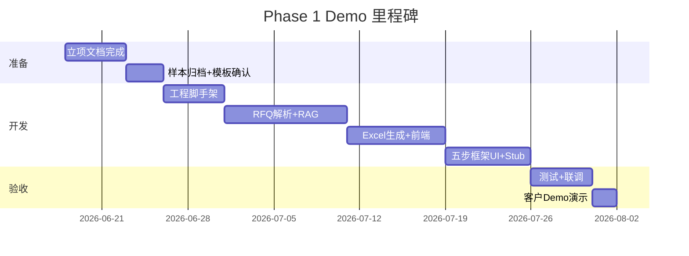

# ARIA 智能应用平台 — 项目实施计划

**首期应用：** ARIA 报价助手  
**版本：** v1.6 · 2026-07-10
**状态：** Demo 完成 · **正式版方案已定 v1.5**（见 [formal-delivery-strategy.md](supplementary/formal-delivery-strategy.md)）· Q2/Q3 已确认 · **SURVEY-01~06 已确认** · 基于 Demo 框架按 R1→M6 逐步开发

> 品牌与范围：[platform-brand.md](supplementary/platform-brand.md) — **当前 WBS 仅覆盖报价助手 Demo，不含财务助手实现。**

---

## 目录

1. [项目概述](#1-项目概述)
2. [里程碑计划](#2-里程碑计划)
3. [WBS 工作分解](#3-wbs-工作分解)
4. [人员分工](#4-人员分工)
5. [依赖与前置条件](#5-依赖与前置条件)
6. [风险管理](#6-风险管理)
7. [沟通机制](#7-沟通机制)
8. [质量保证](#8-质量保证)

---

## 1. 项目概述

### 1.1 项目信息

| 项 | 内容 |
|----|------|
| 产品品牌 | ARIA 智能应用平台（Assisted Reasoning & Intelligence Applications） |
| 首期应用 | ARIA 报价助手 |
| 客户 | EDAG（爱达克） |
| 开发方 | [开发团队名称] |
| 计划周期 | Phase 1: 4–6 周（Demo · 已完成）；**正式版：R1/M3–M6 约 20 周** |
| 需求基线 | [prod.md](../prod.md) v1.9 · [customer-delivery-roadmap.md](customer-delivery-roadmap.md) v1.9 · [使用场景问卷](客户使用场景与访问方式确认（客户版）.md) v1.1 |

### 1.2 项目目标

1. **Phase 1：** 交付 **报价助手** 可演示 Demo（**已完成 / 反馈收集中**）
2. **正式版：** 按 **R1 → M3 → M4 → M5 → M6** 交付（与客户 v3.8 一致）；详见 [prod.md §9.2](../prod.md)
3. **Phase 3：** 平台第二应用 — **财务助手**（远期）

---

## 2. 里程碑计划

### 2.1 Phase 1 — Demo（4–6 周）



| 里程碑 | 目标日期 | 交付物 | 验收标准 |
|--------|---------|--------|---------|
| M0 立项完成 | D+5 | prod.md + 配套文档 | 客户确认需求基线 |
| M1 脚手架就绪 | D+13 | docker-compose 可启动 | 健康检查 200 |
| M2 RFQ 链路通 | D+23 | 上传→解析→对比表 | 3 份 RFQ 测试通过 |
| M3 Excel 链路通 | D+33 | 模板填充+下载 | xlsx 可打开，PM+Chassis 有数据 |
| M3b 五步框架 UI | D+38 | TaskContextBar + /proposal + /qa Stub | [prod.md §10.1.1](../prod.md) 框架档 | **前端 R** / 后端 Stub **R** / PM **A** |
| M4 Demo 验收 | D+42 | 完整 Demo | 框架档 + 能力档全通过 |

### 2.2 正式版 — R1 / M3 / M4 / M5 / M6（约 20 周）

> 路线图：[customer-delivery-roadmap.md](customer-delivery-roadmap.md) v1.9 · 追溯：[delivery-traceability.md](supplementary/delivery-traceability.md) · WBS 见 §3.2

| 里程碑 | 日历周 | 核心交付 | 验收标准 |
|--------|--------|---------|---------|
| **R1** | 1–8 | **签完即用**：≥5 金标准 + bulk、baselines、Top-3、**F1.10**、检索评测 | ≥12/15 Pass；3 份 RFQ 流程；bulk ≥90% 或书面例外 |
| **M3** | 9–11 | ScopeMatch、9 Function Excel、`quote_fill_report` | ≥3 RFQ best_match 书面确认 |
| **M4** | 12–13 | Q_A 合并 dedupe、模板导出 | 列结构 + G/H 符合 m4 规格 |
| **M5** | 14–17 | 34 页 Content Template、`proposal_fill_report` | **不验收** LLM 正文 |
| **M6** | 18–20 | UAT、培训、运维脚本、备份演练 | 3–5 工程师试用通过 |

*内部历史编号 2A–2F 对照见 [prod.md §13.3](../prod.md)。*

### 2.3 Phase 3 — 财务助手（远期）

| 里程碑 | 周期 | 交付物 |
|--------|------|--------|
| M11 财务模块 | 6–8 周 | ARIA 财务助手 App、财务 Sheet 填充 |
| 前置 | — | Phase 2 稳定 3 个月 + 财务规则文档 |

---

## 3. WBS 工作分解

### 3.1 Phase 1 WBS

```
1. 项目管理
   1.1 需求分析与文档
   1.2 进度跟踪与 Demo 彩排
2. 基础设施
   2.1 工程目录脚手架
   2.2 docker-compose + Dockerfile
   2.3 .env.example + README
   2.4 run_tests.sh
3. 后端 — RFQ 模块
   3.1 docx 文本提取
   3.2 LLM Function 解析 Prompt
   3.3 JSON Schema 校验 + repair
   3.4 RFQ API
4. 后端 — RAG 模块
   4.1 ingest_documents.py
   4.2 incremental_update.py（Phase 2）
   4.3 向量检索 + 相似度排序（单一 RAGService.search 契约）
   4.4 技术维度对比表生成（从 hits 派生）
   4.5 置信度计算
   4.6 **P0 待办：** stats Mock 增强、检索 UI、import 按钮、RFQ Function Alert（见 rag-design.md §4）
5. 后端 — Excel 模块
   5.1 模板复制引擎
   5.2 Project information 填充
   5.3 PM/Chassis Sheet 映射
   5.4 Manpower 汇总
   5.5 历史人天基线检索
6. 后端 — Demo Stub
   6.1 proposal_stub / qa_stub Generator
   6.2 solution_draft / qa_items / artifacts_status
   6.3 generate-proposal / generate-qa API
7. 后端 — 公共
   7.1 GeneratorRegistry 插件架构
   7.2 LLMService 封装
   7.3 任务状态管理
   7.4 结构化日志
8. 前端
   8.1 TaskContextBar + WorkflowSteps 公共组件
   8.2 RFQ 页（上传、最近分析、对比表、Expand）
   8.3 技术方案页 /proposal（Mock 模块卡片 + Stub 生成）
   8.4 澄清问题页 /qa（Q_A 表格 + Stub 生成）
   8.5 报价生成页 /quote（Excel + 人天明细 Mock）
   8.6 知识库页（统计 + 检索实验室 + 触发导入 + 原子模块 Tab 占位）
9. 测试
   9.1 单元测试
   9.2 API 测试
   9.3 回归测试集（3 RFQ）
10. 集成
   10.1 端到端联调（含五步 UI 走通）
   10.2 Demo 彩排
```

### 3.1.1 文档 ↔ 实现追踪（M3b / M4 前须对齐）

| prod §10.1 条目 | 文档状态 | 代码状态（截至 2026-06-20） |
|-----------------|---------|---------------------------|
| 10.1.1 五步导航 + TaskContextBar | ✓ | 已实现 |
| 10.1.1 Stub generate-proposal/qa | ✓ api-design | 已实现 |
| 10.1.1 任务历史列表 | ✓ | 已实现 |
| 10.1.2 RFQ + 对标 + Excel | ✓ | 已实现 |
| 10.1.2 相似项目 Expand | ✓ | 已实现 |
| 10.1.2 知识库 stats + 检索 + import | ✓ rag-design | **已实现** |
| 10.1.2 RFQ Function 缺口 Alert | ✓ rag-design F5.9 | **已实现** |

> 彩排前 PM 按本表更新「代码状态」列；框架档不得仅文档验收。

### 3.2 正式版增量 WBS（内部 2A–2F ↔ 合同 R1/M3–M6）

> **R1 开发任务明细（可勾选）：** [docs/R1/README.md](R1/README.md) · [dev-tasks.md](R1/dev-tasks.md)  
> **实施方案（Demo 定位 · 复用壳层 · 里程碑逐步交付）：** [formal-delivery-strategy.md](supplementary/formal-delivery-strategy.md) v1.5
> **对照：** [prod.md §13.3](../prod.md) · [delivery-traceability.md](supplementary/delivery-traceability.md)

```
2A 知识库底座（优先）
   2A.1 manifest.json + Engagement 目录规范
   2A.2 分类型切块（RFQ/Q_A → pgvector；报价 → baselines JSON，**不向量化**）
   2A.3 metadata 增强 + manpower_baselines（见 [manpower-baselines-spec.md](supplementary/manpower-baselines-spec.md)）
   2A.4 KB 运营 UI（upload、导入进度、Re-index）
   2A.5 检索评测集（3–5 RFQ 人工标注应命中项目）
   2A.6 R1-KH00 ADR：generation/job/全局 Ollama 闸/迁移回滚
   2A.7 R1-KH Phase A：索引 job 单飞 + staging generation 原子切换
   2A.8 全局模型优先级 + 磁盘/ZIP/Windows 上传 + 导入审计/备份
   2A.9 R1-KH Phase B：Engagement hash 增量 + 状态 UI + 单卡/故障测试
   2A.10 知识库 UI/UX：上传批次、job、容量、维护提示、Engagement 清单

2B RFQ 对标增强
   2B.1 rfq_baseline_match.txt + 基准库加载（F1.10a–b）
   2B.2 dimension_review + DimensionBaselineReview 勾选 UI（F1.10c）
   2B.3 confirm-dimensions + 矩阵仅 in_scope 行（F1.10d）
   2B.4 PDF RFQ 文本提取

2C Excel 报价全量（**M3**）
   2C.1 excel_manpower 扩展 9 Function Sheet
   2C.2 **ScopeMatchService** + baselines 抽取 + 时间轴 remap
   2C.3 `quote_fill_report`（F4.11）

2D QA 澄清清单（**M4**）
   2D.1 Top-3 Q_A **全表 Area 合并**（非向量主路径）
   2D.2 qa_dedupe + ExcelQAGenerator（客户 Q_A_模板.xlsx）
   2D.3 双语 Question、Author/Assumption/Answer 留空
   2D.4 /qa 导出列对齐 Q_A 模板（Q3 已确认：仅生成/下载，无 Web 在线编辑）

2E PPT 技术方案
   2E.1 slide_mapping.yaml（客户 pptx 摸底）
   2E.2 PPTGenerator（python-pptx）
   2E.3 按 functions_in_scope 选页 + 四段式填充
   2E.4 重点页 Scope 验收（套餐 B/C）

2F 运营上线
   2F.1 review_status 全状态机 + audit trail
   2F.2 引用反馈 + Re-index 飞轮（**F5.6 L1 为内部可选 · 非合同**；见 dev-tasks R1-OPS）
   2F.3 生产部署 UAT、培训、运维移交
```

---

## 4. 人员分工

### 4.1 RACI 矩阵（Phase 1）

| 任务 | 后端 A | 后端 B | 前端 | PM |
|------|--------|--------|------|-----|
| RFQ 解析 | R | C | I | A |
| RAG 检索 | C | R | I | A |
| Excel 生成 | R | C | I | A |
| 五步框架 UI + Stub API | C | R | **R** | A |
| 前端页面（整体） | C | C | R | A |
| Docker/测试 | R | R | C | A |
| Demo 彩排 | C | C | C | **R** |

> R=Responsible, A=Accountable, C=Consulted, I=Informed

### 4.2 客户方配合

| 角色 | 职责 |
|------|------|
| 业务负责人 | 需求确认、Demo 反馈、UAT 签字 |
| 报价工程师（2–3 人） | 提供样本、参与 Demo/UAT |
| IT 管理员 | 服务器、Ollama、网络、备份 |

---

## 5. 依赖与前置条件

> **开放项与 Gate 汇总（写代码前必读）：** [pre-development-open-items.md](supplementary/pre-development-open-items.md)

### 5.1 Demo 启动前（必须 · 历史参考）

| # | 依赖项 | 责任方 | 状态 |
|---|--------|--------|------|
| D1 | 脱敏 RFQ 2–3 份 | 客户 | 待提供 |
| D2 | 历史 Excel 报价 1–2 份 | 客户 | 待提供 |
| D3 | 模板文件归档确认 | 开发方 | 已收到 |
| D4 | Phase 1 合同签订 | 双方 | 待签 |
| D5 | 开发环境（Docker + GPU） | 开发方 | 自备 |

### 5.2 Phase 2 启动前

| # | 依赖项 | 责任方 |
|---|--------|--------|
| D6 | Demo 验收通过 + 反馈基线确认 | 客户 |
| D7 | 生产服务器到位（推荐 4090 + 独立数据盘） | 客户 IT |
| D8 | **≥5 套金标准 + 内网 bulk 落盘计划**（清点表 O-02d；不要求每套三件套齐全） | 客户 |
| D9 | 四套模板书面签收（Q_A / 报价 / PPT / RFQ 样例） | 双方 |
| D10 | 商务套餐选型（A/B/C）+ PPT 重点页清单（套餐 B） | 双方 |
| D11 | 内网域名/DNS 配置 | 客户 IT |

---

## 6. 风险管理

| ID | 风险 | 概率 | 影响 | 应对 | 责任人 |
|----|------|------|------|------|--------|
| R1 | 历史样本不足 | 中 | 高 | 提前索要；Demo 用脱敏 mock 补充 | PM |
| R2 | Excel 模板映射超预期 | 高 | 中 | Demo 仅 PM+Chassis；template-mapping 文档化 | 后端 |
| R3 | LLM JSON 不稳定 | 中 | 中 | repair + 重试 + 回归测试 | 后端 |
| R4 | GPU 未到位影响体验 | 中 | 中 | Demo 用开发机 GPU；文档推荐配置 | PM |
| R5 | 客户二次校验流程不清 | 低 | 中 | prod.md 明确状态机；Demo 演示确认流 | PM |
| R6 | Phase 2 范围蔓延 | 中 | 高 | 变更须书面确认；Phase 3 独立合同 | PM |
| R7 | 客户将 Demo Mock 当作真实 AI | 中 | 高 | UI「Demo 预览」Tag + [demo-scope-brief.md](demo-scope-brief.md) 对外说明 | PM |
| R8 | 文档超前于代码实现 | 高 | 中 | M3b 专档排期；彩排前对照 prod §10.1 逐条打勾 | PM |
| R9 | 框架 UI 延期挤压 AI 调优 | 中 | 中 | 框架档/能力档分开验收；M3b 与 M2/M3 并行 | PM |

---

## 7. 沟通机制

| 活动 | 频率 | 参与人 | 产出 |
|------|------|--------|------|
| 站会 | 每日 15min | 开发团队 | 阻塞项 |
| 周进度汇报 | 每周 | 开发 + 客户业务 | 周报 |
| Demo 评审 | Phase 1 末 | 全员 | 验收签字 |
| 变更评审 | 按需 | PM + 客户 | 变更记录 |

**沟通渠道：** 企业微信群 / 邮件  
**文档共享：** 项目 docs/ 目录 + 版本管理

---

## 8. 质量保证

### 8.1 代码质量

- 后端 api / services / repositories 三层分离
- PR 审查（内部）
- `./run_tests.sh` 每次合并前全绿

### 8.2 测试策略

| 类型 | Phase 1 | Phase 2 |
|------|---------|---------|
| 单元测试 | 核心 Service | 全 Service |
| API 测试 | 主接口 + 异常 | 全接口 |
| 回归测试 | 3 RFQ 固定集 | 5 RFQ + Prompt 版本 |
| UAT | Demo 演示 | 3–5 工程师 1 周 |

### 8.3 验收流程

1. 开发自测 → `run_tests.sh` 全绿
2. 内部集成测试 → 3 RFQ 端到端
3. 客户 Demo/UAT → prod.md 验收清单
4. 签字确认 → 进入下一阶段

---

**关联文档：**

- [prod.md](../prod.md) — 产品需求基线
- [dev-context.md](../dev-context.md) — 开发上下文（技术栈、API、编码规范）
- [proposal.md](proposal.md)
- [deployment-guide.md](deployment-guide.md)
- [ops-guide.md](ops-guide.md)
