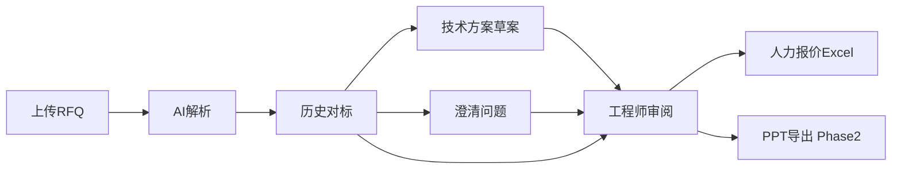

# ARIA 智能应用平台 — 项目建议书

**产品品牌：** ARIA（**A**ssisted **R**easoning & **I**ntelligence **A**pplications）  
**首期应用：** ARIA 报价助手  
**客户：** EDAG（爱达克）  
**版本：** v1.2  
**日期：** 2026-06-29  
**文档类型：** 项目建议书（含方案概述与费用估算）

> 品牌与平台定位：[platform-brand.md](supplementary/platform-brand.md)  
> **商务里程碑与固定价：** 以 [客户版 v3.8](ARIA-报价助手-正式版交付方案与报价（客户版）.md) / [客户易懂版 v1.6](ARIA-报价助手-正式版交付方案与报价（客户易懂版）.md) 为准；本文 §5 套餐 A/B/C 为 **历史估算**，新签约请用 R1/M3–M6 里程碑。

---

## 目录

1. [项目摘要](#1-项目摘要)
2. [方案概述](#2-方案概述)
3. [技术架构](#3-技术架构)
4. [分阶段交付计划](#4-分阶段交付计划)
5. [费用估算](#5-费用估算)
6. [团队配置](#6-团队配置)
7. [交付物清单](#7-交付物清单)
8. [付款建议](#8-付款建议)
9. [风险与保障](#9-风险与保障)

---

## 1. 项目摘要

### 1.1 项目目标

为 EDAG 建设本地私有化 **ARIA 智能应用平台**，首期交付 **报价助手** 应用，辅助 **10–20 名**研发工程师完成 RFQ 解析、历史项目对标、技术澄清、方案编写和人力报价核算，提升报价效率与一致性。

平台统一提供知识库、本地大模型与 RAG 能力；后续 **财务助手** 等内部 AI 工具可在同一平台上扩展，复用基础设施。

### 1.2 建设原则

- **本地私有化：** 数据不出内网，禁止公有云 API
- **平台 + 应用：** ARIA 为平台品牌；报价助手为首个应用；财务等为后续应用
- **AI 辅助而非替代：** 工程师二次校验后定稿
- **分阶段交付：** 报价 Demo → 报价正式版 → 平台第二应用（财务）
- **可持续演进：** 知识库持续优化、模型可升级、架构预留多 App 扩展

### 1.3 建议路径

| 阶段 | 周期 | 目标 |
|------|------|------|
| **Phase 1 Demo** | 4–6 周 | **报价助手** Demo：RFQ 解析 + 历史比对 + Excel 人力报价闭环（**已完成演示**） |
| **Phase 2 正式版** | **18–22 周** | 2A–2F 子阶段；知识库先行；见 [customer-delivery-roadmap.md](customer-delivery-roadmap.md) |
| **Phase 3 财务助手** | 6–8 周 | 平台第二应用（待 Phase 2 稳定后启动） |

---

## 2. 方案概述

### 2.1 业务方案



> Demo 展示完整五步 UI；方案与 QA 为 Mock 预览，RFQ/对标/Excel 为真实能力。详见 [prod.md §9](../prod.md)。

### 2.2 四大功能模块

| 模块 | 能力 | Phase 1 Demo | Phase 2 |
|------|------|-------------|---------|
| **模块 1** RFQ 解析 + 历史比对 | 拆解 Function、检索相似项目、维度对比表 | ✓ 真实 | ✓ 全格式 |
| **模块 2** QA 澄清清单 | 历史疑问汇总、优先级、历史依据 | UI+Mock | ✓ 真实 RAG+LLM |
| **模块 3** 技术方案草案 / PPT | 原子模块拼接、EDAG 模板 | UI+Mock | ✓ 真实 + PPT |
| **模块 4** Excel 人力报价 | 企业模板、Function×技能等级×月度 | PM+Chassis 真实 | 全 9 Function |

### 2.3 差异化设计

| 设计点 | 说明 | 客户价值 |
|--------|------|---------|
| 人机协同 | AI 草稿 → 审阅 → 确认 → 导出 | 质量可控，符合「辅助」定位 |
| 来源引用 + 置信度 | 每条 AI 结论可追溯历史依据 | 便于二次校验，建立信任 |
| 知识库飞轮 | 增量导入 + 反馈优化 | 越用越准 |
| 插件化架构 | Generator/Service 可扩展 | 财务模块无需重构 |
| 运维 SOP | LLM 更新、版本测试、备份 | 长期可维护 |

### 2.4 平台与应用（品牌架构）

| 层级 | 说明 | Phase 1 |
|------|------|---------|
| **ARIA Platform** | 知识库、LLM、RAG、部署 | 历史资料库轻量 + 叙事 |
| **报价助手** | RFQ 五步、Excel、对标 | **Demo 交付范围** |
| **财务助手** | 财务 Sheet AI | 规划（Phase 3） |

详见 [platform-brand.md](supplementary/platform-brand.md)。

---

### 3.1 总体架构

```
┌─────────────────────────────────────────────────────────┐
│  用户层：Web Browser（内网 / VPN）                        │
└────────────────────────┬────────────────────────────────┘
                         │ HTTP
┌────────────────────────▼────────────────────────────────┐
│  Nginx 反向代理 (:80)                                    │
├────────────────────┬────────────────────────────────────┤
│  Next.js 前端       │  FastAPI 后端                       │
│  Ant Design 5      │  RAGService + 业务 Service（pgvector）│
└────────────────────┴──────────────┬─────────────────────┘
                                    │
         ┌──────────────────────────┼──────────────────────┐
         │                          │                      │
    PostgreSQL 16 + pgvector        本地文件系统
    （业务 + 向量 + 任务队列）       uploads / knowledge_base
    业务数据/基线库             向量检索               uploads/outputs/templates
                                    │
                         Ollama (独立进程, localhost:11434)
                         Qwen2.5 14B(Demo) / 32B(生产)
                         nomic-embed-text
```

### 3.2 技术选型

| 层级 | 选型 | 说明 |
|------|------|------|
| LLM | Ollama + Qwen2.5 | 中文理解强，完全离线 |
| Embedding | nomic-embed-text | 本地向量化 |
| 向量库 | PostgreSQL pgvector | 与业务同库，pg_dump 统一备份 |
| 后端 | Python FastAPI + SQLAlchemy 2 | 不引入 LangChain；Ollama 直连 |
| 前端 | Next.js 14 + TypeScript + Ant Design 5 | 企业级 UI |
| 文档 | python-docx / openpyxl / python-pptx | Word/Excel/PPT |
| 容器 | Docker Compose | 一键启动 |
| 测试 | pytest + httpx + run_tests.sh | 硬性验收要求 |

### 3.3 为何选择网页端

- 开发维护成本低于桌面客户端
- 内网/VPN 访问天然支持
- 符合客户「优先低成本方案」偏好
- 10–20 人规模无需安装分发（问卷确认）

---

## 4. 分阶段交付计划

### Phase 1 — Demo MVP（4–6 周）

**目标：** 向客户演示完整业务闭环，验证技术可行性。

| 周次 | 里程碑 |
|------|--------|
| W1 | 工程脚手架、Docker、模板归档、知识库 ingest |
| W2–W3 | RFQ 解析 + RAG 检索 + 技术维度对比表 |
| W3–W4 | Excel 生成（PM+Chassis）+ 前端页面 |
| W5 | 测试、联调、Demo 彩排 |
| W6 | 客户 Demo 演示与反馈 |

**Demo 演示场景：**

1. 上传一份脱敏 RFQ (.docx)
2. 展示 AI 解析的 Function 模块与交付物
3. 展示 Top 3 相似项目技术维度对比表（含置信度）
4. 工程师编辑确认后，生成并下载 Excel 人力报价初稿
5. 展示知识库管理面板

### Phase 2 — 正式版（18–22 周，子阶段）

> Demo 反馈（2026-06）已纳入 prod v1.4。子阶段详解见 [customer-delivery-roadmap.md](customer-delivery-roadmap.md)。

| 子阶段 | 内容 | 贵司可用成果 |
|--------|------|-------------|
| **2A 知识库** | Engagement、切块、baselines、KB UI | 历史项目检索 |
| **2B RFQ** | F1.10 维度确认、对比矩阵、PDF | 对标两阶段流程 |
| **2C Excel** | 9 Function、历史模块锚定 | 完整报价 xlsx |
| **2D QA** | RAG+LLM、客户 Q_A 模板 | 澄清清单导出 |
| **2E PPT** | 客户 pptx 模板填充 | 技术方案下载 |
| **2F 上线** | 状态机、UAT、培训 | 生产运行 |

### Phase 3 — 财务 AI（远期，6–8 周）

- 财务 Sheet 自动填充（Risk/Hourly Rate/Profit 等）
- 人力小计 → 费率 → 总价联动
- **启动条件：** Phase 2 稳定运行 3 个月

---

## 5. 费用估算

> 以下人天单价为参考值 **¥2,500/人天**，实际以合同约定为准。  
> 硬件费用为客户自行采购，单独列项。

### 5.1 Phase 1 — Demo 开发费

| 工作项 | 人天 | 参考费用（¥） |
|--------|------|-------------|
| 需求分析与立项文档 | 3 | 7,500 |
| 工程脚手架 + Docker | 3 | 7,500 |
| RFQ 解析 + Prompt 调优 | 8 | 20,000 |
| RAG 检索 + 历史比对 | 10 | 25,000 |
| Excel 报价生成（EDAG 模板） | 10 | 25,000 |
| Excel 结构化 ingest | 4 | 10,000 |
| 可扩展架构脚手架 | 3 | 7,500 |
| 人机校验最小闭环 | 4 | 10,000 |
| 前端 4 页面 | 8 | 20,000 |
| 测试 + 回归测试集 | 6 | 15,000 |
| 联调 + Demo 彩排 | 3 | 7,500 |
| **小计** | **58 人天** | **¥155,000** |

### 5.2 Phase 2 — 正式版开发费（子阶段明细）

> Demo 反馈后修订（2026-06-29）。原 88 人天拆为 2A–2F，合计 **112–135 人天**。

| 子阶段 / 工作项 | 人天 | 参考费用（¥） |
|----------------|------|-------------|
| **2A 知识库底座** | 22–26 | 55,000 – 65,000 |
| **2B RFQ 对标（含 F1.10 维度确认）** | 12–15 | 30,000 – 37,500 |
| **2C Excel 全 9 Function + 历史锚定** | 16–18 | 40,000 – 45,000 |
| **2D QA 清单（客户模板 + 双语）** | 14–16 | 35,000 – 40,000 |
| **2E PPT 方案（客户 pptx）** | 22–28 | 55,000 – 70,000 |
| **2F 运营上线（状态机 + UAT + 培训）** | 18–22 | 45,000 – 55,000 |
| PM / 需求 / 架构协调 | 8–10 | 20,000 – 25,000 |
| **小计** | **112–135** | **¥280,000 – ¥337,500** |

#### 5.2.1 商务套餐（三选一）

| 套餐 | 包含子阶段 | 参考人天 | 参考开发费 |
|------|-----------|---------|-----------|
| **A · MVP** | 2A + 2B + 2C + 精简 2F | ~85 | ~¥212,500 |
| **B · 标准（推荐）** | 2A–2D + 2F + PPT 重点页（15–20 页） | ~115 | ~¥287,500 |
| **C · 全量** | 2A–2F + 54 页 PPT 全填充 | ~130 | ~¥325,000 |

*套餐 A 保留 QA/PPT 为 Demo 预览；套餐 B/C 按 [customer-feedback-baseline.md](customer-feedback-baseline.md) 落地客户模板。*

#### 5.2.2 与原 Phase 2 估算差异说明

| 增量来源 | 说明 |
|---------|------|
| 知识库底座独立加强 | 2A 单独验收；Engagement + baselines |
| F1.10 维度确认 | 客户 RFQ 页核心反馈 |
| PPT 按客户 54 页实模板 | slide mapping 工程量大 |
| QA 客户模板对齐 | 双语 Question + 8 列导出 |

### 5.3 Phase 3 — 财务 AI（远期报价）

| 工作项 | 人天 | 参考费用（¥） |
|--------|------|-------------|
| 财务规则引擎 + Excel 财务 Sheet | 20 | 50,000 |
| 人力→财务联动 + 测试 | 10 | 25,000 |
| **小计** | **30 人天** | **¥75,000** |

### 5.4 费用汇总

| 阶段 | 人天 | 参考开发费 |
|------|------|-----------|
| Phase 1 Demo | 58 | ¥155,000 |
| Phase 2 正式版（套餐 B 参考） | 115 | ¥287,500 |
| Phase 2 正式版（全量 C） | 130 | ¥325,000 |
| Phase 3 财务 AI | 30 | ¥75,000 |
| **合计（全量 C + Phase 1）** | **218** | **¥555,000** |

### 5.5 硬件费用（客户自购，参考）

| 配置 | 预算参考 | 适用 |
|------|---------|------|
| 基础版（无 GPU） | 2–4 万 | Demo 验证，推理慢 |
| **推荐版（RTX 4090 24G）** | **6–10 万** | **生产推荐** |
| 旗舰版（A100 40G） | 20 万+ | 高并发 / 多卡并行 / 32B 全精度 |

> 详见 [部署方案](deployment-guide.md) 三档配置对比。

### 5.6 年度运维（可选）

| 项目 | 参考费用/年 |
|------|------------|
| 应用版本维护（bug 修复 + 小版本） | ¥30,000 – ¥50,000 |
| Prompt/模型调优支持（按需） | ¥800/人天 |
| 知识库导入协助（按需） | ¥800/人天 |

---

## 6. 团队配置

### 6.1 Phase 1 团队

| 角色 | 人数 | 职责 |
|------|------|------|
| 后端工程师（Python/AI） | 2 | RFQ 解析、RAG、Excel 生成、API |
| 前端工程师 | 1 | Next.js 页面、交互 |
| 项目经理 / 架构 | 0.5 | 需求、协调、Demo 彩排 |

### 6.2 Phase 2 增量

| 角色 | 人数 | 职责 |
|------|------|------|
| 后端工程师 | +1 | QA/PPT 模块、运维脚本 |
| 测试工程师 | 0.5 | 回归测试集、UAT 支持 |

---

## 7. 交付物清单

### 7.1 Phase 1 交付

| 类别 | 交付物 |
|------|--------|
| 应用 | Docker 镜像（backend + frontend）+ `docker-compose.yml`（开发/Demo）+ **`docker-compose.prod.yml`（生产数据盘 bind）** |
| 文档 | prod.md、proposal、implementation-plan、deployment-guide、ops-guide、**customer-it-infrastructure.md** |
| 脚本 | ingest_documents.py、run_tests.sh、**deploy/scripts/**（start/stop/backup/reindex） |
| 测试 | unit_tests/ + API_tests/ |
| 模板 | 归档客户 Excel/PPT/QA 模板至 data/templates/ |
| 演示 | Demo 环境 + 操作演示 |

### 7.2 Phase 2 增量交付（按子阶段）

| 子阶段 | 交付物 |
|--------|--------|
| 2A | Engagement 入库规范、KB 运营 UI、检索评测报告 |
| 2B | F1.10 维度确认流程、PDF RFQ 支持 |
| 2C | 9 Function 报价 Excel、历史锚定逻辑 |
| 2D | 客户 Q_A 模板导出、QA Prompt v1 |
| 2E | PPT Generator + slide_mapping、proposal 下载 |
| 2F | 生产镜像、UAT 报告、培训记录 |

**对客户一页纸：** [customer-delivery-roadmap.md](customer-delivery-roadmap.md)

### 7.3 不包含

- 源代码（黑盒镜像交付）
- 服务器硬件
- Ollama 模型文件（客户 IT 自行管理）
- 客户历史文档脱敏处理（客户提供）

---

## 8. 付款建议

| 节点 | 比例 | 条件 |
|------|------|------|
| 合同签订 | 30% | Phase 2 启动（建议自 2A 起签） |
| 2A 知识库验收 | 15% | Engagement 入库 + 检索达标 |
| 2B+2C 核心链路验收 | 25% | 对标 + 报价 Excel 可用 |
| 正式版 UAT（2F） | 20% | 所选套餐全项通过 |
| 质保期满（3 个月） | 10% | 无 P0/P1 遗留 |

> Phase 3 财务模块独立合同，建议 40/40/20 分期。

---

## 9. 风险与保障

| 风险 | 保障措施 |
|------|---------|
| AI 准确性不足 | RAG 来源引用 + 置信度 + 人工校验闭环 |
| 知识库样本不足 | Demo 前收集 RFQ + 历史 Excel；持续增量导入 |
| LLM 推理慢 | 推荐 RTX 4090；异步任务 + 进度展示 |
| 模板结构变更 | template-mapping 文档化；Generator 插件隔离 |
| 后续财务扩展 | 架构 Day 1 预留 FinanceService + 路由占位 |

**质保：** Phase 2 上线后 3 个月免费 bug 修复。

---

**下一步：** 客户确认本建议书后，签署 Phase 1 合同并启动 Demo 开发。

**关联文档：**

- [产品需求规格书](../prod.md)
- [实施计划](implementation-plan.md)
- [部署方案](deployment-guide.md)
