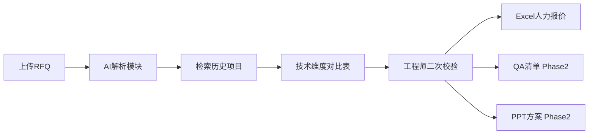

# ARIA 智能报价辅助系统 — 项目建议书

**项目名称：** ARIA（Automated RFQ Intelligence Assistant）  
**客户：** EDAG（爱达克）  
**版本：** v1.0  
**日期：** 2026-06-18  
**文档类型：** 项目建议书（含方案概述与费用估算）

---

## 目录

1. [项目摘要](#1-项目摘要)
2. [方案概述](#2-方案概述)
3. [技术架构](#3-技术架构)
4. [分阶段交付计划](#4-分阶段交付计划)
5. [费用估算](#5-费用估算)
6. [团队配置](#6-团队配置)
7. [交付物清单](#7-交付物清单)
8. [付款建议](#8-付款建议)
9. [风险与保障](#9-风险与保障)

---

## 1. 项目摘要

### 1.1 项目目标

为 EDAG 建设本地私有化 AI 报价辅助系统 ARIA，辅助 20–30 名研发工程师完成 RFQ 解析、历史项目对标、技术澄清、方案编写和人力报价核算，提升报价效率与一致性。

### 1.2 建设原则

- **本地私有化：** 数据不出内网，禁止公有云 API
- **AI 辅助而非替代：** 工程师二次校验后定稿
- **分阶段交付：** Demo 验证 → 正式版 → 远期财务模块
- **可持续演进：** 知识库持续优化、模型可升级、架构预留扩展

### 1.3 建议路径

| 阶段 | 周期 | 目标 |
|------|------|------|
| **Phase 1 Demo** | 4–6 周 | 验证 RFQ 解析 + 历史比对 + Excel 人力报价闭环 |
| **Phase 2 正式版** | 10–12 周 | 四大模块全量 + 运维体系 + 生产上线 |
| **Phase 3 财务 AI** | 6–8 周 | 财务 Sheet 核算（待 Phase 2 稳定后启动） |

---

## 2. 方案概述

### 2.1 业务方案



### 2.2 四大功能模块

| 模块 | 能力 | Phase 1 | Phase 2 |
|------|------|---------|---------|
| **模块 1** RFQ 解析 + 历史比对 | 拆解 Function、检索相似项目、维度对比表 | ✓ | ✓ 全格式 |
| **模块 2** QA 澄清清单 | 历史疑问汇总、优先级、历史依据 | — | ✓ |
| **模块 3** PPT 方案初稿 | EDAG 模板结构、四段式填充 | — | ✓ |
| **模块 4** Excel 人力报价 | 企业模板、Function×技能等级×月度 | PM+Chassis | 全 9 Function |

### 2.3 差异化设计

| 设计点 | 说明 | 客户价值 |
|--------|------|---------|
| 人机协同 | AI 草稿 → 审阅 → 确认 → 导出 | 质量可控，符合「辅助」定位 |
| 来源引用 + 置信度 | 每条 AI 结论可追溯历史依据 | 便于二次校验，建立信任 |
| 知识库飞轮 | 增量导入 + 反馈优化 | 越用越准 |
| 插件化架构 | Generator/Service 可扩展 | 财务模块无需重构 |
| 运维 SOP | LLM 更新、版本测试、备份 | 长期可维护 |

---

## 3. 技术架构

### 3.1 总体架构

```
┌─────────────────────────────────────────────────────────┐
│  用户层：Web Browser（内网 / VPN）                        │
└────────────────────────┬────────────────────────────────┘
                         │ HTTP
┌────────────────────────▼────────────────────────────────┐
│  Nginx 反向代理 (:80)                                    │
├────────────────────┬────────────────────────────────────┤
│  Next.js 前端       │  FastAPI 后端                       │
│  Ant Design 5      │  LangChain RAG + 业务 Service       │
└────────────────────┴──────────────┬─────────────────────┘
                                    │
         ┌──────────────────────────┼──────────────────────┐
         │                          │                      │
    PostgreSQL 16              ChromaDB              本地文件系统
    业务数据/基线库             向量检索               uploads/outputs/templates
                                    │
                         Ollama (独立进程, localhost:11434)
                         Qwen2.5 14B(Demo) / 32B(生产)
                         nomic-embed-text
```

### 3.2 技术选型

| 层级 | 选型 | 说明 |
|------|------|------|
| LLM | Ollama + Qwen2.5 | 中文理解强，完全离线 |
| Embedding | nomic-embed-text | 本地向量化 |
| 向量库 | ChromaDB | Demo 友好，可迁移 Milvus |
| 后端 | Python FastAPI + LangChain + SQLAlchemy | AI 生态完整 |
| 前端 | Next.js 14 + TypeScript + Ant Design 5 | 企业级 UI |
| 文档 | python-docx / openpyxl / python-pptx | Word/Excel/PPT |
| 容器 | Docker Compose | 一键启动 |
| 测试 | pytest + httpx + run_tests.sh | 硬性验收要求 |

### 3.3 为何选择网页端

- 开发维护成本低于桌面客户端
- 内网/VPN 访问天然支持
- 符合客户「优先低成本方案」偏好
- 20–30 人规模无需安装分发

---

## 4. 分阶段交付计划

### Phase 1 — Demo MVP（4–6 周）

**目标：** 向客户演示完整业务闭环，验证技术可行性。

| 周次 | 里程碑 |
|------|--------|
| W1 | 工程脚手架、Docker、模板归档、知识库 ingest |
| W2–W3 | RFQ 解析 + RAG 检索 + 技术维度对比表 |
| W3–W4 | Excel 生成（PM+Chassis）+ 前端页面 |
| W5 | 测试、联调、Demo 彩排 |
| W6 | 客户 Demo 演示与反馈 |

**Demo 演示场景：**

1. 上传一份脱敏 RFQ (.docx)
2. 展示 AI 解析的 Function 模块与交付物
3. 展示 Top 3 相似项目技术维度对比表（含置信度）
4. 工程师编辑确认后，生成并下载 Excel 人力报价初稿
5. 展示知识库管理面板

### Phase 2 — 正式版（10–12 周）

| 模块 | 内容 |
|------|------|
| 功能补全 | QA 清单、PPT 初稿、9 Function Sheet、PDF RFQ |
| 人机协同 | 全状态机、audit trail、在线编辑 |
| 知识库 | 反馈闭环、Re-index Dashboard |
| 运维 | 生产部署、备份、版本 SOP、用户培训 |

### Phase 3 — 财务 AI（远期，6–8 周）

- 财务 Sheet 自动填充（Risk/Hourly Rate/Profit 等）
- 人力小计 → 费率 → 总价联动
- **启动条件：** Phase 2 稳定运行 3 个月

---

## 5. 费用估算

> 以下人天单价为参考值 **¥2,500/人天**，实际以合同约定为准。  
> 硬件费用为客户自行采购，单独列项。

### 5.1 Phase 1 — Demo 开发费

| 工作项 | 人天 | 参考费用（¥） |
|--------|------|-------------|
| 需求分析与立项文档 | 3 | 7,500 |
| 工程脚手架 + Docker | 3 | 7,500 |
| RFQ 解析 + Prompt 调优 | 8 | 20,000 |
| RAG 检索 + 历史比对 | 10 | 25,000 |
| Excel 报价生成（EDAG 模板） | 10 | 25,000 |
| Excel 结构化 ingest | 4 | 10,000 |
| 可扩展架构脚手架 | 3 | 7,500 |
| 人机校验最小闭环 | 4 | 10,000 |
| 前端 4 页面 | 8 | 20,000 |
| 测试 + 回归测试集 | 6 | 15,000 |
| 联调 + Demo 彩排 | 3 | 7,500 |
| **小计** | **58 人天** | **¥155,000** |

### 5.2 Phase 2 — 正式版开发费

| 工作项 | 人天 | 参考费用（¥） |
|--------|------|-------------|
| QA 澄清清单模块 | 14 | 35,000 |
| PPT 方案初稿（EDAG 53 页结构） | 22 | 55,000 |
| Excel 全 9 Function + 人天基线库 | 16 | 40,000 |
| PDF/PPT RFQ 解析 | 8 | 20,000 |
| 人机协同全闭环 | 10 | 25,000 |
| 知识库飞轮 | 8 | 20,000 |
| 运维文档 + 回归测试 + 版本 SOP | 6 | 15,000 |
| 生产部署 + 安全加固 | 6 | 15,000 |
| 培训 + 用户手册 | 4 | 10,000 |
| **小计** | **88 人天** | **¥220,000** |

### 5.3 Phase 3 — 财务 AI（远期报价）

| 工作项 | 人天 | 参考费用（¥） |
|--------|------|-------------|
| 财务规则引擎 + Excel 财务 Sheet | 20 | 50,000 |
| 人力→财务联动 + 测试 | 10 | 25,000 |
| **小计** | **30 人天** | **¥75,000** |

### 5.4 费用汇总

| 阶段 | 人天 | 参考开发费 |
|------|------|-----------|
| Phase 1 Demo | 58 | ¥155,000 |
| Phase 2 正式版 | 88 | ¥220,000 |
| Phase 3 财务 AI | 30 | ¥75,000 |
| **合计（全量）** | **176** | **¥450,000** |

### 5.5 硬件费用（客户自购，参考）

| 配置 | 预算参考 | 适用 |
|------|---------|------|
| 基础版（无 GPU） | 2–4 万 | Demo 验证，推理慢 |
| **推荐版（RTX 4090 24G）** | **6–10 万** | **生产推荐** |
| 旗舰版（A100 40G） | 20 万+ | 高并发 / 72B 模型 |

> 详见 [部署方案](deployment-guide.md) 三档配置对比。

### 5.6 年度运维（可选）

| 项目 | 参考费用/年 |
|------|------------|
| 应用版本维护（bug 修复 + 小版本） | ¥30,000 – ¥50,000 |
| Prompt/模型调优支持（按需） | ¥800/人天 |
| 知识库导入协助（按需） | ¥800/人天 |

---

## 6. 团队配置

### 6.1 Phase 1 团队

| 角色 | 人数 | 职责 |
|------|------|------|
| 后端工程师（Python/AI） | 2 | RFQ 解析、RAG、Excel 生成、API |
| 前端工程师 | 1 | Next.js 页面、交互 |
| 项目经理 / 架构 | 0.5 | 需求、协调、Demo 彩排 |

### 6.2 Phase 2 增量

| 角色 | 人数 | 职责 |
|------|------|------|
| 后端工程师 | +1 | QA/PPT 模块、运维脚本 |
| 测试工程师 | 0.5 | 回归测试集、UAT 支持 |

---

## 7. 交付物清单

### 7.1 Phase 1 交付

| 类别 | 交付物 |
|------|--------|
| 应用 | Docker 镜像（backend + frontend）+ docker-compose.yml |
| 文档 | prod.md、proposal、implementation-plan、deployment-guide、ops-guide |
| 脚本 | ingest_documents.py、incremental_update.py、run_tests.sh |
| 测试 | unit_tests/ + API_tests/ |
| 模板 | 归档客户 Excel/PPT/QA 模板至 data/templates/ |
| 演示 | Demo 环境 + 操作演示 |

### 7.2 Phase 2 增量交付

| 类别 | 交付物 |
|------|--------|
| 应用 | 全功能镜像 + docker-compose.prod.yml |
| 文档 | user-manual.md、CHANGELOG.md |
| 脚本 | start/stop/update/backup/reindex |
| 培训 | 工程师培训（1 场）+ 管理员培训（1 场） |

### 7.3 不包含

- 源代码（黑盒镜像交付）
- 服务器硬件
- Ollama 模型文件（客户 IT 自行管理）
- 客户历史文档脱敏处理（客户提供）

---

## 8. 付款建议

| 节点 | 比例 | 条件 |
|------|------|------|
| 合同签订 | 30% | 项目启动 |
| Demo 验收通过 | 30% | Phase 1 验收清单全通过 |
| 正式版 UAT 通过 | 30% | Phase 2 验收 |
| 质保期满（3 个月） | 10% | 无 P0/P1 遗留问题 |

> Phase 3 财务模块独立合同，建议 40/40/20 分期。

---

## 9. 风险与保障

| 风险 | 保障措施 |
|------|---------|
| AI 准确性不足 | RAG 来源引用 + 置信度 + 人工校验闭环 |
| 知识库样本不足 | Demo 前收集 RFQ + 历史 Excel；持续增量导入 |
| LLM 推理慢 | 推荐 RTX 4090；异步任务 + 进度展示 |
| 模板结构变更 | template-mapping 文档化；Generator 插件隔离 |
| 后续财务扩展 | 架构 Day 1 预留 FinanceService + 路由占位 |

**质保：** Phase 2 上线后 3 个月免费 bug 修复。

---

**下一步：** 客户确认本建议书后，签署 Phase 1 合同并启动 Demo 开发。

**关联文档：**

- [产品需求规格书](../prod.md)
- [实施计划](implementation-plan.md)
- [部署方案](deployment-guide.md)
