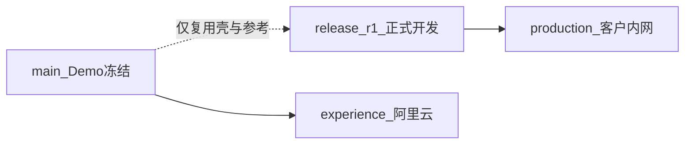

# 正式版交付实施方案（内部 · 定方案版）

**版本：** v1.4 · 2026-07-07  
**状态：** **方案已定 · 可开工 R1**  
**受众：** PM、开发、验收负责人（**本文不对客户披露**）  
**关联：** [prod.md](../../prod.md) v1.7 · [delivery-traceability.md](delivery-traceability.md) v1.1 · [customer-feedback-baseline.md](../customer-feedback-baseline.md) v1.5 · [customer-delivery-roadmap.md](../customer-delivery-roadmap.md) v2.0

> **本文用途：** 统一内部实施口径：Demo 与正式版的关系、按合同里程碑如何一步一步开发、分支与环境如何隔离。  
> **客户侧：** 仅感知 [customer-delivery-roadmap.md](../customer-delivery-roadmap.md) 与各期验收文档；**不参与**分支、Profile、是否复用 Demo 代码等工程决策。  
> **不含：** 日级任务排期（见 [implementation-plan.md](../implementation-plan.md)）。

---

## 1. Demo 与正式版：定位（先读）

| | Demo（Phase 1 · 已完成） | 正式版（R1→M6） |
|---|--------------------------|-----------------|
| **目的** | 给客户体验流程、核对系统理解与大规划是否一致 | 按合同交付可验收、可生产的真实能力 |
| **是否生产代码** | **否** — 含 Mock/Stub，仅供前期演示 | **是** — 禁止 Mock 欺骗 |
| **与客户关系** | 已演示；远程体验环境可继续保留 | 分期验收与付款（R1/M3/M4/M5/M6） |
| **代码关系** | **`main` 冻结为 Demo 基线**，不再向客户交付 Demo 新能力 | 自 Demo **框架与 UI 基本设计**出发，在 `release/r1` **按里程碑逐步实现** |

**一句话：** Demo 验证了「做什么、长什么样」；正式版在 **同一产品规划** 下 **一步一步做真**，复用 Demo 的 **壳与框架**，**不**把 Demo 的 Mock/Stub/临时实现当作生产基线。

---

## 2. 核心决策（内部签字）

| # | 问题 | 决策 | 理由 |
|---|------|------|------|
| D1 | 是否复用 Demo？ | **复用框架与 UI 基本设计，不沿用 Demo 生产逻辑** | 五步 IA、TaskContext、Ant Design 壳已在 Demo 验证；后端须按 R1 规格重建/替换 |
| D2 | 是否从零另起产品？ | **否** | 与客户规划一致；复用工程资产（Compose、模板、测试框架、路由结构） |
| D3 | 代码从哪条分支做？ | **`release/r1`**（自 `main` 切出） | `main` = Demo/远程体验；正式交付仅在 release 分支 Gate 合并 |
| D4 | R1 交付给客户什么界面？ | **仅完整交付 `/rfq` + `/knowledge`**（`ARIA_UI_PROFILE=r1`） | 合同 R1 范围；避免未购里程碑出现 Mock 可点 |
| D5 | 远程 Demo 环境？ | **保留** `main` + `docker-compose.aliyun-demo.yml` + Mock | 与正式生产环境隔离；Demo 不再演进业务功能 |
| D6 | R1 后端必做项？ | pgvector + PG 任务队列 + worker + F1.10 + Engagement | 见 §6；与 Demo 实现无关，按设计文档实施 |
| D7 | Demo 反馈 Q2/Q3？ | **已获客户确认（2026-07-04）** | Q2 五步顺序锁定；Q3 M4 **仅生成/下载 Excel**，无 Web 在线编辑 |
| D8 | R1 是否含登录与权限？ | **是 · Auth MVP 同期交付、不延期** | 问卷 SURVEY-05/06：任务隔离 + 两角色；**不含** SSO/部门 ACL/任务委派 |

---

## 3. 客户反馈 → 正式版实施

来源：[customer-feedback-baseline.md](../customer-feedback-baseline.md) v1.5

| ID | 客户反馈 | 正式版落点 | 状态 |
|----|----------|------------|------|
| Q1 | 中文界面 | 全局 | 已锁定 |
| Q2 | 五步顺序符合习惯 | `WorkflowSteps`：**RFQ → 方案 → QA → 报价** | **已确认 2026-07-04** |
| Q3 | 仅生成 / 下载 Excel | M4 `/qa`：`generate-qa` + `download/qa`；**无 Web 表格在线编辑** | **已确认 2026-07-04** |
| Q4 | Q_A 8 列规范 | M4 导出 schema | 已锁定 |
| Q6 | 对标前先确认维度 | R1 F1.10a–d | 已纳入 R1 |
| Q7 | 最相似项目填 Excel | M3 ScopeMatch | 已纳入 M3 |
| **Q8** | **RFQ 全维度对比矩阵**（核心） | 基准库 ~100 项 + 勾选 + 矩阵 | **已反馈 · 清单待客户提供** |
| **SURVEY-05** | 每人只看到自己的 RFQ 项目 | R1-AUTH · `owner_id` 任务隔离 | **已确认 2026-07-07** |
| **SURVEY-06** | 分角色（工程师 / 资料库管理员） | R1-AUTH · `quote_engineer` / `kb_admin` | **已确认 2026-07-07** |

**Q8 规格：** [rfq-dimension-baseline-spec.md](rfq-dimension-baseline-spec.md) · 确认页全量基准行；矩阵页仅 in_scope 行。

**M4 `/qa` 页（Q3 口径）：** 选择任务 → 生成 QA 清单 → **下载 Q_A Excel**；可选展示生成状态/条数说明；**不在网页内编辑表格**。Author / Assumption / Answer 等列在 Excel 中由工程师填写。

---

## 4. 复用什么 · 替换什么

### 4.1 从 Demo 复用（框架与 UI 基本设计）

| 类别 | 内容 |
|------|------|
| 信息架构 | 五步报价流程 + 平台知识库侧栏 |
| 前端壳 | [`AppLayout.tsx`](../../frontend/src/components/AppLayout.tsx) · [`TaskContextBar`](../../frontend/src/components/TaskContextBar.tsx) · [`WorkflowSteps`](../../frontend/src/components/WorkflowSteps.tsx) · 路由表 |
| 技术栈 | Next.js 14 · Ant Design 5 · FastAPI · PostgreSQL |
| 工程资产 | Docker Compose 画像 · 测试目录 · Excel/PPT 模板 · Prompt 目录结构 |
| 插件模式 | `GeneratorRegistry` · `BaseGenerator` |

### 4.2 不继承 Demo（正式版须重做或替换）

| 类别 | Demo 现状 | 正式版 |
|------|-----------|--------|
| 长任务 | `BackgroundTasks` | PG 任务表 + 独立 worker |
| 访问控制 | 内网 flat、无登录 | **JWT 登录 + 两角色 + RFQ 任务归属** |
| 向量库 | Chroma | pgvector + Ollama Embedding |
| RAG | Mock 兜底 | Top-K + metadata；`insufficient_evidence` 拒答 |
| RFQ | 段落解析；无 F1.10 | Word 表格 + **基准库匹配** + `dimension_review` 勾选 UI + 矩阵 |
| 知识库 | 触发导入 | manifest · Engagement Web ≤5 · baselines |
| `/proposal` `/qa` | Stub + Mock | M5/M4 按规格 **新建真实实现** |
| `/quote` | PM+Chassis 片段 | M3 全 9 Function + ScopeMatch |
| 生产环境 | 可有 Mock | **`MOCK_LLM` / `MOCK_RAG` 必须 false** |
| UI 文案 | 「Demo 预览」 | 生产 Profile 不出现；未开通步隐藏或锁定 |

### 4.3 按里程碑的前端工作（在 Demo 壳上增量）

| 页面 | R1 | M3 | M4 | M5 | M6 |
|------|----|----|----|----|-----|
| `/rfq` | **F1.10a–d：** 模块摘要 · 基准勾选表 · 对比矩阵 · **登录 + 排队 UI** | — | — | — | 联调 |
| `/knowledge` | 扩展：Engagement · baselines · **kb_admin 写操作入口** | — | — | — | 联调 |
| `/quote` | 不交付 / 不可达 | 业务区正式实现 | — | — | 联调 |
| `/qa` | 不交付 / 不可达 | — | 生成 + 下载 Excel（无 Web 编辑） | — | 联调 |
| `/proposal` | 不交付 / 不可达 | — | — | 业务区正式实现 | 联调 |

---

## 5. 分支与环境策略（内部）



| 环境 | Compose | 分支 | UI Profile | LLM/RAG |
|------|---------|------|------------|---------|
| Demo 远程体验 | `docker-compose.aliyun-demo.yml` | `main` | `experience` / 全开 | Mock |
| 正式本地/生产 | `docker-compose.prod.yml` 等 | `release/r1` | **`r1` → … → `full`** | 真实 |
| 正式功能开发 | `docker-compose.yml` | `feat/*` → `release/r1` | `dev` / `r1` | 开发可 Mock 单测 |

### 5.1 分支规则

- **`main`：** Demo 标签；**冻结**新业务；仅修体验环境严重缺陷
- **`release/r1`：** 正式版唯一交付线；PR 须对照 [delivery-traceability.md](delivery-traceability.md)
- **`feat/r1-*`：** 从 `release/r1` 切出，合并回 `release/r1`

### 5.2 UI Profile（内部环境变量 · 不对客户解释）

| Profile | 侧栏 | R1 期生产 | 用途 |
|---------|------|-----------|------|
| `experience` | 五步全开 + Demo 标识 | 否 | 阿里云 Demo |
| **`r1`** | **RFQ + 知识库** | **是（R1 验收）** | 客户内网 R1 |
| `m3` / `m4` / `m5` | 逐步增加已验收模块 | 各期可选 | 分期生产（可选） |
| `full` | 五步全开、无 Stub | 是（M6 终态） | M6 终验 |

**环境变量（拟定）：** `ARIA_UI_PROFILE=r1|m3|m4|m5|full|experience|dev`

---

## 6. 后端架构（R1 必做）

与 [dev-context.md](../../dev-context.md) v1.9、[rag-design.md](rag-design.md) v1.4 一致。

| 项 | R1 目标 | 优先级 |
|----|---------|--------|
| 任务队列 | PG 表 + worker（`SKIP LOCKED`） | P0 |
| LLM | worker 内并发闸 + 前端排队 ETA | P0 |
| 向量 | pgvector + nomic-embed-text | P0 |
| RAG | Top-K + metadata；禁止 Mock 兜底 | P0 |
| RFQ | F1.10a–d · Word 表格 · 基准库 | P0 |
| 知识库 | manifest · Engagement Web ≤5 · baselines | P0 |
| 清理 | 移除未使用 LangChain | 低 |
| DB 池 | `pool_size=10` / `max_overflow=20` | 低 |

**容量 SLA 数字：** 高峰并发人数影响 GPU/限流/排队文案 — 属 **IT 与商务口径**，与 R1 架构实施并行，**不阻塞 R1 开工**（见 [customer-it-infrastructure.md](../customer-it-infrastructure.md) §6.1）。

---

## 7. 里程碑交付包（与客户规划逐步对齐）

### R1（第 1–8 周）— 当前唯一开发范围

**后端：** 任务队列 · pgvector · Engagement · **F1.10a–d** · **Auth MVP（R1-AUTH）** · 检索评测支持  

**前端：** RFQ **两阶段 UI** · 知识库 · **登录页** · Profile=`r1`  

**客户验收：** R1 文档 · 3 份 RFQ **基准勾选 + 矩阵** · ≥12/15 检索 · **须客户正式基准清单（R1-β）**

**不做：** M3/M4/M5 · 财务助手 · Hybrid/Rerank  

### M3 → M6（R1 签字后按 Gate 启动）

| 里程碑 | 交付重点 | 前端 |
|--------|----------|------|
| M3 | ScopeMatch · 9 Function Excel · `quote_fill_report` | `/quote` 正式实现 |
| M4 | Q_A 合并 dedupe · 8 列导出（Q3：仅生成/下载） | `/qa` 正式实现 |
| M5 | 34 页 PPT · `proposal_fill_report` | `/proposal` 正式实现 |
| M6 | 五步联调 · 培训 · 运维 · 体验优化 | Profile=`full` |

---

## 8. 开发顺序

每个能力仍按项目规范：

```
Service → unit test → API → API test → 前端 → 联调
```

**R1 推荐顺序：**

1. 从 `main` 创建 `release/r1`（复用 Demo 壳与工程配置）  
2. 任务队列 + worker  
3. **Auth MVP（R1-AUTH01–07，与 2–4 并行）**  
4. pgvector + ingest  
4. Engagement + baselines  
5. **F1.10a–d** + RFQ 页（基准勾选 + 矩阵）  
6. Knowledge 页扩展 + Profile=`r1`  
7. 检索评测 + R1 内网彩排  

---

## 9. 开工前检查清单

### 9.1 客户配合（业务 · 非开发方案确认）

- [ ] **≥5 套**金标准 + **内网 bulk** 提供计划（清点表 O-02d；R1 第 7–8 周内网验收；见 [bulk-import-workload-assessment.md](../R1/bulk-import-workload-assessment.md)）  
- [ ] **工作维度基准表（~100 项）** — 见 [rfq-dimension-baseline-spec 附录 A](rfq-dimension-baseline-spec.md)（**R1-β 验收前**）  
- [ ] R1 验收方式双方已知悉（检索评测表 + 3 RFQ 基准勾选流程 — 合同附件已有）  
- [ ] IT：M0 数据盘 / GPU / Ollama（与 R1 并行）  

### 9.2 内部（开发团队）

- [ ] **必读** [pre-development-open-items.md](pre-development-open-items.md) §1 Gate 快查  
- [ ] **R1 任务清单** [docs/R1/dev-tasks.md](../R1/dev-tasks.md)（优先级 P0-0→P0-3）  
- [ ] 创建 `release/r1`  
- [ ] 团队共读本文 v1.1 + [delivery-traceability.md](delivery-traceability.md)  
- [ ] R1 PR 模板：traceability 行号 + 测试路径  
- [ ] 编写 **R1 验收彩排脚本**（仅 RFQ + 知识库；与 [demo-rehearsal-guide.md](../demo-rehearsal-guide.md) 分离）  
- [ ] `.cursor/rules` 与 dev-context 同步 pgvector / 无 LangChain  
- [ ] **F5.6 L1** 仅作内部运维增强（**R1-OPS · 可选**）；**不**对客户承诺、**不**写入 R1 验收 DoD  

### 9.3 R1 交付 DoD

- [ ] Profile=`r1` 生产可用；proposal/qa/quote 不可误触 Mock  
- [ ] 生产无 Mock LLM/RAG  
- [ ] F1.10a–d + Engagement + ≥12/15 检索评测  
- [ ] **Auth MVP**：登录 · 任务隔离 · kb_admin 写守卫（AUTH-01～07）  
- [ ] 客户正式基准库已导入并完成 3 份 RFQ 对标签字  
- [ ] `run_tests.ps1` 全绿；涉及 RAG/解析则 `--regression` 结构通过  
- [ ] **不含** F5.6 一键反馈作为客户交付或验收项

---

## 10. 风险与对策

| 风险 | 对策 |
|------|------|
| Demo Mock 流入生产 | Profile + 环境变量双检；release 分支禁止合并 Demo-only 逻辑 |
| 在 R1 做 M3+ 功能 | PR 挂 traceability 里程碑；超范围拒绝 |
| 误把 Demo 当正式代码维护 | `main` 冻结；正式只在 `release/r1` |
| R1 被问「方案/QA 在哪」 | 验收脚本与合同附录 §2.1–2.2 口径；R1 仅演示已购能力 |
| 后期要 Web 在线编辑 QA | 变更单（Q3 已确认为仅下载） |
| 基准清单延迟 | R1-α/β 分期；客户签字绑定 R1-β |

---

## 11. 文档维护

| 变更类型 | 须同步 |
|----------|--------|
| Q8 / 基准库 | `customer-feedback-baseline.md` + [rfq-dimension-baseline-spec.md](rfq-dimension-baseline-spec.md) |
| 开放项 / Gate | [pre-development-open-items.md](pre-development-open-items.md) |
| 里程碑范围 | `prod.md` + `delivery-traceability.md` + 本文 §7 |
| Profile / 环境 | 本文 §5 + `api-design.md` + `deployment-guide.md` |
| 架构 | `dev-context.md` + `rag-design.md` |

---

**下一步：**

1. 内部确认本文 v1.2  
2. 创建 `release/r1`  
3. 按 §8 顺序启动 R1 开发（仍须通过 §9 内部 Gate）
