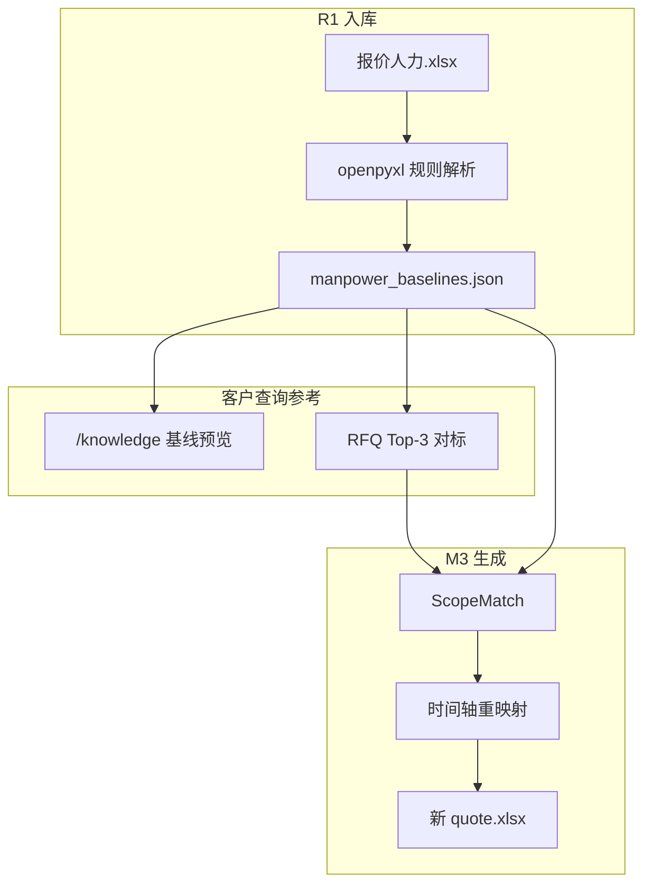

# 人力报价 Excel · baselines 与生成链路规格

**版本：** v1.0 · 2026-07-06  
**状态：** 架构定稿 · **R1-K04/K05 未实现** · Debug 预览解析已实现  
**关联：** [m3-scope-match-spec.md](m3-scope-match-spec.md) · [rag-design.md §11.3](rag-design.md) · [template-mapping.md §1](template-mapping.md) · [api-design.md §2.3 baselines](api-design.md)

---

## 1. 产品结论（2026-07-06 评审）

| 问题 | 决策 |
|------|------|
| 历史报价 Excel 是否向量化（主路径） | **否** — Sheet 规则 → `manpower_baselines.json` |
| 客户「查历史人力报价 / 类似需求人天参考」 | **是** — 结构化 baselines + RFQ Top-3 联动，**非**报价表单元格向量检索 |
| 新 Excel 生成数字从哪来 | **历史 baselines 抽取 + 当前 RFQ 时间轴重映射**；LLM **不发明**人天 |
| 大模型角色 | 解析**当前 RFQ**；可选 `manpower_row_map` 筛岗位行；**不**靠 RAG 读报价表 |

**三层交付（实施顺序）：**

| 层 | 里程碑 | 能力 | 客户价值 |
|----|--------|------|----------|
| **Layer 1** | R1 | 解析 → `manpower_baselines.json` · `GET /knowledge/baselines` · `/knowledge` 基线预览 · RFQ Top-3 挂 baselines | 历史项目人天可查、可对照源 Excel |
| **Layer 2** | M3 | ScopeMatch · 9 Function 填 Sheet · 时间轴 remap · `quote_fill_report` · 替换 Demo Mock | 自动生成新报价 Excel 初稿 |
| **Layer 3** | Phase 2 可选 | Engagement **摘要** chunk 入向量（metadata + 各 Function 合计人天） | 自然语言「类似项目人力大概多少」辅助检索 |

**明确不做（主路径）：**

- 报价 Excel 逐行/逐单元格 pgvector 索引  
- LLM 直接生成月列 FTE  
- 带历史日期的整 Sheet 原样粘贴  

---

## 2. 客户场景与系统路径映射

| 客户诉求 | 系统路径 | 是否依赖报价 Excel 向量 |
|----------|----------|-------------------------|
| 找「需求类似」的历史项目 | 上传 RFQ → **RFQ 向量 Top-3** → ScopeMatch（M3） | 否 |
| 看某历史项目各 Function 人天 | **`GET /knowledge/baselines`** · engagement 筛选 | 否 |
| 对比源 Excel 数字是否读对 | R1 §4.2 对照表 · `/knowledge` 基线 Tab | 否 |
| 生成新项目报价 Excel | M3：best_match baselines + **当前 RFQ milestones** remap | 否 |
| 自然语言「搜历史报价」（增强） | Layer 3：Engagement 摘要向量 + 跳转 baselines | 可选，非 R1 |



---

## 3. R1 · baselines 解析与存储

### 3.1 输入

- 客户 **Engagement 三件套** 中的人力报价 Excel（如 `报价人力模板.xlsx` / `报价人力_*.xlsx`）  
- **须为填好数的历史项目文件**；空模板仅用于结构验证，无知识库查询价值  

默认验证语料：`E:\AI文档项目\RE_ 报价AI需求沟通\`（`ARIA_VALIDATION_CORPUS` 可覆盖）

### 3.2 解析规则（`quote_baseline_extractor.py`）

| Sheet | 抽取内容 |
|-------|----------|
| Project information | B6/B7/B8/B13：客户、项目、报价号、周期（月） |
| PM / BIW / Interior / GI / Test validation / Chassis / CAE / EE / PS | 自第 5 行起：岗位名、Tariff、Sum、月列 D–W 非零格 |

**R1-K04a 待实现 · 解析加固：**

| 项 | 现状 | 目标 |
|----|------|------|
| Expense/Money 行 | Travel Expense 等可能混入 positions | 过滤 `Expense`/`Money`/非 Headcount 行 |
| 岗位行截断 | Debug 预览每 Sheet 最多 20 行 | 正式 ingest **全量** positions |
| `total_man_days` | 预览用 Sum 列 | 与 Manpower 汇总、源 Excel 对照验收 |
| engagement 关联 | 单文件预览 | manifest `engagement_id` + `source_doc` 写入 JSON |

### 3.3 存储

| 项 | 规格 |
|----|------|
| 路径（dev） | `backend/data/manpower_baselines.json` |
| 路径（prod） | `${ARIA_DATA_ROOT}/app/manpower_baselines.json` |
| 写入 | 与 `POST /knowledge/import` 同批；先写 `.tmp` → 校验 → rename |
| 数据库 | **R1 主路径为 JSON 文件**；Phase 2 可选 `manpower_baselines` 表 |

### 3.4 API

```
GET /api/v1/knowledge/baselines
  ?engagement_id=
  &function=PM,Chassis
```

用途：R1 验收台、管理员查历史；M3 `load_baselines(engagement_id)`。

响应形状见 [api-design.md §2.3](api-design.md) 与 [m3-scope-match-spec.md §2](m3-scope-match-spec.md)。

### 3.5 `/knowledge` UI（R1-K08b）

**基线预览 Tab**（客户可见，非 Debug）：

- Engagement 列表：客户、项目、周期、源 Excel 路径  
- 钻取：9 Function 合计人天 + 岗位行（可展开）  
- 操作：导出对照表 PDF/Excel（验收签字用）  
- **RFQ 对标页联动**：Top-3 项目卡片 →「查看该项目 baselines」  

---

## 4. M3 · 生成新 Excel（Layer 2）

完整流水线见 [m3-scope-match-spec.md §5–§6](m3-scope-match-spec.md)。

**时间轴原则（重申）：**

| 字段 | 来源 |
|------|------|
| Project information 全部里程碑日期 | **当前 RFQ** `milestones` + `timeline_months` |
| Function Sheet 月列 D–W | baselines **人天总量** + **当前 RFQ 周期** 重映射 |
| 禁止 | 复制历史项目 Excel 中的日期列 |

**Function 范围：**

- 由当前 RFQ `development_scope` → Sheet 映射表决定填哪些 Sheet  
- scope 外 Sheet 保持模板空  

**Demo 现状（`manpower_plan_service.py`）：**

- 仍使用 `MOCK_MANPOWER_BASELINES`  
- 仅 PM + Chassis；Layer 1 完成后须切换为真实 JSON  

---

## 5. Phase 2 可选 · Engagement 摘要向量（Layer 3）

**触发条件：** R1 baselines + RFQ Top-3 仍无法满足「自然语言查历史项目」时再上。

| 项 | 规格 |
|----|------|
| Chunk 粒度 | **每 engagement 1–3 条**摘要（非 Excel 逐行） |
| 内容 | 项目名、客户、年份、scope 摘要（来自 RFQ metadata）、各 Function **合计人天**、周期 |
| `doc_type` | `quote_summary`（或 `engagement_summary`） |
| 检索后 | **必须**展示 engagement_id + 源 Excel + baselines 明细；禁止仅 LLM 输出数字 |

任务 ID：**R1-P2-01**（合同外 / 变更单；见 [dev-tasks.md §R1-P2](../R1/dev-tasks.md)）。

---

## 6. Debug UI 与正式交付边界

| 能力 | Debug `/knowledge/debug` | R1 客户交付 `/knowledge` |
|------|--------------------------|---------------------------|
| 报价 Excel 预览解析 | ✓ 已实现（`quote_baselines`） | — |
| 预览缓存 | `kb_debug_preview.json`（临时） | — |
| baselines 持久化 | ✗ 未做 | R1-K04 → `manpower_baselines.json` |
| 向量化报价 Excel | ✗ 不做 | ✗ 不做 |
| RFQ/Q_A 向量索引 | ✓ DEV 验证 | R1-K02/K07 |

---

## 7. 验收要点

### R1（Layer 1）

- [ ] ≥2 份历史报价 Excel × 每份 ≥3 Function 人天与源文件一致（§4.2 对照）  
- [ ] `GET /knowledge/baselines` 可按 engagement / function 查询  
- [ ] `/knowledge` 基线预览 Tab 可浏览 + Top-3 可跳转 baselines  
- [ ] 检索评测 15 题：**RFQ/Q_A 为主**；不要求「向量搜报价单元格」Pass  

### M3（Layer 2）

- [ ] ≥3 RFQ ScopeMatch 书面确认  
- [ ] 新 Excel 里程碑 = 当前 RFQ；scope 内 Sheet 来自 baselines + remap  
- [ ] `quote_fill_report` 覆盖缺 milestone / 无 baseline 等  

---

## 8. 实现任务索引

| 任务 ID | 说明 |
|---------|------|
| R1-K02 | 分类型 ingest（报价 → baselines 分支，非 pgvector） |
| R1-K04 | baselines JSON 写入 + import 同批 |
| R1-K04a | 解析加固（Expense 过滤、全量行、total 校验） |
| R1-K05 | `GET /knowledge/baselines` |
| R1-K08b | `/knowledge` 基线预览 Tab + Top-3 联动 |
| R1-F09 / R1-U04 | RFQ 矩阵 Top-3 卡片挂 baselines 入口 |
| M3-2C | ScopeMatch + 9 Function + remap + fill_report |
| R1-P2-01 | Layer 3 摘要向量（可选） |

完整表：[dev-tasks.md](../R1/dev-tasks.md)

---

## 9. 版本记录

| 版本 | 日期 | 说明 |
|------|------|------|
| v1.0 | 2026-07-06 | PM/架构评审：三层交付、不向量化主路径、解析加固与 UI 任务 |
