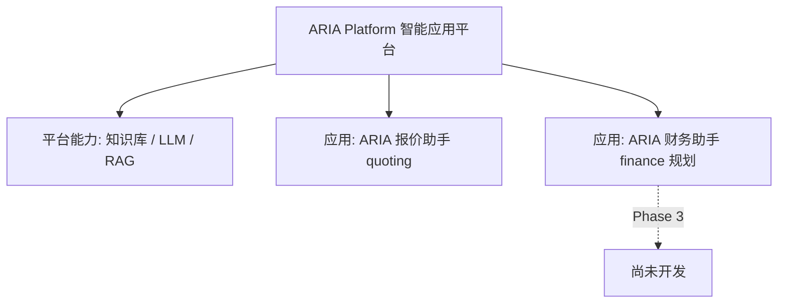

# ARIA 产品品牌与平台定位

**版本：** v1.1 · 2026-06-29  
**状态：** 已确认（对外叙事基线 · 同步客户版 v3.5）  
**关联：** [prod.md §1](../../prod.md) · [demo-scope-brief.md](../demo-scope-brief.md)

---

## 1. 品牌定义

| 项 | 内容 |
|----|------|
| **品牌名** | **ARIA** |
| **英文释义** | **A**ssisted **R**easoning & **I**ntelligence **A**pplications |
| **中文名称** | **ARIA 智能应用平台** |
| **英文名称** | ARIA Platform |
| **性质** | 部署在客户内网的 **本地私有化 AI 应用平台**（产品品牌） |

ARIA 统一提供：

- 企业知识库（历史资料建库、维护、检索）
- 本地大模型调用（Ollama）
- 检索增强生成（RAG）与 Prompt 管理
- 可扩展的应用挂载能力（Generator / 路由 / 领域 Prompt）

---

## 2. 平台 vs 应用

| 层级 | 名称 | 内部标识 | 说明 |
|------|------|----------|------|
| **平台** | ARIA 智能应用平台 | — | 品牌与共享基础设施 |
| **平台能力** | 知识库（历史项目工程资料） | `/knowledge` | Demo：统计 + 检索 + 触发导入 |
| **应用 1（首期）** | **ARIA 报价助手** | App `quoting` | **当前 Demo / 开发范围** |
| **应用 2（规划）** | ARIA 财务助手 | App `finance` | Phase 3；仅文档与路由占位 |

**历史称谓（应用级，不再指整个平台）：**

- Automated RFQ Intelligence Assistant — 报价助手起源说明，可作脚注
- 「智能报价辅助系统」— 指 **报价助手应用**，非 ARIA 平台全称

---

## 3. 当前开发范围（硬性）

**仅交付「ARIA 报价助手」Demo（框架可认知 Demo + 能力档），不开发：**

- 财务助手应用（除菜单/API 占位与文档描述外）
- 平台级 `/platform/*` API 命名空间重构（Phase 2 规划）
- 通用「资料问答」Chat（Phase 2.5 规划）
- 完整知识库 DMS（upload UI、Engagement DB 等属 Phase 2）

**Demo 须向客户传递的平台理念：**

- ARIA 是 **可扩展的内网 AI 应用平台**
- 知识库与模型为 **共享平台能力**，报价助手为 **首个应用**
- 后续财务等模块可 **复用同一知识库、模型与部署**，无需重搭基础设施

---

## 4. 工程标识（不因品牌升级而修改）

| 标识 | 值 |
|------|-----|
| 代码仓库 | `aria` |
| 数据根目录 | `ARIA_DATA_ROOT`（默认 `/data/aria`） |
| API 前缀 | `/api/v1`（Demo 保持；Phase 2 可增 `/platform`） |

---

## 5. 对外话术（建议）

**Elevator pitch：**

> ARIA 是贵司内网部署的 AI 智能应用平台，统一提供知识库、本地大模型与检索能力。我们首期交付 **报价助手**，帮助工程师完成 RFQ 解析、历史对标与人力报价；后续财务等应用可在同一平台上扩展，共享基础设施、缩短建设周期。

**Demo 演示补充：**

> 今天演示的是 ARIA 平台上的 **报价助手**。**知识库** 展示的是平台级共享能力（历史项目 RFQ、方案、报价等）——正式版接入贵司历史项目后，报价与未来其他应用都将使用同一套检索引擎。

---

## 6. 变更记录

| 日期 | 版本 | 说明 |
|------|------|------|
| 2026-06-29 | v1.1 | 同步客户版 v3.5：Engagement KB、卖点、M3 抽取+重映射 |
| 2026-06-22 | v1.1 | 平台能力 UI 主名「知识库」 |
