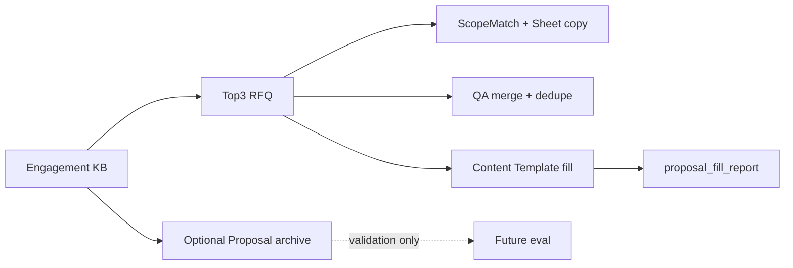

# ARIA 平台 · 知识库 / RAG 设计说明

**层级：** ARIA 平台共享能力（非报价应用私有）  
**版本：** v1.5 · 2026-07-10
**状态：** Demo P0 已实施（Chroma 嵌入式为 **过渡实现**）· **R1 目标：pgvector + Ollama Embedding** · 代码 Gate 未开  
**关联：** [platform-brand.md](platform-brand.md) · [prod.md §3.5–§3.6](../../prod.md) · [delivery-traceability.md](delivery-traceability.md) · [api-design.md §2.3](api-design.md)

---

## 1. 设计结论

知识库是 **ARIA 平台** 的核心共享能力；报价助手、未来财务助手等 **应用均通过同一 RAG 管道消费**。Demo 阶段页面定位是 **「信任后台 + 检索实验室」**，不是完整文档管理系统（DMS）。

| 维度 | Demo（P0） | Phase 2 |
|------|------------|---------|
| 页面角色 | 验证历史资料可入库、可检索、可驱动 RFQ 对标 | 可运营的知识库 + 原子模块 |
| 核心能力 | 统计 + 可编辑检索 + 触发导入 | engagement 项目包 + manifest + upload UI |
| RFQ 消费 | 对比矩阵 + 相似项目 Expand + Function 缺口 Alert | 同上 + QA/方案 RAG 生成 |
| 明确不做 | upload 弹窗、DB 异步索引、Re-index UI、RFQ 独立侧栏 | — |

**架构铁律：** 一条检索管道（`RAGService.search()`），多处消费（RFQ 对标、`/knowledge/search`）。禁止为 `/knowledge` 与 `/rfq` 维护两套 Mock 数据源。

**解析铁律（与向量检索分工）：**

| 资料类型 | 入库/读取主路径 | 不用 RAG/LLM 做的事 |
|----------|----------------|---------------------|
| RFQ Word | 结构化预解析（章节+表格）→ LLM 填 JSON；章节切块 → pgvector | 整篇 flatten 丢 LLM；表格不读 |
| Q_A Excel | **openpyxl 按行 8 列**；可选行级向量 | M4 **读全表 Area 合并**，不靠向量决定抽题 |
| 人力报价 Excel | **Sheet 规则 → `manpower_baselines.json`** | LLM 填月列数字；向量检索选股 |
| Proposal PPT | manifest 配对归档 | M5 不用 Proposal RAG 生成 |

**向量存储（R1 目标）：** PostgreSQL **pgvector**（与业务表同库，`pg_dump` 统一备份）。**不采用** LangChain、独立 ChromaDB 服务；Demo 代码中的 `chroma_store.py` 为迁移前过渡。

---

## 2. 目标架构

```mermaid
flowchart TB
  subgraph ingest [入库]
    KBDir["knowledge_base/ + manifest.json"]
    RFQparse["RFQ: 章节+表格 IR"]
    QAparse["Q_A: openpyxl 按行"]
    Quoteparse["报价: Sheet→baselines.json"]
    EmbedSvc["EmbeddingService Ollama nomic-embed-text"]
    ImportAPI["POST /knowledge/import"]
    KBDir --> RFQparse
    KBDir --> QAparse
    KBDir --> Quoteparse
    RFQparse --> EmbedSvc
    QAparse --> EmbedSvc
    EmbedSvc --> PGvec[(PostgreSQL pgvector)]
    Quoteparse --> BaselinesJSON[manpower_baselines.json]
    ImportAPI --> ingest
  end

  subgraph search [检索 — 单一出口]
    RAGSvc["RAGService.search() Top-K"]
    PGvec --> RAGSvc
    MockData["MOCK_RAG_HITS"] --> RAGSvc
    RAGSvc --> Compare["build_comparison_table()"]
    RAGSvc --> KBSearch["POST /knowledge/search"]
    Compare --> RFQUI["/rfq Top-3 对标"]
  end

  subgraph gate [拒答与溯源]
    RAGSvc --> Threshold{"similarity 阈值 / 空结果?"}
    Threshold -->|否| Insufficient["insufficient_evidence 不编造"]
    Threshold -->|是| Citation["source_doc + locator 出处"]
  end
```

---

## 3. 统一 RAG 检索契约

### 3.1 命中项（RAGHit）

所有检索 API 与 RFQ 内部分析共用同一 JSON 形状（Pydantic：`RAGHit` / `KnowledgeSearchResponse`）。

```json
{
  "content": "底盘集成验证内容...",
  "metadata": {
    "project_name": "2023_chassis",
    "source_doc": "knowledge_base/2023_chassis/rfq.docx",
    "doc_type": "rfq",
    "engagement_id": null,
    "functions": ["Chassis"],
    "year": 2023,
    "customer": "OEM-A",
    "chunk_chapter": "3.2 Scope",
    "locator": { "sheet": null, "row": null, "area": null }
  },
  "similarity_score": 0.85,
  "chunk_id": "uuid-or-stable-id"
}
```

**出处（locator）规则（R1）：**

| doc_type | locator 示例 |
|----------|-------------|
| `rfq` | `{ "chapter": "3.2 Scope", "table_index": 1 }` |
| `qa` | `{ "sheet": "Sheet1", "row": 12, "area": "Chassis" }` |
| `quote_manpower` | 不进向量主检索；baselines 中 `{ "sheet": "PM", "row": 5 }` |

**拒答门控（R1）：** Top-K 为空或 `max(similarity_score) < 阈值`（默认约 0.65，可调）→ 返回 `insufficient_evidence: true`，**禁止**回退 Mock 项目或编造对比表人天。

| 字段 | Demo | Phase 2 | 说明 |
|------|------|---------|------|
| `content` | ✓ | ✓ | chunk 文本 |
| `metadata.project_name` | ✓ | ✓ | 项目标识 |
| `metadata.source_doc` | ✓ | ✓ | 相对路径，供 UI 展示来源 |
| `metadata.doc_type` | ✓ | ✓ | `rfq` / `qa` / `quote_manpower` / `summary` |
| `metadata.functions[]` | Mock 扩展 | ✓ | 用于 Function 过滤与缺口检测 |
| `metadata.engagement_id` | null | ✓ | 历史项目包 ID |
| `metadata.locator` | — | ✓ | 文档内位置（章节/行/Area） |
| `chunk_id` | — | ✓ | 稳定 chunk 标识，供溯源与反馈 |
| `similarity_score` | ✓ | ✓ | 统一字段名，禁止混用 `similarity` |

**展示层字段（如 `actual_man_days`）** 优先来自 `comparison_table.projects`，**不要** duplicate 在 RAG hit 顶层。

### 3.2 Mock 策略

| 常量 | 用途 | 规则 |
|------|------|------|
| `MOCK_RAG_HITS` | `MOCK_RAG=true` 时检索结果 | **唯一** chunk 级 Mock 源 |
| `MOCK_COMPARISON_TABLE` | 对比表基线 / 测试 | 应由 hits **派生**或与之字段对齐，禁止第三套嵌套结构 |
| `MOCK_KNOWLEDGE_STATS` | stats Mock 增强（P0） | 含 `function_coverage`、`last_import_at` |

切换 `MOCK_RAG` 时前端与 RFQ 页 **零改动**；集成测试对 Mock/Real 断言同一 schema（Real 允许空结果）。

### 3.3 置信度

- 计算：`RAGService.calculate_overall_confidence()`（见 prod §8.2）
- UI：RFQ 页 `ConfidenceBadge` + 行级 `similarity_score`；**不在** `/knowledge` 重复一套置信度 UI

---

## 4. Demo 改动计划（P0 / P1）

### P0 — 对齐 prod F5.1–F5.4 + RFQ 缺口提示

| ID | 工作包 | 文件 | 说明 |
|----|--------|------|------|
| P0-1 | 增强 stats Mock | `mock_data.py`, `rag_service.py`, `knowledge/page.tsx` | `function_coverage`、`last_import_at` |
| P0-2 | 检索实验室 UI | `knowledge/page.tsx`, `schemas/knowledge.py` | 可编辑 query、`top_k`、结果表 |
| P0-3 | 触发导入 | `knowledge/page.tsx` | 按钮 → `POST /knowledge/import` + Toast |
| P0-4 | Function 缺口 Alert | `rfq/page.tsx` | `functions_in_scope` 与命中 projects 差集 |
| P0-5 | 契约文档 | 本文档 + api-design §2.3 | 已完成（本文） |
| P0-6 | Schema parity 测试 | `API_tests/test_knowledge_api.py` | Mock/Real 同一响应形状 |

### P1 — 有时间再做

| ID | 工作包 | 说明 |
|----|--------|------|
| P1-1 | `GET /knowledge/documents` | 只读：扫描 `knowledge_base/` 或 Mock 三态各 1 条；**不建 DB** |
| P1-2 | `function_filter` on search | 需 metadata 含 `functions[]` |
| P1-3 | 60 秒 Demo 脚本 | 见 [user-manual.md §5](../user-manual.md) |

### Demo 明确不做

- `knowledge_documents` / `knowledge_imports` DB + 异步 processing 轮询
- `POST /documents/upload` multipart + AI preview
- `POST /reindex` UI（F5.5 Demo = 脚本 `ingest_documents.py`）
- RFQ 历史参考**独立侧栏**（已有 ExpandRow + 对比矩阵）

---

## 5. Phase 2：Engagement（历史项目包）

先于完整 upload UI 落地，避免「单文件上传无法关联 RFQ/QA/报价」的返工。

### 5.1 概念

**Engagement** = 一次完整报价项目的资料包，关联：

- RFQ 原文
- Q_A 清单（Excel）
- 人力报价（Excel）
- 技术方案 / SOW（可选）

### 5.2 manifest.json（批量入库主路径）

```json
{
  "engagement_id": "2023_chassis_oem_a",
  "project_name": "2023 Chassis Integration",
  "customer": "OEM-A",
  "year": 2023,
  "functions": ["Chassis", "PM"],
  "documents": [
    {"path": "rfq.docx", "doc_type": "rfq"},
    {"path": "qa.xlsx", "doc_type": "qa"},
    {"path": "quote.xlsx", "doc_type": "quote_manpower"},
    {"path": "proposal.docx", "doc_type": "summary"}
  ]
}
```

目录结构建议（**容器内 / 逻辑路径**；生产宿主机为 `${ARIA_DATA_ROOT}/app/knowledge_base/`）：

```
knowledge_base/
└── 2023_chassis_oem_a/
    ├── manifest.json
    ├── rfq.docx
    ├── qa.xlsx
    └── quote.xlsx
```

### 5.3 RFQTask 归档链路

```
RFQTask (review_status = exported)
  → archive_engagement()
  → 复制 rfq/qa/quote 文件 + rfq_modules JSON
  → ingest（engagement_id + parent_document_id）
  → 可选：写入 manpower_baselines / qa_records 结构化表
```

### 5.4 数据模型（Phase 2）

| 表 | 用途 |
|----|------|
| `engagements` | 项目包元数据 |
| `knowledge_documents` | 文件级记录、索引状态、doc_type |
| `knowledge_imports` | 导入批次与时间戳 |

API 契约见 [api-design.md §2.3.4](api-design.md)。

---

## 6. 入库与迁移（R1 必做）

| 问题 | Demo 现状 | R1 目标 |
|------|-----------|---------|
| 向量库 | Chroma 嵌入式 `chroma_db/` | **PostgreSQL pgvector**（`pgvector/pgvector:pg16`） |
| 切块 | 1 docx = 1 chunk | RFQ **按章节**；Q_A **按行**；报价 **Sheet→baselines**（不进向量） |
| metadata | project_name / source_doc / doc_type | §3.1 全量 + **locator** + engagement_id |
| engagement | 文件夹名当 project | **manifest.json** + `engagements` 表 |
| embedding | Chroma 默认 ONNX | **Ollama `nomic-embed-text`** → 写入 pgvector；**批量 `/api/embed`**（Ollama ≥0.3）+ 超长截断（≈2400 字符） |
| pgvector 写入 | 逐条 insert | **分批 upsert**（200 条/批，`ON CONFLICT`） |
| 增量 | 文件 hash skip（部分） | 同左 + import 批次表 |
| LangChain | requirements 声明未使用 | **移除** |

### 6.1 生产稳定性与资源隔离（R1-KH）

> 任务与优先级见 [dev-tasks R1-KH](../R1/dev-tasks.md)。以下属于 R1 生产硬化，不等同于运营级 upload 门户。

**索引 generation：**

```
active_generation（工程师持续读取）
        │
        ├─ kb_index job → staging_generation
        │                  ├─ 解析 / 分批 embedding / 校验
        │                  └─ 成功后原子切 active pointer
        └─ 任一步失败 → 删除 staging，active 不变
```

- `knowledge_chunks` 主键为 **`(generation_id, chunk_id)`**；`knowledge_index_state` 按 logical namespace 保存 active/previous pointer，允许 active/staging 同时保存相同业务 chunk。
- 禁止 `clear production → embed → insert`；服务重启、Ollama/DB/磁盘失败时旧 generation 必须可读。
- **KH03 已实现：** legacy chunks 迁移为 `legacy-<namespace hash>` generation；staging 完整写入并校验 count 后，单事务切换 pointer；保留 active + previous，GC 失败不回滚 active。
- `kb_index` 进入 PostgreSQL job 队列；同一生产 namespace 只允许 1 个写任务。重复点击返回当前 job，不重复执行。
- 模型优先级：**交互 query embedding > RFQ 解析/生成 > KB 增量 > KB 全量重建**。KB 按小批释放全局租约并可安全取消；暂停/恢复仅在 checkpoint 语义和恢复测试通过后启用。
- **KH04 已实现：** `ollama_resource_leases` 保存 queued/acquired/released/expired 状态，短事务 advisory lock 串行化授予；调用期间 heartbeat 续租、崩溃后 TTL 回收。进程内 Semaphore 仅作防御性限制，不作为生产并发真相。

**增量与删除：**

- Engagement 计算稳定 `content_hash`；未变化计入 `skipped`，新增/修改仅替换该 engagement chunks。
- 文件/目录删除产生 tombstone，同批删除对应向量、baselines 和状态记录，禁止幽灵数据。
- Embedding 模型或 chunk schema 变化时显式触发全量 generation，不复用旧 hash。

**磁盘与 staging：**

- Web 上传流式写 `${ARIA_DATA_ROOT}/app/.staging/`；校验完成后 atomic rename 至 `knowledge_base/`。
- **KH05 已实现：** 同时检查数据盘与临时盘；80% 告警、90% 写保护（可配置），所需空间加保留量不足或 ENOSPC 返回结构化 507，既有检索/下载不受影响。
- ZIP 限制压缩包大小、文件数、解压后总大小、单文件大小与压缩比；拒绝绝对路径、`..`、反斜杠逃逸和链接条目。

**Windows 客户端 → Linux 服务器：**

- 浏览器上传与 Office 二进制格式本身跨平台；服务器内部路径统一为 UTF-8 NFC + POSIX 相对路径。
- 文件角色识别大小写不敏感；保留 `original_filename`，内部存储名不得直接信任客户端路径。
- R1 明确支持 `.docx` / `.doc`（Linux LibreOffice）；历史 Excel 默认 `.xlsx`。`.xls` 若未实现转换，不得在 UI 宣称支持。
- 回归集须覆盖中文、空格、大小写、长文件名、Windows ZIP、manifest 反斜杠和 legacy `.doc`。

---

## 7. 提升检索准确度的工程路径（ROI 排序）

1. **metadata 预过滤**（`functions_in_scope` + `doc_type` + `engagement_id`）— R1 必做
2. **切块 + Ollama Embedding**（§6）— R1 必做
3. **拒答门控 + 完整 locator**（§3.1）— R1 必做
4. **轻量 keyword boost**（可选，R1 与 Hybrid 之间）：PostgreSQL 对 `project_name` / `customer` / `platform_type` 的 `ILIKE` 或 `tsvector` 加权，覆盖项目代号类 query
5. **完整 Hybrid**（向量 + BM25 双路融合）— **R1 不含**；评测暴露精确匹配缺口或客户变更单
6. **Rerank**（Top-20 → Top-5）— **R1 不含**；变更单 / 技术升级包
7. **评测集**：≥15 query，≥12/15 人工判相关（[R1 验收说明](../R1-知识库验收与检索评测说明（客户版）.md)）

LLM 负责**有上下文**的语义合成（RFQ JSON、qa_dedupe）；检索质量取决于 **embedding + chunk + metadata**，而非换更大模型（生产 **32B Q4** 已足够，不推 70B/72B）。

---

## 7.1 开发期验证（切块 / 检索 / 拒答）

| 类型 | 自动化 | 人工 |
|------|--------|------|
| RFQ 切块 | golden 样本：章节数、表格行数、关键 JSON 字段 | 随机 20 chunk spot check |
| Q_A 入库 | 有效行数 = Excel 行数；8 列 schema | Area 分布抽查 |
| 报价 baselines | R1 §4.2：≥2 份 × ≥3 Function 数字一致 | 对照表签字 |
| 检索 | 回归 JSON：query → expected `engagement_id`（结构断言，不比 score） | ≥15 题评测表 |
| 拒答 | API 测试：空 hits → `insufficient_evidence`，无 Mock 回退 | — |
| regression | Top-K 数量、Excel Sheet、QA 列数；**不**比对 LLM 文本 | — |

---

## 8. UX 要点（设计师）

### 8.1 /knowledge 信息架构

```
/knowledge
├── Tab：历史项目库
│   ├── A：概览（统计 + Function 覆盖条）
│   ├── B：运维（上传项目包 | 触发导入 | 导入说明链接）
│   └── C：检索实验室（query + 结果 + source_doc）
└── Tab：原子模块（Phase 2 占位）
```

### 8.2 状态标注

复用 `DemoModuleCapability`：真实 RAG = 绿 Tag；Mock = 橙 Tag。不为知识库发明第三套状态色。

### 8.3 RFQ 页

- **不加**独立侧栏；增强 ExpandRow（片段 + 来源 + 可选跳转知识库同 query）
- Function 缺口：**对比矩阵 Card 下方 Alert**（如「CAE / EE 无历史参考，建议人工补充」）

---

## 9. 验收映射

| 验收项 | Demo | 说明 |
|--------|------|------|
| stats 展示 | P0 | Mock 增强即可 |
| 可编辑检索 | P0 | F5.4 |
| 触发导入 | P0 | F5.1 轻量版 |
| 文档列表三态 | P1 | Mock 样例，非 P0 |
| 单套/小批量 Web 上传 | **R1** | §11.4.1；不含 AI preview |
| upload + AI 预填 | 扩展 | — |
| Re-index UI | Phase 2 | Demo 用脚本 |
| RFQ Function 缺口 | P0 | Alert，非侧栏 |
| MOCK 切换零改动 | P0 | 统一契约 |
| 原子模块 Tab | 已完成 | F5.8 占位 |

---

## 11. R1 验收范围（v3.3 · 文档规格）

与客户版 v3.3 对齐；**代码 Gate 未开** 前以本文 + [R1 验收说明](../R1-知识库验收与检索评测说明（客户版）.md) 为准。

### 11.1 Engagement 三件套

| 资料 | R1 必达 | M3/M4/M5 主路径 |
|------|--------|----------------|
| RFQ | ✓ 切块 + 向量 | Top-3 相似 RFQ；§四 `development_scope[]` metadata |
| Q_A | 金标准须有；铜级可缺失；存在时 **按行 1 chunk** | M4：**读全表** Area 合并（非向量主路径）；缺失则 M4 不可用 |
| 报价 | ✓ **Sheet 结构化** baselines | M3：**ScopeMatch + 抽取 + 时间轴重映射** |
| Proposal | 可选 | **不作 M5 生成**；manifest 配对归档 |

### 11.2 检索与对标

- RFQ 对标：**Top-3**（A/B/C）；N&lt;3 时 1–2 个 + UI Warning
- R1 评测：≥15 条 query；**不含** M5 方案模块生成题
- **R1 不含：** Hybrid、Rerank（§7 路径 3–4 为 Phase 2 可选）

### 11.3 manpower_baselines（R1 硬交付）

> **完整规格：** [manpower-baselines-spec.md](manpower-baselines-spec.md)（2026-07-06 定稿）

| 项 | 决策 |
|----|------|
| 存储 | `${ARIA_DATA_ROOT}/app/manpower_baselines.json` |
| 写入 | 与 import 同批；原子 rename |
| 读取 | `GET /knowledge/baselines`；M3 替换 `MOCK_MANPOWER_BASELINES` |
| 验收 | `/knowledge` **基线预览** Tab + 数字对照表签字 |
| **向量** | **报价 Excel 不进 pgvector 主路径**；客户「查历史人力」= baselines 结构化查询 + RFQ Top-3 联动 |
| Phase 2 可选 | Engagement **摘要** chunk（`quote_summary`）；见 manpower-baselines-spec §5 · dev-tasks R1-P2-01 |

**客户场景映射：**

| 诉求 | R1/M3 路径 |
|------|------------|
| 类似需求人天参考 | RFQ Top-3 → 展示对应 engagement baselines |
| 浏览历史项目各 Function 人天 | `GET /knowledge/baselines` + 基线预览 Tab |
| 生成新报价 Excel | M3：ScopeMatch + baselines 抽取 + **当前 RFQ** 时间轴 remap |

### 11.4 `/knowledge` 验收台（R1  reposition）

向导：**上传/准备 → 索引 → 清单 → 检索验证 → 基线核对**  
角色：管理员 + R1 验收会；工程师日常仍以 `/rfq` 为主。

#### 11.4.1 R1 轻量 Web 上传（单套 / 小批量）

| 项 | R1 含 | 说明 |
|----|-------|------|
| **单套上传** | ✓ | 知识库页上传 **1 个历史项目包**：`.zip` **或** 多文件（RFQ + 可选 Q&A + 报价 + 可选 `manifest.json`） |
| **小批量** | ✓ | 同一操作内 **≤5 套** 项目包（逐套 ZIP 或多组文件）；上传后展示 **成功/失败/缺件** 清单 |
| **缺件提示** | ✓ | 缺 Q&A 或报价时 **仍可入库**（银/铜），UI 标明 **哪些自动流程不可用** |
| **上传后索引** | ✓ | 上传完成可 **一键触发** 本次包的 import（或并入「更新知识库索引」） |
| **大批量历史库** | 仍推荐 | **内网 IT 目录落盘 + 触发全量索引**；不以浏览器一次传数十套为 R1 目标 |

**R1 客户合同不含（可选内部实现见 §11.4.2）：** 拖拽整目录、断点续传、upload AI 预识别 preview、**SSO/部门级 ACL**、**F5.6 客户交付**、归档一键入库、过期提醒、检索热力看板、**运营级上传门户**。R1 已包含本地账号、`quote_engineer` / `kb_admin` 两角色与 KB 写操作守卫。

#### 11.4.2 引用反馈 L1（F5.6 · 内部运维增强 · 可选 · **未实现**）

> **2026-07-06：** **不进客户合同**；R1～M6 视进度可选（[dev-tasks R1-OPS](../R1/dev-tasks.md)）。对客户仍用试搜表 + 例会；商用立项见 [feedback-ops-pack（客户版）](../supplementary/feedback-ops-pack（客户版）.md)。

| 项 | L1 规格 | 说明 |
|----|---------|------|
| **提交反馈** | 计划 | `POST /knowledge/feedback`；知识库检索 + RFQ 相似项目行 |
| **类型** | 计划 | `wrong_project` / `irrelevant` / `wrong_snippet` |
| **列表/导出** | 计划 | `GET /feedback`、`GET /feedback/export` — **乙方**双周复盘（CSV） |
| **存储** | 计划 | `${ARIA_DATA_ROOT}/app/feedback/feedback.jsonl` |
| **自动变准** | 不含 | **不** 微调 LLM；审查后人工：改 metadata、补评测题、Re-index |
| **L2 闭环** | 不含 | 审查 UI、看板、评测集自动合并 — 变更单 |

**飞轮（L2 目标，非 L1）：**

```
工程师点「引用不准」 → 反馈库 → 管理员/乙方审查 → 修正数据或评测集 → Re-index → 下次检索更准
```

L1 目标为 **点选 + 存储 + CSV 导出**。**当前代码 Gate 未开**；实施后 **不**写入 R1 acceptance-checklist。

---

### 11.5 入库方式（R1 双路径）

```
路径 A（推荐大批量）：IT 落盘 knowledge_base/<engagement_id>/ → 知识库页「更新索引」
路径 B（单套/小批量）：知识库页「上传项目包」→ 校验 → 写入同目录 → 触发索引
```

---

## 12. 应用消费路径（v3.3 · 与 M5 解耦）



- **M5：** 仅 RFQ → **34 页 Content Template** + [proposal_fill_report](m5-proposal-fill-spec.md)；**不**走 Proposal RAG
- **M4：** manifest Q_A → Area 合并 → `qa_dedupe` + G/H（见 [m4-qa-merge-spec.md](m4-qa-merge-spec.md)）
- **M3：** ScopeMatch → baselines **抽取** + RFQ **时间轴重映射**（见 [m3-scope-match-spec.md](m3-scope-match-spec.md)）

---

## 13. 变更记录

| 日期 | 版本 | 说明 |
|------|------|------|
| 2026-06-20 | v1.0 | 初版：评审 Claude 方案后的分阶段设计与 Demo P0 计划 |
| 2026-06-29 | v1.2 | v3.3–v3.5：R1 三件套、Q_A 按行、M3 抽取+重映射、M5 解耦 |
| 2026-06-29 | v1.3 | 回链 m3/m4 规格；baselines Sheet 级 ingest |
| 2026-07-04 | v1.4 | pgvector 目标架构；解析铁律；拒答/溯源 locator；R1 检索路径（无 Hybrid）；验证体系 |
| 2026-07-10 | v1.5 | R1-KH：Blue/Green 索引、跨进程资源调度、磁盘保护、Windows→Linux 文件兼容；修正铜级/RBAC 口径 |
