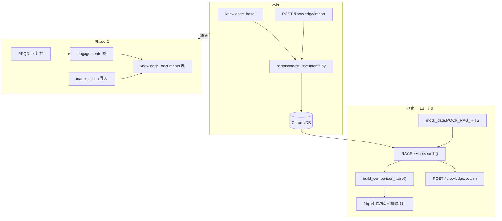

# ARIA 知识库 / RAG 设计说明

**版本：** v1.0 · 2026-06-20  
**状态：** Demo P0 已实施 · Phase 2 设计已定稿  
**关联：** [prod.md §3.5](../../prod.md) · [api-design.md §2.3](api-design.md) · [dev-context.md](../../dev-context.md)

---

## 1. 设计结论

知识库在 Demo 阶段的定位是 **「信任后台 + 检索实验室」**，不是完整文档管理系统（DMS）。

| 维度 | Demo（P0） | Phase 2 |
|------|------------|---------|
| 页面角色 | 验证历史资料可入库、可检索、可驱动 RFQ 对标 | 可运营的知识库 + 原子模块 |
| 核心能力 | 统计 + 可编辑检索 + 触发导入 | engagement 项目包 + manifest + upload UI |
| RFQ 消费 | 对比矩阵 + 相似项目 Expand + Function 缺口 Alert | 同上 + QA/方案 RAG 生成 |
| 明确不做 | upload 弹窗、DB 异步索引、Re-index UI、RFQ 独立侧栏 | — |

**架构铁律：** 一条检索管道（`RAGService.search()`），多处消费（RFQ 对标、`/knowledge/search`、Phase 2 QA/方案）。禁止为 `/knowledge` 与 `/rfq` 维护两套 Mock 数据源。

---

## 2. 目标架构



---

## 3. 统一 RAG 检索契约

### 3.1 命中项（RAGHit）

所有检索 API 与 RFQ 内部分析共用同一 JSON 形状（Pydantic：`RAGHit` / `KnowledgeSearchResponse`）。

```json
{
  "content": "底盘集成验证内容...",
  "metadata": {
    "project_name": "2023_chassis",
    "source_doc": "knowledge_base/2023_chassis/rfq.docx",
    "doc_type": "rfq",
    "engagement_id": null,
    "functions": ["Chassis"],
    "year": 2023,
    "customer": "OEM-A",
    "chunk_chapter": "3.2 Scope"
  },
  "similarity_score": 0.85
}
```

| 字段 | Demo | Phase 2 | 说明 |
|------|------|---------|------|
| `content` | ✓ | ✓ | chunk 文本 |
| `metadata.project_name` | ✓ | ✓ | 项目标识 |
| `metadata.source_doc` | ✓ | ✓ | 相对路径，供 UI 展示来源 |
| `metadata.doc_type` | ✓ | ✓ | `rfq` / `qa` / `quote_manpower` / `summary` |
| `metadata.functions[]` | Mock 扩展 | ✓ | 用于 Function 过滤与缺口检测 |
| `metadata.engagement_id` | null | ✓ | 历史项目包 ID |
| `similarity_score` | ✓ | ✓ | 统一字段名，禁止混用 `similarity` |

**展示层字段（如 `actual_man_days`）** 优先来自 `comparison_table.projects`，**不要** duplicate 在 RAG hit 顶层。

### 3.2 Mock 策略

| 常量 | 用途 | 规则 |
|------|------|------|
| `MOCK_RAG_HITS` | `MOCK_RAG=true` 时检索结果 | **唯一** chunk 级 Mock 源 |
| `MOCK_COMPARISON_TABLE` | 对比表基线 / 测试 | 应由 hits **派生**或与之字段对齐，禁止第三套嵌套结构 |
| `MOCK_KNOWLEDGE_STATS` | stats Mock 增强（P0） | 含 `function_coverage`、`last_import_at` |

切换 `MOCK_RAG` 时前端与 RFQ 页 **零改动**；集成测试对 Mock/Real 断言同一 schema（Real 允许空结果）。

### 3.3 置信度

- 计算：`RAGService.calculate_overall_confidence()`（见 prod §8.2）
- UI：RFQ 页 `ConfidenceBadge` + 行级 `similarity_score`；**不在** `/knowledge` 重复一套置信度 UI

---

## 4. Demo 改动计划（P0 / P1）

### P0 — 对齐 prod F5.1–F5.4 + RFQ 缺口提示

| ID | 工作包 | 文件 | 说明 |
|----|--------|------|------|
| P0-1 | 增强 stats Mock | `mock_data.py`, `rag_service.py`, `knowledge/page.tsx` | `function_coverage`、`last_import_at` |
| P0-2 | 检索实验室 UI | `knowledge/page.tsx`, `schemas/knowledge.py` | 可编辑 query、`top_k`、结果表 |
| P0-3 | 触发导入 | `knowledge/page.tsx` | 按钮 → `POST /knowledge/import` + Toast |
| P0-4 | Function 缺口 Alert | `rfq/page.tsx` | `functions_in_scope` 与命中 projects 差集 |
| P0-5 | 契约文档 | 本文档 + api-design §2.3 | 已完成（本文） |
| P0-6 | Schema parity 测试 | `API_tests/test_knowledge_api.py` | Mock/Real 同一响应形状 |

### P1 — 有时间再做

| ID | 工作包 | 说明 |
|----|--------|------|
| P1-1 | `GET /knowledge/documents` | 只读：扫描 `knowledge_base/` 或 Mock 三态各 1 条；**不建 DB** |
| P1-2 | `function_filter` on search | 需 metadata 含 `functions[]` |
| P1-3 | 60 秒 Demo 脚本 | 见 [user-manual.md §5](../user-manual.md) |

### Demo 明确不做

- `knowledge_documents` / `knowledge_imports` DB + 异步 processing 轮询
- `POST /documents/upload` multipart + AI preview
- `POST /reindex` UI（F5.5 Demo = 脚本 `ingest_documents.py`）
- RFQ 历史参考**独立侧栏**（已有 ExpandRow + 对比矩阵）

---

## 5. Phase 2：Engagement（历史项目包）

先于完整 upload UI 落地，避免「单文件上传无法关联 RFQ/QA/报价」的返工。

### 5.1 概念

**Engagement** = 一次完整报价项目的资料包，关联：

- RFQ 原文
- Q_A 清单（Excel）
- 人力报价（Excel）
- 技术方案 / SOW（可选）

### 5.2 manifest.json（批量入库主路径）

```json
{
  "engagement_id": "2023_chassis_oem_a",
  "project_name": "2023 Chassis Integration",
  "customer": "OEM-A",
  "year": 2023,
  "functions": ["Chassis", "PM"],
  "documents": [
    {"path": "rfq.docx", "doc_type": "rfq"},
    {"path": "qa.xlsx", "doc_type": "qa"},
    {"path": "quote.xlsx", "doc_type": "quote_manpower"},
    {"path": "proposal.docx", "doc_type": "summary"}
  ]
}
```

目录结构建议：

```
knowledge_base/
└── 2023_chassis_oem_a/
    ├── manifest.json
    ├── rfq.docx
    ├── qa.xlsx
    └── quote.xlsx
```

### 5.3 RFQTask 归档链路

```
RFQTask (review_status = exported)
  → archive_engagement()
  → 复制 rfq/qa/quote 文件 + rfq_modules JSON
  → ingest（engagement_id + parent_document_id）
  → 可选：写入 manpower_baselines / qa_records 结构化表
```

### 5.4 数据模型（Phase 2）

| 表 | 用途 |
|----|------|
| `engagements` | 项目包元数据 |
| `knowledge_documents` | 文件级记录、索引状态、doc_type |
| `knowledge_imports` | 导入批次与时间戳 |

API 契约见 [api-design.md §2.3.4](api-design.md)。

---

## 6. 入库技术债（Phase 2 必还）

| 问题 | 现状 | 目标 |
|------|------|------|
| 切块 | 1 docx = 1 chunk（max 8000 字） | 按章节/Function；QA 按行；报价按 sheet |
| metadata | 仅 project_name / source_doc / doc_type=summary | 完整 §3.1 字段 |
| engagement | 文件夹名当 project | manifest + engagement_id |
| 增量 | 全量 upsert | 文件 hash skip（`incremental_update.py`） |
| embedding | Chroma 默认 | 与 `.env` `EMBEDDING_MODEL` 一致 |

---

## 7. 提升检索准确度的工程路径（ROI 排序）

1. metadata 预过滤（`functions_in_scope` + `doc_type`）
2. 切块策略（F5.7 原子化）
3. Hybrid 检索（向量 + 项目名 keyword）
4. Rerank（Top-20 → Top-5，可选本地 cross-encoder）
5. Grounding：QA `history_reference` 必须引用 `source_doc` + chunk_id
6. 评测集：3–5 份 RFQ + 人工标注应命中项目

LLM 负责生成表述；检索质量取决于 **embedding + chunk + metadata**，而非单纯换更大模型。

---

## 8. UX 要点（设计师）

### 8.1 /knowledge 信息架构

```
/knowledge
├── Tab：历史项目库
│   ├── A：概览（统计 + Function 覆盖条）
│   ├── B：运维（触发导入 | 导入说明链接）
│   └── C：检索实验室（query + 结果 + source_doc）
└── Tab：原子模块（Phase 2 占位）
```

### 8.2 状态标注

复用 `DemoModuleCapability`：真实 RAG = 绿 Tag；Mock = 橙 Tag。不为知识库发明第三套状态色。

### 8.3 RFQ 页

- **不加**独立侧栏；增强 ExpandRow（片段 + 来源 + 可选跳转知识库同 query）
- Function 缺口：**对比矩阵 Card 下方 Alert**（如「CAE / EE 无历史参考，建议人工补充」）

---

## 9. 验收映射

| 验收项 | Demo | 说明 |
|--------|------|------|
| stats 展示 | P0 | Mock 增强即可 |
| 可编辑检索 | P0 | F5.4 |
| 触发导入 | P0 | F5.1 轻量版 |
| 文档列表三态 | P1 | Mock 样例，非 P0 |
| upload + AI 预填 | Phase 2 | — |
| Re-index UI | Phase 2 | Demo 用脚本 |
| RFQ Function 缺口 | P0 | Alert，非侧栏 |
| MOCK 切换零改动 | P0 | 统一契约 |
| 原子模块 Tab | 已完成 | F5.8 占位 |

---

## 10. 变更记录

| 日期 | 版本 | 说明 |
|------|------|------|
| 2026-06-20 | v1.0 | 初版：评审 Claude 方案后的分阶段设计与 Demo P0 计划 |
