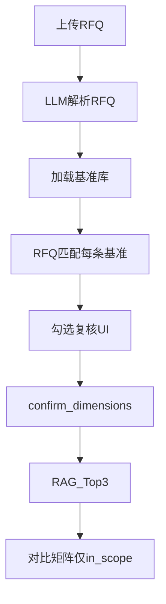

# RFQ 全维度对比矩阵 — 设计规格（F1.10a–d）

**版本：** v1.0 · 2026-07-04  
**状态：** 方案已定 · **待客户基准清单** · 未开发  
**关联：** [customer-feedback-baseline.md §1.1 Q8](../customer-feedback-baseline.md) · [prod.md](../../prod.md) F1.10 · [prompt-spec.md §3](prompt-spec.md) · [api-design.md §2.2](api-design.md)

> **客户反馈定位：** R1 **核心优先级最高** 功能 — 在统一 **~100 项工作维度基准库** 上，自动匹配 RFQ、勾选复核、再生成 Top-3 历史对比矩阵。

---

## 1. 与 F1.10 的关系

| prod ID | 名称 | 说明 |
|---------|------|------|
| F1.10 | 维度确认 + 对比矩阵（总） | 合同已有；本 spec 细化实现 |
| **F1.10a** | 基准维度库 | 可版本化主数据 ~100 项 |
| **F1.10b** | RFQ↔基准匹配 | 解析后自动打标 in/out + 工作内容 |
| **F1.10c** | 勾选复核 UI | `dimension_review` 阶段人机交互 |
| **F1.10d** | 确认后矩阵 | 仅 in_scope 行进 Top-3 对比表 |

**流程不变：** `parsing` → `dimension_review` → `retrieving` → `generating` → `completed`



---

## 2. 基准维度库（F1.10a）

### 2.1 存储

| 项 | 说明 |
|----|------|
| **路径（生产）** | `${ARIA_DATA_ROOT}/app/config/dimension_baseline.v1.json` |
| **路径（开发）** | `backend/data/config/dimension_baseline.v1.json` |
| **版本字段** | `version`: `v1`；升级时新文件 `v2`，任务记录 `baseline_version` |

### 2.2 JSON Schema

```json
{
  "version": "v1",
  "updated_at": "2026-07-04",
  "source": "customer | seed",
  "modules": [
    {
      "code": "Chassis",
      "label": "底盘",
      "dimensions": [
        {
          "id": "chassis_front_susp",
          "name": "前悬架开发",
          "keywords": ["front suspension", "前悬", "Front suspension"],
          "description": "可选说明"
        }
      ]
    }
  ]
}
```

| 字段 | 必填 | 说明 |
|------|------|------|
| `modules[].code` | 是 | 与 Function 可对齐：`Chassis` / `CAE` / `Interior` / `BIW` / `Closure` / `Simulation` 等 |
| `modules[].label` | 是 | 中文展示名 |
| `dimensions[].id` | 是 | 全局唯一 stable id |
| `dimensions[].name` | 是 | 维度显示名 |
| `dimensions[].keywords` | 否 | 规则匹配用 |
| `dimensions[].description` | 否 | 工程师说明 |

### 2.3 模块分类（客户口径 · 示例）

仿真 · 内外饰 · 底盘 · 车身(BIW) · 开闭件 · PM · EE · GI · CAE · Test validation 等 — **以客户提供 Excel 为准**。

---

## 3. RFQ 匹配规则（F1.10b）

**输入：** `rfq_modules`（含 `development_scope`、`modules`、`functions_in_scope`）+ 基准库全量条目

**输出：** 写入任务 `dimension_draft`（见 §4）

### 3.1 匹配通道（双通道 · 人工最终权威）

1. **规则通道：** `keywords` 命中 RFQ 全文 / `development_scope.title` / `modules[].module_name`  
2. **LLM 通道：** Prompt `rfq_baseline_match.txt` — 对每条基准输出 `in_scope`、`work_content`、`source_ref`、`confidence`

### 3.2 展示规则（客户 Q8）

| 状态 | `in_scope` | 工作内容列 | 勾选默认 |
|------|------------|------------|----------|
| RFQ 未涉及 | `false` | **`—`** | unchecked |
| RFQ 涉及 | `true` | 匹配文本（可编辑） | checked |
| 不确定 | `unknown` → 人工定 | 「未知」或 — | unchecked，标黄 |

### 3.3 模块摘要（`module_summary`）

对每个 `module` 聚合：

- `needed`: 该模块下是否存在 ≥1 条 `in_scope=true`  
- `in_scope_count`: 勾选条数  
- UI 顶栏：**底盘：需要介入 · 内外饰：不需要 · CAE：需要介入 …**

---

## 4. 任务数据 `dimension_draft`

```json
{
  "baseline_version": "v1",
  "items": [
    {
      "dimension_id": "chassis_front_susp",
      "module": "Chassis",
      "module_label": "底盘",
      "name": "前悬架开发",
      "in_scope": true,
      "work_content": "前悬架 M1/M2 数据开发",
      "source_ref": "RFQ §4.2.1",
      "manually_adjusted": false,
      "custom": false
    }
  ],
  "custom_items": [],
  "module_summary": [
    {"module": "Chassis", "module_label": "底盘", "needed": true, "in_scope_count": 5}
  ]
}
```

**自定义维度（`custom: true`）：** 工程师补充、不在基准库中的行；确认矩阵时一并纳入。

**兼容旧字段：** `confirm-dimensions` 仍可接受精简 `comparison_dimensions[]`（由 `items` 中 `in_scope=true` 映射生成）。

---

## 5. R1 分期（已决）

| 阶段 | 内容 | 基准库 | 验收 |
|------|------|--------|------|
| **R1-α** | 数据模型 · API 契约 · UI 线框 · 内部 seed（20–30 项） | seed | 内部演示 + 契约测试 |
| **R1-β** | 导入客户 ~100 项 · 调优匹配 Prompt · 3 份 RFQ 签字 | **客户正式** | **R1 客户验收** |

> **已决：** R1 客户验收 **绑定 R1-β**（须客户正式基准清单）。R1-α 不替代签字。

**已决 · UI：**

- **确认页（dimension_review）：** 展示 **全量基准行**（~100），out_of_scope 工作内容列 `—`  
- **矩阵页（completed）：** 仅展示 **in_scope** 行 + Top-3 历史列  

---

## 6. 页面设计（F1.10c · `/rfq`）

### 6.1 阶段 A — 维度确认（`dimension_review`）

```
┌─ 模块摘要 ─────────────────────────────────────────┐
│ 底盘: 需要介入 │ 内外饰: 不需要 │ CAE: 需要介入 …  │
└──────────────────────────────────────────────────┘
┌─ 基准维度表（Collapse 按 module）─────────────────┐
│ [√] 前悬架开发     │ 工作内容 │ 来源              │
│ [ ] 门把手开闭件   │ —        │ 未涉及            │
│ … 虚拟滚动 / 分页                                 │
│ [+ 补充自定义维度]                                │
└──────────────────────────────────────────────────┘
              [ 确认维度清单，生成对比矩阵 ]
```

**组件（规划）：** `DimensionBaselineReview`（新建）；不复用 Demo 直接出矩阵流程。

**交互：**

- Checkbox 切换 `in_scope`；编辑 `work_content`  
- 模块折叠；>50 行建议虚拟滚动  
- 确认前至少 1 项 `in_scope=true`（或允许全 — 时 Warning + 人工确认）

### 6.2 阶段 B — 对比矩阵（`generating` → `completed`）

- 复用 [`ComparisonMatrix.tsx`](../../frontend/src/components/ComparisonMatrix.tsx)  
- 行 = 已确认 `in_scope` 项（`dimension_id` / `name` + `work_content` → `new_project` 列）  
- 列 = 新项目 | 历史 A/B/C  
- 保留：编辑、置信度、ExpandRow 溯源

---

## 7. API（摘要 · 详见 api-design）

| 方法 | 路径 | 说明 |
|------|------|------|
| GET | `/api/v1/rfq/dimension-baseline` | 只读基准库（`version` + `modules`） |
| GET | `/api/v1/rfq/tasks/{id}` | 含扩展 `dimension_draft` |
| PUT | `/api/v1/rfq/tasks/{id}` | 更新 `dimension_draft.items` / 勾选 / 工作内容 |
| POST | `/api/v1/rfq/tasks/{id}/confirm-dimensions` | 提交 in_scope 项 → 触发 RAG + 矩阵 |

---

## 8. Prompt

| 文件 | 用途 |
|------|------|
| `prompts/v1/rfq_baseline_match.txt` | RFQ 结构化结果 + 基准条目 batch → `dimension_draft.items` |
| `prompts/v1/comparison_table.txt` | 确认后 Top-3 矩阵（输入为 in_scope 维度列表） |

> **supersede：** 原「动态生成 ~5 项 `comparison_dimensions`」降为 fallback；**主路径** 为基准库匹配。自定义维度走 `custom_items`。

---

## 9. 验收（R1 · 对标部分）

- [ ] 基准库已导入（客户 v1，≥80 项或双方认可数量）  
- [ ] 3 份 RFQ：**上传 → 全表勾选复核 → 确认 → Top-3 矩阵** 全流程  
- [ ] 未涉及维度在确认页显示 `—`；矩阵页不出现 out_of_scope 行  
- [ ] 模块摘要与工程师人工判断 **无明显矛盾**（允许个别条目标黄复核）  
- [ ] 对比矩阵可编辑、含来源与置信度  

---

## 10. 风险

| 风险 | 对策 |
|------|------|
| 客户清单延迟 | R1-α 文档/契约先行；签字等 R1-β |
| 100 行性能 | 折叠 + 虚拟滚动 |
| LLM 误匹配 | 人工勾选权威；`manually_adjusted` 审计 |
| 与 Demo 矩阵 UX 不一致 | RFQ 页两阶段；Demo `main` 不改动 |

---

## 附录 A · 向客户索取「工作维度基准表」

### A.1 业务说明（可复制至邮件）

> 尊敬的业务同事：  
> 为完成 R1 **RFQ 全维度技术对标**（贵司反馈的核心功能），请提供贵司历史项目采用的 **全量工作维度基准表**（Excel 即可）。  
> 该表将作为所有 RFQ 的 **统一比对基准**（约 100 项），系统将自动识别 RFQ 涉及/未涉及项，并在确认后生成与历史项目的对比矩阵。  
> 建议在 **R1 第 7–8 周联合调优前** 提供初版；可在试用后共同修订一版作为验收基线。

### A.2 Excel 模板列（建议）

| 列 | 字段名 | 必填 | 示例 |
|----|--------|------|------|
| A | 模块分类 | 是 | 底盘 / 内外饰 / 仿真 / 车身 / 开闭件 |
| B | 维度名称 | 是 | 前悬架开发 |
| C | 维度 ID（可选） | 否 | chassis_front_susp（不填则由系统生成） |
| D | 关键词（可选） | 否 | 前悬; front suspension |
| E | 说明（可选） | 否 | M1/M2 数据与 DMU |

**Sheet 名：** `工作维度基准`  
**行数：** 约 80–120 行（贵司实际为准）  
**勿含：** 客户机密项目名、报价数字 — 仅 **维度名称与分类**

### A.3 我方收到后

1. 转换为 `dimension_baseline.v1.json`  
2. 与客户确认模块分类与条目数量  
3. 进入 R1-β 匹配调优 + 3 份 RFQ 验收  

---

**维护：** Q8 / 基准库结构变更时同步 [customer-feedback-baseline.md](../customer-feedback-baseline.md) · [formal-delivery-strategy.md](formal-delivery-strategy.md) · [prompt-spec.md](prompt-spec.md) · [api-design.md](api-design.md)
