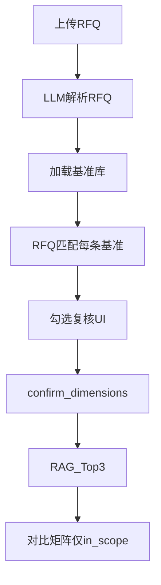

# RFQ 全维度对比矩阵 — 设计规格（F1.10a–d）

**版本：** v1.2 · 2026-07-08  
**状态：** F1.10c 单视图复核 **已实现（v1.2）** · **待客户基准清单**  
**关联：** [customer-feedback-baseline.md §1.1 Q8](../customer-feedback-baseline.md) · [prod.md](../../prod.md) F1.10 · [prompt-spec.md §3](prompt-spec.md) · [api-design.md §2.2](api-design.md)

> **客户反馈定位：** R1 **核心优先级最高** 功能 — 在统一 **~100 项工作维度基准库** 上，自动匹配 RFQ、勾选复核、再生成 Top-3 历史对比矩阵。

---

## 1. 与 F1.10 的关系

| prod ID | 名称 | 说明 |
|---------|------|------|
| F1.10 | 维度确认 + 对比矩阵（总） | 合同已有；本 spec 细化实现 |
| **F1.10a** | 基准维度库 | 可版本化主数据 ~100 项 |
| **F1.10b** | RFQ↔基准匹配 | 解析后自动打标 in/out + 工作内容 |
| **F1.10c** | 勾选复核 UI | `dimension_review` 阶段人机交互 |
| **F1.10d** | 确认后矩阵 | 仅 in_scope 行进 Top-3 对比表 |

**流程不变：** `parsing` → `dimension_review` → `retrieving` → `generating` → `completed`



---

## 2. 基准维度库（F1.10a）

### 2.1 存储

| 项 | 说明 |
|----|------|
| **路径（生产）** | `${ARIA_DATA_ROOT}/app/config/dimension_baseline.v1.json` |
| **路径（开发）** | `backend/data/config/dimension_baseline.v1.json` |
| **首次部署** | `scripts/seed-runtime-data.sh` 与 backend entrypoint：数据卷缺失时从 seed 复制；镜像内备份路径 `/app/seed/config/` |
| **版本字段** | `version`: `v1`；升级时新文件 `v2`，任务记录 `baseline_version` |

### 2.2 JSON Schema

```json
{
  "version": "v1",
  "updated_at": "2026-07-04",
  "source": "customer | seed",
  "modules": [
    {
      "code": "Chassis",
      "label": "底盘",
      "dimensions": [
        {
          "id": "chassis_front_susp",
          "name": "前悬架开发",
          "keywords": ["front suspension", "前悬", "Front suspension"],
          "description": "可选说明"
        }
      ]
    }
  ]
}
```

| 字段 | 必填 | 说明 |
|------|------|------|
| `modules[].code` | 是 | 与 Function 可对齐：`Chassis` / `CAE` / `Interior` / `BIW` / `Closure` / `Simulation` 等 |
| `modules[].label` | 是 | 中文展示名 |
| `dimensions[].id` | 是 | 全局唯一 stable id |
| `dimensions[].name` | 是 | 维度显示名 |
| `dimensions[].keywords` | 否 | F1.10b 纳入匹配 + **Layer-2 矩阵章节对齐别名**（配置驱动，无代码 hardcode） |
| `dimensions[].description` | 否 | 工程师说明 |

### 2.3 模块分类（客户口径 · 示例）

仿真 · 内外饰 · 底盘 · 车身(BIW) · 开闭件 · PM · EE · GI · CAE · Test validation 等 — **以客户提供 Excel 为准**。

---

## 3. RFQ 匹配规则（F1.10b）

**输入：** `rfq_modules`（含 `development_scope`、`modules`、`functions_in_scope`）+ 基准库全量条目

**输出：** 写入任务 `dimension_draft`（见 §4）

### 3.1 匹配通道（双通道 · 人工最终权威）

1. **规则通道：** `keywords` 命中 RFQ 全文 / `development_scope.title` / `modules[].module_name`  
2. **LLM 通道：** Prompt `rfq_baseline_match.txt` — 对每条基准输出 `in_scope`、`work_content`、`source_ref`、`confidence`

### 3.2 展示规则（客户 Q8 · v1.1 例外驱动）

| 状态 | `review_tier` | `in_scope` 默认 | 工作内容列 | UI（v1.2） |
|------|---------------|-----------------|------------|-----|
| RFQ 明确涉及 | `auto_include` | `true` | 匹配文本 | 状态「自动纳入」 |
| 需人工确认 | `needs_review` | **`false`**（`module_scope`）或按规则 | 可编辑 | 状态「已纳入」；待 ack 计入顶栏 |
| RFQ 未涉及 | `auto_exclude` | `false` | **`—`** | 展开模块内可见，状态「未纳入」 |
| 系统推荐 | `auto_include` | `false` | **`—`** | 状态「系统推荐」；勾选后纳入 |

> **原则（v1.2）：** 单视图展示 RFQ 相关模块；展开后可查全模块行（含 excluded）。`module_scope` **一律** `needs_review` 且默认 **不勾选**。

### 3.3 复核档位（`review_tier`）

| review_tier | 判定规则 | 默认勾选 |
|-------------|----------|----------|
| `auto_include` | `match_type=keywords` 且有 RFQ 证据片段 | checked |
| `needs_review` | `match_type=module_scope`；或 `confidence=low`；或 LLM 无片段 | unchecked（module_scope） |
| `auto_exclude` | 无模块、无关键词命中 | unchecked |

### 3.4 模块摘要（`module_summary`）

对每个 `module` 聚合：

- `needed`: 该模块下是否存在 ≥1 条 `in_scope=true`  
- `in_scope_count`: 勾选条数  
- UI 顶栏：**底盘：需要介入 · 内外饰：不需要 · CAE：需要介入 …**

---

## 4. 任务数据 `dimension_draft`

```json
{
  "baseline_version": "v1",
  "review_summary": {
    "total": 100,
    "auto_include": 18,
    "needs_review": 12,
    "auto_exclude": 70
  },
  "items": [
    {
      "dimension_id": "chassis_front_susp",
      "module": "Chassis",
      "module_label": "底盘",
      "name": "前悬架开发",
      "in_scope": true,
      "work_content": "前悬架 M1/M2 数据开发",
      "match_type": "keywords",
      "source_label": "关键词匹配",
      "source_ref": "RFQ §4.2.1 · 前悬架开发",
      "confidence": "high",
      "review_tier": "auto_include",
      "evidence": {
        "rfq_section": "4.2.1",
        "rfq_section_title": "前悬架开发",
        "matched_keyword": "前悬",
        "snippet": "…前悬架 MacPherson 布置…"
      },
      "manually_adjusted": false,
      "custom": false
    }
  ],
  "custom_items": [],
  "module_summary": [
    {"module": "Chassis", "module_label": "底盘", "needed": true, "in_scope_count": 5}
  ]
}
```

| 字段 | 说明 |
|------|------|
| `match_type` | 内部：`keywords` \| `module_scope` \| `llm` \| `none` |
| `source_label` | 客户可见：关键词匹配 / 模块范围推断 / AI 语义匹配 |
| `source_ref` | 客户可见 RFQ 出处摘要（非内部枚举） |
| `review_tier` | UI 分流：`auto_include` \| `needs_review` \| `auto_exclude` |
| `evidence` | RFQ 章节 + **RFQ 摘录** + **匹配关键词**（客户可见；禁止 dict/JSON  dump） |
| `review_summary` | 顶部摘要条统计 |

**自定义维度（`custom: true`）：** 工程师补充、不在基准库中的行；确认矩阵时一并纳入。

**兼容旧字段：** `confirm-dimensions` 仍可接受精简 `comparison_dimensions[]`（由 `items` 中 `in_scope=true` 映射生成）。

---

## 5. R1 分期（已决）

| 阶段 | 内容 | 基准库 | 验收 |
|------|------|--------|------|
| **R1-α** | 数据模型 · API 契约 · UI 线框 · 内部 seed（20–30 项） | seed | 内部演示 + 契约测试 |
| **R1-β** | 导入客户 ~100 项 · 调优匹配 Prompt · 3 份 RFQ 签字 | **客户正式** | **R1 客户验收** |

> **已决：** R1 客户验收 **绑定 R1-β**（须客户正式基准清单）。R1-α 不替代签字。

**已决 · UI（v1.2 · 2026-07-08）：**

- **单视图（无 Tab）：** 仅展示与 RFQ 相关的模块；展开后显示该模块**全部**基准行（含已排除项）
- **Sticky 汇总条 + 底栏：** 顶部统计 + 底部「保存勾选 / 确认生成矩阵」
- **列：** 纳入（Checkbox）· 维度 · 工作内容 · RFQ 依据 · 匹配方式 · **状态**（合并原「档位 + 操作」）
- **勾选即纳入：** 取消勾选即排除并清除「已确认」；无独立「确认此项」按钮
- **RFQ 依据 Drawer：** § 章节 · 匹配关键词 · RFQ 出处 · RFQ 摘录（禁止工程用语「命中」/ 原始 dict 串）
- **矩阵页（completed）：** 仅展示 **in_scope** 行 + Top-3 历史列

**复核 KPI（R1-β 验收建议）：**

| 指标 | 目标 |
|------|------|
| 需逐条细看的行数 | ≤ 总数 15% |
| 单份 RFQ 复核时长 | ≤ 5 分钟 |
| 确认后矩阵因维度漏/错回退 | < 5% |

---

## 6. 页面设计（F1.10c · `/rfq`）

> 线框详见 [f1.10c-review-wireframe.md](f1.10c-review-wireframe.md) · 客户对齐议程 [f1.10c-customer-alignment.md](../R1/f1.10c-customer-alignment.md)

### 6.1 阶段 A — 维度确认（`dimension_review`）

#### 6.1.1 单视图（默认 · v1.2）

```
┌─ Sticky 汇总 ──────────────────────────────────────────────────┐
│ 共 100 项 · 已纳入 19 · 待确认 9 · 3 个相关模块 / 24 行        │
└────────────────────────────────────────────────────────────────┘
┌─ 模块 Collapse（仅 RFQ 相关模块）──────────────────────────────┐
│ ▼ [车身] 已纳入 3 项 · 1 项系统推荐纳入 · 1 项待确认 (3/3 已勾选) │
│   纳入 │ 维度 │ 工作内容 │ RFQ 依据 │ 匹配方式 │ 状态            │
│   [√]  白车身结构 │ … │ §4.1.2 车身系统开发 │ 关键词匹配 │ 自动纳入 │
└────────────────────────────────────────────────────────────────┘
┌─ Sticky 底栏 ──────────────────────────────────────────────────┐
│ [ 保存勾选 ]  [ 确认以上例外，生成对比矩阵 ]                    │
└────────────────────────────────────────────────────────────────┘
```

**RFQ 依据 Drawer（点击 RFQ 依据列）：**

| 字段 | 示例 |
|------|------|
| 章节 | §4.1.2 车身系统开发 |
| 匹配方式 | 关键词匹配 |
| 匹配关键词 | BIW |
| RFQ 出处 | RFQ §4.1.2 · 车身系统开发 |
| RFQ 摘录 | 白车身 BIW 结构设计与验证 |

#### 6.1.2 已废弃线框

- **v1.1 双 Tab（复核 / 审计）：** 已合并为单视图；审计需全量时通过展开模块查看含 excluded 行
- **v1.0 全模块 Collapse：** 见下

**组件：** [`DimensionBaselineReview.tsx`](../../frontend/src/components/DimensionBaselineReview.tsx)

**交互（v1.2 · 已实现）：**

- 模块表头 Checkbox：本模块全选/全不选  
- 行 Checkbox：切换 `in_scope`；勾选即视为已确认，`needs_review` 取消勾选清除 ack  
- **展开模块（过目）**：将该模块内已勾选的 `needs_review` 项记为 `item_acknowledged`（系统预勾选场景无需再点一次勾选）  
- 状态列：`needs_review` 显示「待确认」→ 确认后「已确认」；`auto_include` 显示「自动纳入」  
- `auto_include` 且未勾选行仍展示，状态为「系统推荐」  
- 编辑 `work_content` 或切换勾选即 `manually_adjusted=true`  
- 点击 RFQ 依据列打开 Drawer（只读展示，字段见上表）  
- 确认前至少 1 项 `in_scope=true`

**确认门禁：**

1. `in_scope >= 1`  
2. 含 in_scope 的模块均已 `module_reviewed`（展开即过目）  
3. 所有 `needs_review` 且 `in_scope` 条目均已 `item_acknowledged`（过目或勾选/改工作内容均可写入）  

### 6.1.3 旧版线框（v1.0 · 已由 v1.2 单视图替代）

```
┌─ 模块摘要 ─────────────────────────────────────────┐
│ 底盘: 需要介入 │ 内外饰: 不需要 │ CAE: 需要介入 …  │
└──────────────────────────────────────────────────┘
┌─ 基准维度表（Collapse 按 module）─────────────────┐
│ [√] 前悬架开发     │ 工作内容 │ 来源              │
│ [ ] 门把手开闭件   │ —        │ 未涉及            │
└──────────────────────────────────────────────────┘
              [ 确认维度清单，生成对比矩阵 ]
```

### 6.2 阶段 B — 对比矩阵（`generating` → `completed`）

- 复用 [`ComparisonMatrix.tsx`](../../frontend/src/components/ComparisonMatrix.tsx)  
- 行 = 已确认 `in_scope` 项（`dimension_id` / `name` + `work_content` → `new_project` 列）  
- 列 = 新项目 | 历史 A/B/C  
- 保留：编辑、置信度、ExpandRow 溯源

---

## 7. API（摘要 · 详见 api-design）

| 方法 | 路径 | 说明 |
|------|------|------|
| GET | `/api/v1/rfq/dimension-baseline` | 只读基准库（`version` + `modules`） |
| GET | `/api/v1/rfq/tasks/{id}` | 含扩展 `dimension_draft` |
| PUT | `/api/v1/rfq/tasks/{id}` | 更新 `dimension_draft.items` / 勾选 / 工作内容 |
| POST | `/api/v1/rfq/tasks/{id}/confirm-dimensions` | 提交 in_scope 项 → 触发 RAG + 矩阵 |

---

## 8. Prompt

| 文件 | 用途 |
|------|------|
| `prompts/v1/rfq_baseline_match.txt` | RFQ 结构化结果 + 基准条目 batch → `dimension_draft.items` |
| `prompts/v1/comparison_table.txt` | 确认后 Top-3 矩阵（输入为 in_scope 维度列表） |

> **supersede：** 原「动态生成 ~5 项 `comparison_dimensions`」降为 fallback；**主路径** 为基准库匹配。自定义维度走 `custom_items`。

---

## 9. 验收（R1 · 对标部分）

- [ ] 基准库已导入（客户 v1，≥80 项或双方认可数量）  
- [ ] 3 份 RFQ：**上传 → 例外复核（≤15% 逐条）→ 确认 → Top-3 矩阵** 全流程  
- [ ] 顶栏摘要与 `review_summary`、模块展开行数一致  
- [ ] RFQ 依据 Drawer 无「命中」/ dict 串；出处为 `RFQ §… · 章节标题`  
- [ ] `module_scope` 项默认不勾选；勾选或编辑后视为 ack  
- [ ] 未涉及维度在确认页显示 `—`；矩阵页不出现 out_of_scope 行  
- [ ] 模块摘要与工程师人工判断 **无明显矛盾**（允许个别条目标黄复核）  
- [ ] 对比矩阵可编辑、含来源与置信度  

---

## 10. 风险

| 风险 | 对策 |
|------|------|
| 客户清单延迟 | R1-α 文档/契约先行；签字等 R1-β |
| 100 行性能 | 折叠 + 虚拟滚动 |
| LLM 误匹配 | 人工勾选权威；`manually_adjusted` 审计 |
| 与 Demo 矩阵 UX 不一致 | RFQ 页两阶段；Demo `main` 不改动 |

---

## 附录 A · 向客户索取「工作维度基准表」与矩阵准确度输入

> 跟踪 ID：**O-01 / O-01a / O-01b** — 见 [customer-dependencies.md](../R1/customer-dependencies.md)。

### A.1 业务说明（可复制至邮件）

> 尊敬的业务同事：  
> 为完成 R1 **RFQ 全维度技术对标**（贵司反馈的核心功能），请提供以下三类输入（Excel 即可），否则对比矩阵只能验证流程、难以验证业务准确度：  
> 1. **工作维度基准表（约 100 项）** — 所有 RFQ 统一比对的「尺子」；  
> 2. **维度 ↔ 历史章节别名对照** — 每项工作在历史 RFQ 目录中的常见叫法（减少「有内容但对不上名」）；  
> 3. **矩阵单元格金标准（2～3 份历史 RFQ）** — 按维度标注应有摘录 / 应为空 / 标题异名，作为联合调优与验收依据。  
> 建议在 **R1 第 7–8 周联合调优前** 提供初版；可在试用后共同修订一版作为验收基线。

### A.2 Excel 模板列（建议）— Sheet「工作维度基准」（O-01）

| 列 | 字段名 | 必填 | 示例 |
|----|--------|------|------|
| A | 模块分类 | 是 | 底盘 / 内外饰 / 仿真 / 车身 / 开闭件 |
| B | 维度名称 | 是 | 前悬架开发 |
| C | 维度 ID（可选） | 否 | chassis_front_susp（不填则由系统生成） |
| D | 关键词（可选） | 否 | 前悬; front suspension |
| E | 说明（可选） | 否 | M1/M2 数据与 DMU |

**Sheet 名：** `工作维度基准`  
**行数：** 约 80–120 行（贵司实际为准）  
**勿含：** 客户机密项目名、报价数字 — 仅 **维度名称与分类**

### A.3 我方收到后（O-01）

1. 转换为 `dimension_baseline.v1.json`  
2. 与客户确认模块分类与条目数量  
3. 进入 R1-β 匹配调优 + 3 份 RFQ 验收  

### A.4 Sheet「章节别名对照」（O-01a · 强烈建议）

| 列 | 字段名 | 必填 | 示例 |
|----|--------|------|------|
| A | 维度名称或维度 ID | 是 | NVH 仿真 / cae_nvh |
| B | 历史章节常见叫法 | 是 | 噪声振动分析 |
| C | 其它别名（可选） | 否 | 模态; NVH; 振动噪声 |
| D | 备注（可选） | 否 | 常见于 CAE 章节 4.x |

**说明：** 别名用于历史 RFQ **章节标题对齐**（维度对比矩阵填格），与「本次 RFQ 是否纳入该维度」的关键词可共用，但**建议单独成表**便于业务审核。

### A.5 Sheet「矩阵单元格金标准」（O-01b · 验收必备）

| 列 | 字段名 | 必填 | 示例 |
|----|--------|------|------|
| A | 历史项目/RFQ 标识 | 是 | 脱敏包名或 engagement 代号 |
| B | 维度名称或维度 ID | 是 | 白车身结构 |
| C | 期望结果 | 是 | `应有摘录` / `应为空` / `标题异名` |
| D | 期望章节名或关键词（可选） | 条件 | 应有摘录或标题异名时填写 |
| E | 备注 | 否 | 业务说明 |

**样例数：** 2～3 份历史 RFQ × 拟纳入 R1-β 签字的维度子集（可先覆盖高频模块，再扩全量）。  
**读法：** 「未匹配到对应章节」在有金标准后，才能判定是系统规则问题还是历史确实未写。

---

**维护：** Q8 / 基准库结构变更时同步 [customer-feedback-baseline.md](../customer-feedback-baseline.md) · [formal-delivery-strategy.md](formal-delivery-strategy.md) · [customer-dependencies.md](../R1/customer-dependencies.md) · [prompt-spec.md](prompt-spec.md) · [api-design.md](api-design.md)
